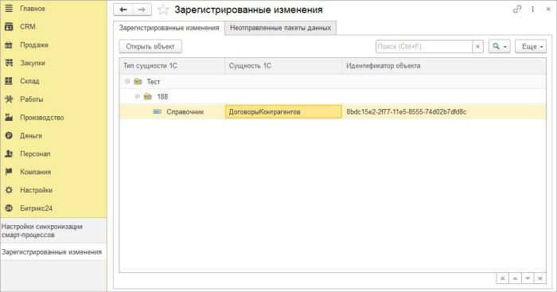
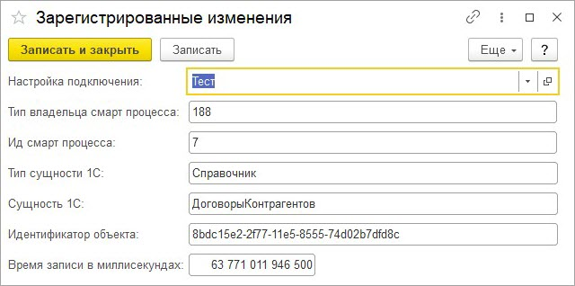

# Просмотр зарегистрированных на выгрузку данных

**Навигация**
- [← Оглавление курса](index.md)
- [← Предыдущий: 25920 — Мастер настроек. 7 этап](lesson_25920.md)
- [Следующий: 25924 — Просмотр идентификаторов Битрикс24 элементов смарт-процессов →](lesson_25924.md)

Официальная страница урока: https://dev.1c-bitrix.ru/learning/course/index.php?COURSE_ID=48&LESSON_ID=25922

На форму просмотра зарегистрированных изменений можно перейти по кнопке «Зарегистрированные изменения» на форме списка настроек синхронизации смарт-процессов.

На форме можно увидеть зарегистрированные к выгрузке в *Битрикс24* данные, а также данные, которое ранее не удалось выгрузить. При нажатии на кнопку «Открыть объект» можно увидеть, какой объект зарегистрирован.

По самой записи видно, что в ней нет ссылки на объект, только идентификатор объекта *1С*.
