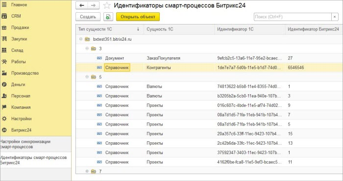
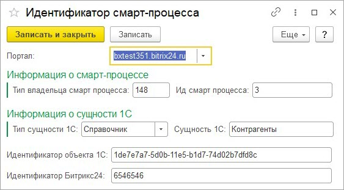

# Просмотр идентификаторов Битрикс24 элементов смарт-процессов

**Навигация**
- [← Оглавление курса](index.md)
- [← Предыдущий: 25922 — Просмотр зарегистрированных на выгрузку данных](lesson_25922.md)
- [Следующий: 6721 — Установка модуля обмена →](lesson_6721.md)

Официальная страница урока: https://dev.1c-bitrix.ru/learning/course/index.php?COURSE_ID=48&LESSON_ID=25924

На форму просмотра идентификаторов можно перейти по кнопке «Идентификаторы элементов» на форме списка настроек синхронизации смарт-процессов.

На форме можно увидеть привязанные к элементам смарт-процессов объекты *1С*. Привязка осуществляется через идентификатор *Битрикс24*.

При нажатии на кнопку «Открыть объект» можно увидеть, более подробную информацию.

По самой записи видно, что в ней нет ссылки на объект, только идентификатор объекта *1С*, поэтому руками вводить идентификаторы крайне не рекомендуется.
