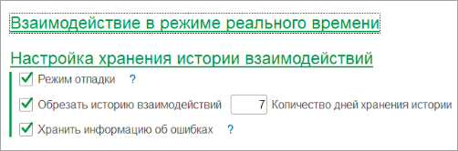

# Настройка хранения истории взаимодействий

**Навигация**
- [← Оглавление курса](index.md)
- [← Предыдущий: 25834 — Настройка взаимодействия в режиме реального времени](lesson_25834.md)
- [Следующий: 25836 — Открытие 1С из Битрикс24 и Битрикс24 из 1С →](lesson_25836.md)

Официальная страница урока: https://dev.1c-bitrix.ru/learning/course/index.php?COURSE_ID=48&LESSON_ID=25926

История всех взаимодействий между *1С* и *Битрикс24* хранится в базе *1С*. В общих настройках настраивается механизм логирования и хранения логов.

Во время настройки и отладки интеграции полезно включать режим отладки. Он позволяет хранить REST запросы в логе для дальнейшего анализа. Но во время повседневной работы следует отключать этот режим, т.к. запросы могут быть большого размера, что очень быстро «раздует» базу *1С*.

Во время повседневной работы следует **отключать** режим отладки.

Для того, чтобы база *1С* не сильно увеличивалась в размерах из-за логирования, рекомендуется периодически обрезать историю. В поле «Количество дней хранения истории» указывается, сколько дней должны храниться логи.

Помимо журнала истории, в модуле есть журнал ошибок, позволяющий видеть ошибки, оповещать пользователей о них. Для заполнения журнала необходимо установить флаг «Хранить информацию об ошибках». Если требуется хранить информацию об ошибках, то следует их контролировать и исправлять. Иначе они будут постоянно добавляться вновь в журнал, что тоже значительно увеличит объем базы *1С*.
