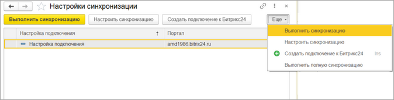
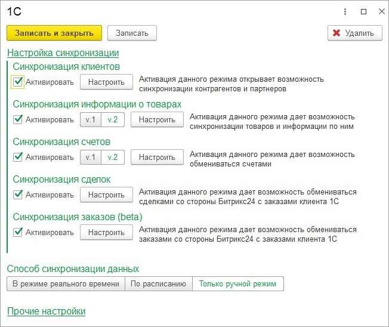
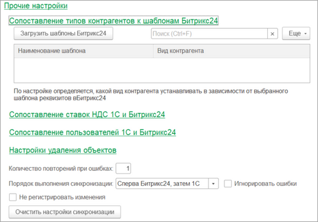
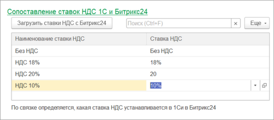
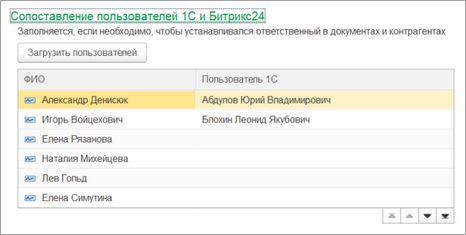
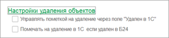
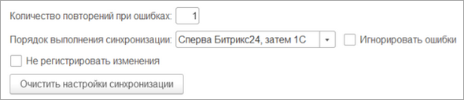

# Настройки синхронизации

**Навигация**
- [← Оглавление курса](index.md)
- [← Предыдущий: 25870 — Телефония Битрикс24](lesson_25870.md)
- [Следующий: 25874 — Синхронизация клиентов →](lesson_25874.md)

Официальная страница урока: https://dev.1c-bitrix.ru/learning/course/index.php?COURSE_ID=48&LESSON_ID=25928

Синхронизация может происходить в трех режимах:

- Ручном. Только пользователем по кнопке.
- По расписанию. Автоматически по заданному расписанию.
- В режиме реального времени. В момент изменения данных. Для режима реального времени должна быть установлена связь между *Битрикс24* и *1С*.

Для сущностей *Битрикс24* «Компания», «Контакт», «Сделка» из 1С выгружается *дело*, при нажатии на которое может открыться сущность *1С* в слайдере или десктоп приложении, связанная с сущностью *Битрикс24*. Также в пункте *дело* осуществляется привязка к роботам и триггерам.

Синхронизация данных настраивается в разрезе настроек подключения.

Раздел Битрикс24 &gt; Настройки синхронизации

 

При переходе на список настроек синхронизации можно увидеть, есть ли для текущей настройки подключения настройки синхронизации. У настроек подключения с серым фоном нет настроек синхронизации.

Из списка настроек по выбранной настройке подключения можно запустить синхронизацию. Синхронизация всегда выполняется в режиме изменений. Если требуется полная синхронизация, то выполнить ее можно по кнопке Еще &gt; Выполнить полную синхронизацию, но выполнять ее рекомендуется только на этапе первоначальной синхронизации данных, далее рекомендуется выполнять только в режиме синхронизации изменений.

При двойном щелчке мыши на настройку подключения, или при нажатии на кнопку **Настроить синхронизацию**, открывается окно настройки синхронизации:

В группе **Настройка синхронизации** задается перечень типов данных, которые должны синхронизироваться между *1С* и *Битрикс24*. Для товаров и счетов можно выбрать версию. Рекомендуется использовать последние версии синхронизации.

В группе **Способ синхронизации данных** задается способ выполнения синхронизации. Если синхронизация выполняется в режиме реального времени, то для корректной работы должно быть запущено подключение к *Битрикс24* (в разделе «1С + CRM Битрикс24»

			желтый фон

                    

		 у настройки подключения).

В группе **Прочие настройки** указываются менее влияющие настройки синхронизации.

В группе

			Сопоставление типов контрагентов к шаблонам Битрикс24

                    

		 указывается, какого типа контрагент/партнер будет в зависимости от шаблона *Битрикс24*. Это очень важная настройка задается также в окне настройки синхронизации клиентов.

В группе

			Сопоставление ставок НДС 1С и Битрикс24

                    

		 задается связь ставок НДС *1С* и *Битрикс24*. Это важная настройка задается также в окне настройки синхронизации товаров.

В группе

			Сопоставление пользователей 1С и Битрикс24

                    

		 задается привязка пользователей обеих систем. В первую очередь, эта настройка необходима для закрепления ответственного за Контрагентом/Заказом, в зависимости от менеджера *Битрикс24*. И наоборот. Также по этой настройке заполняются дополнительные поля с типом «Сотрудник» . Эта же настройка используется и для модуля экспорта печатных форм и отчетов в живую ленту.

В группе

			Настройки удаления объектов

                    

		 настраиваются сценарии:

- Если установлен флаг «Управлять пометкой на удаление через поле «Удален в 1С», то из *1С* в *Битрикс24* для Компаний/Контактов/Сделок/Счетов выгружается служебное дополнительное свойство *1С* (создается модулем), которое хранит признак пометки удаления объекта в *1С*. Если свойство не выгрузилось на сайт, то необходимо пересохранить это свойство в *1С*, чтобы оно при следующей синхронизации выгрузилось в *Битрикс24*. Дополнительное свойство *1С* - это дополнительный реквизит *Битрикс24*. По значению дополнительного реквизита *Битрикс24* можно увидеть, помечен ли объект *1С*, а также управлять пометкой удаления объекта *1С* из *Битрикс24*.
- Если установлен флаг «Помечать на удаление в 1С если удален в Б24», то когда удаляется объект в *Битрикс24*, а затем выполняется синхронизация в режиме изменения – объект *1С*, привязанный к удаленной сущности *Битрикс24*, будет помечен на удаление.

В группе **Прочие настройки** есть настройки, не относящиеся к подгруппам.

По настройке

			Количество повторений при ошибках

                    

		 указывается, сколько раз будет повторно выгружаться пакет данных, если во время выгрузки получена ошибка.

По умолчанию порядок синхронизации такой: сначала данные выгружаются из *Битрикс24* в *1С*, а затем из *1С* загружаются в *Битрикс24*. Настройкой «Порядок выполнения синхронизации» можно изменить порядок.

Если установлен флаг «Игнорировать ошибки», то если во время выгрузки из *Битрикс24* в *1С* произойдет критическая ошибка, то выгрузка из *1С* в *Битрикс24* все равно будет выполнена. И наоборот.

Если установлен флаг «Не регистрировать изменения», то в базе *1С* не регистрируются изменения. Это влечет за собой то, что изменения *1С* в *Битрикс24* не выгружаются.

По кнопке «Очистить настройки синхронизации» заполняются по умолчанию настройки синхронизации данных.
