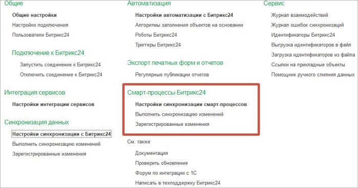
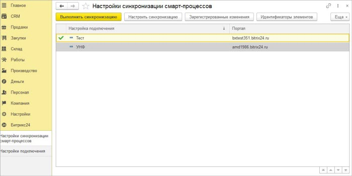

# Общее описание подраздела

**Навигация**
- [← Оглавление курса](index.md)
- [← Предыдущий: 25902 — Триггеры](lesson_25902.md)
- [Следующий: 25908 — Мастер настроек. 1 этап →](lesson_25908.md)

Официальная страница урока: https://dev.1c-bitrix.ru/learning/course/index.php?COURSE_ID=48&LESSON_ID=25938

В разделе Битрикс24 есть подраздел Смарт-процессы Битрикс24.

Из подраздела можно зайти на форму настроек синхронизации.

Для каждой настройки подключения может быть только одна настройка синхронизации смарт-процессов. Если у настройки подключения нет настроек синхронизации смарт-процессов, то она выделена серым фоном.

По нажатию кнопки «Выполнить синхронизацию» происходит синхронизация данных смарт-процессов по выбранной настройке подключения. Синхронизация только изменений.

При нажатии на кнопку «Настроить синхронизацию» происходит открытие формы настройки синхронизации.

При нажатии на кнопку «Зарегистрированные изменения» открывается форма просмотра зарегистрированных к выгрузке из *1С* данных и данных, которые не удалось ранее выгрузить на портал.

Идентификаторы *Битрикс24*, присвоенные объектам *1С* во время синхронизации, можно увидеть на форме, открывающейся по кнопке «Идентификаторы элементов».

В группе кнопок «Еще» спрятана команда «Выполнить полную синхронизацию данных». При нажатии происходит синхронизация всех данных настроенных смарт-процессов. Рекомендуется использовать команду только для начального заполнения данных.
