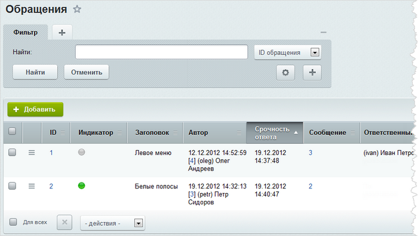
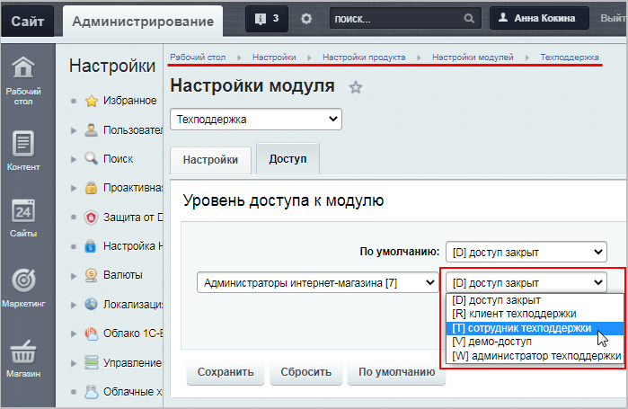

# Организация работы службы поддержки

**Навигация**
- [← Оглавление курса](index.md)
- [← Предыдущий: 7967 — Решение проблем с телефонией и видеозвонками](lesson_7967.md)
- [Следующий: 9109 — Настройки модуля Техподдержка →](lesson_9109.md)

Официальная страница урока: https://dev.1c-bitrix.ru/learning/course/index.php?COURSE_ID=48&LESSON_ID=2617

### Модуль Техподдержка

Современный корпоративный портал насыщен разнообразными функциями, сориентироваться в которых сотрудникам компании бывает порой непросто. Кроме того, многие производственные компании хотели бы иметь возможность оперативно отвечать на вопросы сотрудников. Особенно это касается порталов, ориентированных на консультирование сотрудников в онлайновом режиме по вопросам использования программного обеспечения, технических устройств и т.п.

Для решения перечисленных задач разработан модуль **Техподдержка**.

Модуль технической поддержки позволяет:

- организовать на сайте систему обращений сотрудников компании к группе сотрудников, отвечающих за консультирование и техподдержку;
- назначать ответственных за решение тех или иных вопросов;
- управлять уровнями технической поддержки;
- отслеживать время и эффективность рассмотрения обращений;
- анализировать оценку получаемых ответов.

Для полноценного управления модулем **Техподдержка** необходимо обладать правами группы **Администраторы**.

#### Дополнительная информация

- [Техподдержка (документация)](http://dev.1c-bitrix.ru/user_help/service/support/index.php)

### Организация работы службы поддержки

Процесс создания и обработки обращений, поступающих в службу технической поддержки, регламентируется соглашением об уровне поддержки (SLA).

> **SLA** – это описание обязательств компании по предоставлению определенного уровня сервиса (в данном случае технической поддержки) тем или иным пользователям. Уровни сервиса используются для управления приоритетами пользователей на получение поддержки.

- Каждой группе пользователей, обладающей правом на создание обращений в службу поддержки, назначается определенный SLA. Уровень поддержки определяет время реакции на сообщения пользователей данных групп, а также некоторые параметры сообщений.
- Пользователи могут создавать обращения в службу поддержки следующими способами:
  Также некоторые сообщения пользователей на форуме, например, имеющие технический характер или выходящие за рамки тематики форума, могут быть перенесены в службу поддержки. Сообщение может быть перемещено администратором *Bitrix Framework* или администратором форума с помощью специального интерфейса.
  Каждому сообщению присваивается уникальный номер, что позволяет вести строгий учет поступивших обращений и следить за процессом их обработки.

  - через стандартные формы на сайте;
  - посредством электронного письма;
  - посредством телефонного звонка.
- Обращение в службу поддержки рассматривается в соответствии с параметрами SLA. Ответ на обращение публикуется в *Bitrix Framework*, а также отсылается пользователю по электронной почте. При этом просмотр обсуждения проблемы на *Bitrix Framework* доступен только пользователю, создавшему обращение, и сотрудникам службы поддержки.

### Интерфейс техподдержки

Интерфейс техподдержки состоит из двух частей:

- **публичной:**
  
- **административной:**
  

Обычно клиенты техподдержки получают доступ к публичному интерфейсу службы, а сотрудники техподдержки ведут работу из административного интерфейса. В связи с этим административный и публичный интерфейс различаются по внешнему виду и доступному функционалу.

Для регулирования

			уровня доступа

		 пользователей к модулю технической поддержки предусмотрено использование штатных, не настраиваемых, ролей:

- **Клиент техподдержки** - доступ к административному меню **Обращения** открыт, в административных и публичных файлах разрешено создание и редактирование своих обращений.
  Клиент техподдержки получает почтовые извещения обо всех событиях, связанных с созданным им обращением (об изменении статуса сообщения, назначении ответственного, ответе на обращение и т.д.). Также при создании обращения пользователь получает извещение, содержащее исходную информацию об обращении (номер обращения, имя ответственного по умолчанию и т.д.)
- **Сотрудник техподдержки** - доступ ко всем пунктам меню и страницам модуля открыт. Пользователь работает с теми обращениями, в параметрах которых он указан как сотрудник, ответственный за решение проблемы.
  Сотрудник техподдержки получает почтовые извещения обо всех событиях, связанных с обращениями, за рассмотрение которых он отвечает. При назначении сотрудника ответственным за какое-либо обращение ему также направляется извещение с параметрами данного обращения.
- **Администратор техподдержки** - пользователь может редактировать справочник техподдержки и любое обращение, а также назначать ответственных за решение проблем. Администратор получает почтовые извещение обо всех обращениях, создаваемых в службу поддержки.
