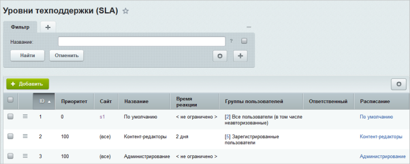
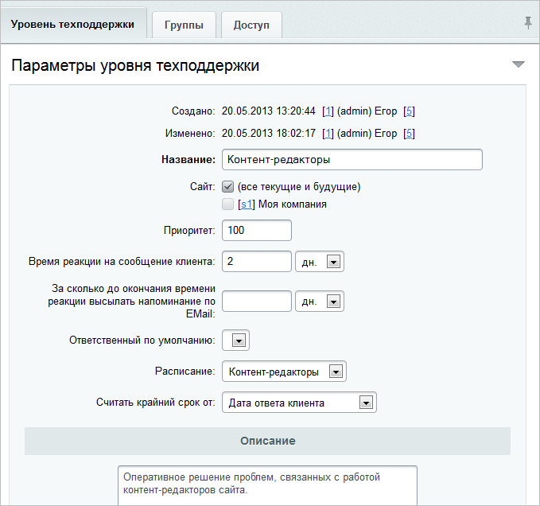
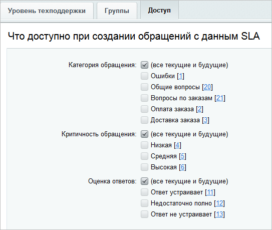

# Уровни поддержки (SLA)

**Навигация**
- [← Оглавление курса](index.md)
- [← Предыдущий: 2621 — Назначение ответственного за обращение](lesson_2621.md)
- [Следующий: 2641 — Создание публичного интерфейса →](lesson_2641.md)

Официальная страница урока: https://dev.1c-bitrix.ru/learning/course/index.php?COURSE_ID=48&LESSON_ID=2620

Настройка уровней сервиса выполняется на странице **Уровни техподдержки (SLA)** (Сервисы &gt; Техподдержка &gt; Уровни поддержки):

SLA определяет:

- время реакции на обращение пользователя (т.е. время, в течение которого сотрудник службы поддержки должен отреагировать на обращение пользователя);
  
  Параметр **Считать крайний срок от** определяет момент, с которого следует отсчитывать время реакции на обращение клиента: с даты его создания, либо даты последнего ответа клиента. Во втором случае счетчик крайнего срока обнуляется после каждого ответа сотрудника техподдержки. Первым ответом считается само обращение клиента.
- группы, пользователи которых имеют право на создание обращений с данным уровнем поддержки;
  
  **Примечание:** Доступные группы определяются в настройках модуля **Техподдержка** (Настройки &gt; Настройки продукта &gt; Настройки модулей &gt; Техподдержка), закладка **Доступ**.
- доступные категории и уровни критичности обращений, а также оценки ответов на обращение.
  Например, пользователям с обычным SLA может быть предоставлено право на создание обращений с низкой критичностью, а клиентам с SLA «Партнеры» – с низкой, средней и высокой.
  
- другие параметры.

|  | #### Документация по теме: |
| --- | --- |

- [Уровни поддержки](https://dev.1c-bitrix.ru/user_help/service/support/ticket_sla_list.php)
- [Создание и редактирование уровня поддержки](https://dev.1c-bitrix.ru/user_help/service/support/ticket_sla_edit.php)
