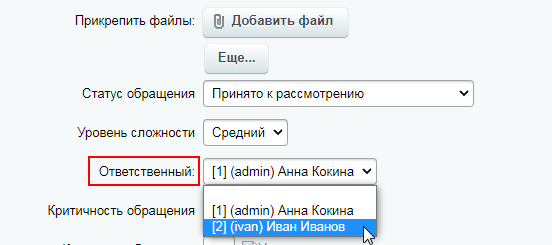
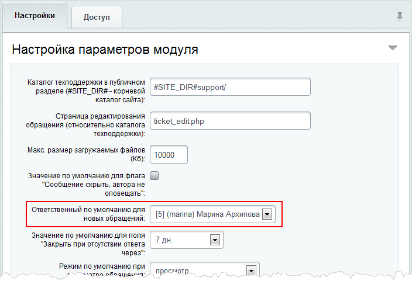
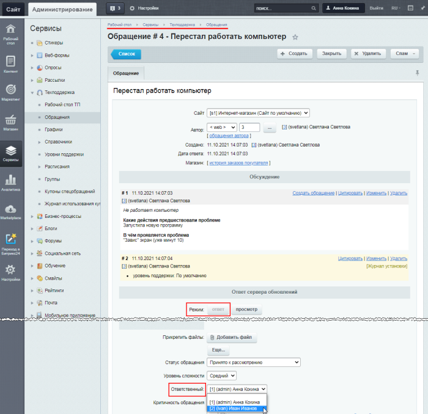

# Назначение ответственного за обращение

**Навигация**
- [← Оглавление курса](index.md)
- [← Предыдущий: 2619 — Справочники](lesson_2619.md)
- [Следующий: 2620 — Уровни поддержки (SLA) →](lesson_2620.md)

Официальная страница урока: https://dev.1c-bitrix.ru/learning/course/index.php?COURSE_ID=48&LESSON_ID=2621

**Внимание!** Невозможно назначить ответственными группу сотрудников за одно обращение.

> **Администратор техподдержки** – сотрудник, имеющий полный доступ к модулю техподдержки. Может выполнять обязанности ответственного по обращению.
>
>
>
> **Ответственный по умолчанию** – сотрудник, назначаемый автоматически согласно настройкам модуля. Может выполнять обязанности ответственного по обращению.
>
>
>
> **Ответственный за обращение** – это сотрудники, отвечающие за рассмотрение и решение того или иного конкретного обращения.

Назначение ответственного сотрудника может быть выполнено:

- **автоматически**, в соответствии с установленными параметрами назначается ответственный по умолчанию;
- **вручную** администратором техподдержки или ответственным по умолчанию
  			при просмотре конкретного обращения
  
  		.

**Примечание:** Чтобы можно было выбрать сотрудников в поле **Ответственный**, в случаях, описанных ниже, необходимо присвоить им права **сотрудник техподдержки** на доступ к модулю техподдержки.

Проще всего для этого создать отдельную группу пользователей (Настройки &gt; Пользователи &gt; Группы пользователей) и на закладке **Доступ** указать соответствующие права.

- **Автоматическое назначение**
  Автоматическое назначение выполняется исходя из следующих параметров:

  - в соответствии с настройками следующих Справочников: Категория, Критичность, Источник (Сервисы &gt; Техподдержка &gt; Справочники &gt; Категории, Сервисы &gt; Техподдержка &gt; Справочники &gt; Критичность, Сервисы &gt; Техподдержка &gt; Справочники &gt; Источник), в зависимости от типа, к которому было отнесено обращение.
    
  - если ответственный в Справочнике не установлен, то назначается сотрудник, ответственный по умолчанию за решение обращения с тем или иным [SLA](lesson_2617.md#sla).
    В соответствии с правами пользователя, каждому сообщению присваивается определенный SLA. В настройках SLA (Сервисы &gt; Техподдержка &gt; Уровни поддержки) может быть указан сотрудник техподдержки, ответственный по умолчанию за решение вопросов с указанным уровнем поддержки.
    
  - если и ответственный для SLA не установлен, то ответственный по умолчанию сотрудник назначается исходя из настроек модуля техподдержки (Настройки &gt; Настройки продукта &gt; Настройки модулей &gt; Техподдержка).
    
- **Назначение вручную**
  При просмотре обращения администратор техподдержки (или Ответственный по умолчанию/Ответственный за обращение) может назначить или изменить ответственного за решение проблемы:
  
