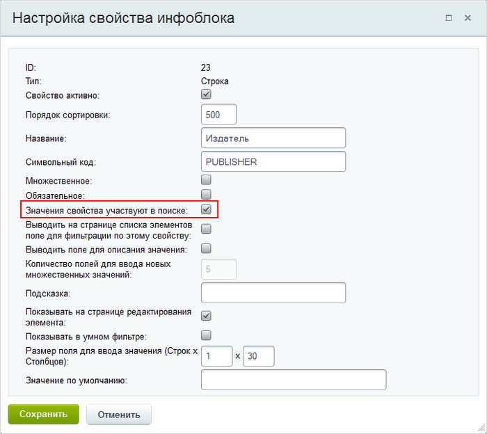

# Поиск элементов инфоблока по их свойствам

**Навигация**
- [← Оглавление курса](index.md)
- [← Предыдущий: 2165 — Типичные ошибки](lesson_2165.md)
- [Следующий: 2861 — Настройки модуля →](lesson_2861.md)

Официальная страница урока: https://dev.1c-bitrix.ru/learning/course/index.php?COURSE_ID=48&LESSON_ID=2651

### Видеоурок

Знаете ли вы, что поиск элементов инфоблока можно выполнять не только по названию, но и по значениям их свойств? Такой поиск будет работать у вас на сайте, если в свойствах отмечена всего лишь специальная галочка. Давайте вместе разберем данную настройку.

<!-- &lt;p&gt;&lt;iframe title="Поиск элементов инфоблока по их свойствам" src="//www.youtube.com/embed/PyIDPGcveBY?feature=oembed&rel=0" allowfullscreen="" width="853" height="480" frameborder="0"&gt;
&lt;/iframe&gt;&lt;/p&gt; -->

### Настройка поиска элементов по значениям их свойств

- Откройте форму с настройками требуемого инфоблока (Контент &gt; Инфоблоки &gt; Типы инфоблоков &gt; [ваш_инфоблок]) и перейдите на закладку **Свойства**.
- Нажмите кнопку
  			[...]
                      
  		 напротив интересующего свойства.
- В открывшейся форме отметьте опцию
  			Значения свойства участвуют в поиске
                      
  		.
  **Примечание:** поиск невозможен по значениям свойств следующих типов: **Привязка к элементам**, **Привязка к разделам**, **Привязка к Яндекс.Карте**, **Привязка к карте Google Maps**, **Привязка к разделам с автозаполнением**, **Привязка к товарам (SKU)**, **Привязка к элементам с автозаполнением**, **Привязка к теме форума**, **Привязка к элементам в виде списка** и **Счетчик**.
- Сохраните внесенные данные.
- Выполните полную [переиндексацию](lesson_2048.md) (т.е. в форме переиндексации флаг **Переиндексировать только измененные** должен быть снят).

Теперь поиск элементов инфоблока будет осуществляться и по названиям, и по значениям свойств.

### Документация по теме

- [Создание и редактирование свойств инфоблока](http://dev.1c-bitrix.ru/user_help/content/iblock/iblock_edit_property.php)
- [Переиндексация](http://dev.1c-bitrix.ru/user_help/settings/search/search_reindex.php)
