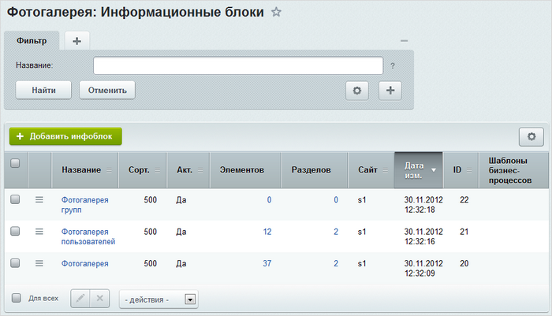
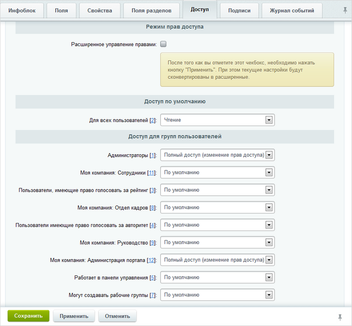

# Основные понятия

**Навигация**
- [← Оглавление курса](index.md)
- [← Предыдущий: 2418 — Создание списка](lesson_2418.md)
- [Следующий: 2981 — Фотогалерея в социальной сети →](lesson_2981.md)

Официальная страница урока: https://dev.1c-bitrix.ru/learning/course/index.php?COURSE_ID=48&LESSON_ID=2657

Работа модуля **Фотогалерея 2.0** основана на модуле **Информационные блоки**. Альбомы и фотографии галерей сотрудников хранятся как разделы и элементы инфоблока.

Таким образом, в системе необходимо создать тип инфоблока, например **Фотогалерея**, а для всех видов фотогалерей портала - соответствующие инфоблоки. Например:

- **Фотогалерея** – для хранения альбомов и фотографий компании. Разделами инфоблока являются альбомы, а элементами – фотографии.
- **Фотогалерея групп** – для хранения альбомов и фотографий рабочих групп. Разделами инфоблока являются галереи рабочих групп, подразделами – альбомы групп, а элементами – фотографии.
- **Фотогалерея пользователей** – для хранения альбомов и фотографий сотрудников портала. Разделами инфоблока являются персональные галереи пользователей, подразделами – альбомы пользователей, а элементами – фотографии.

**Примечание:** При наличии установленного модуля **Экстранет** в списке будут присутствовать еще 2 инфоблока: **Фотогалерея групп - экстранет** и **Фотогалерея пользователей - экстранет**.

В результате, созданная структура будет иметь следующий вид:

Доступ к фотогалерее определяется в настройках доступа выбранного инфоблока:

