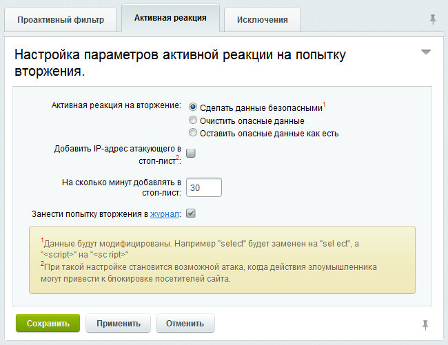
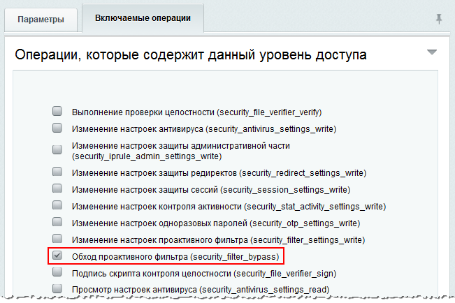
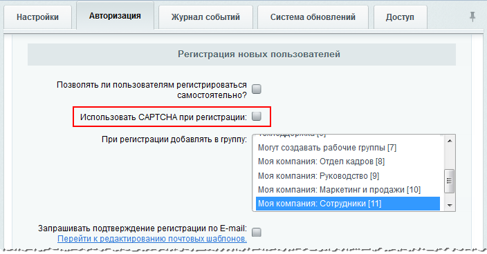

# Стандартный уровень

**Навигация**
- [← Оглавление курса](index.md)
- [← Предыдущий: 5801 — Трактовка результатов сканера безопасности](lesson_5801.md)
- [Следующий: 2673 — Высокий уровень →](lesson_2673.md)

Официальная страница урока: https://dev.1c-bitrix.ru/learning/course/index.php?COURSE_ID=48&LESSON_ID=2669

|  | ### Стандартный уровень |
| --- | --- |

Чтобы защита веб-проекта осуществлялась на стандартном уровне безопасности, необходимо настроить должным образом все параметры данного уровня:

***** для быстрого перехода к описанию настройки нужного Вам параметра кликните по одной из ссылок ниже:

- 1 **,** 2 [Проактивный фильтр и исключения из него](#filter);
- 3 [Ведение журнала вторжений](#event_log);
- 4 [Контроль активности](#activity);
- 5 [Уровень безопасности группы администраторов](#admin);
- 6 [Использовать CAPTCHA при регистрации](#captcha);
- 7 [Режим вывода ошибок (error_reporting)](#error);
- 8 [Показ ошибочных запросов базы данных](#dbdebug).

**Внимание:** если стандартный уровень не настроен полностью, то защита сайта будет осуществляться на **начальном** уровне, но с учетом настроенных параметров на стандартном, высоком и повышенном уровнях.

### 1 , 2 Проактивный фильтр и исключения из него

Включение или отключение

			проактивного фильтра

**Проактивный фильтр** (**Web Application Firewall**) – это набор специализированных средств, которые выполняют фильтрацию трафика. Фильтр обеспечивает защиту от большинства известных атак на веб-приложения. В потоке внешних запросов пользователей проактивный фильтр распознает большинство опасных угроз и блокирует вторжения на сайт.

		 выполняется на странице **Проактивный фильтр** (Настройки &gt; Проактивная защита &gt; Проактивный фильтр) с помощью

			кнопки

		 **Включить проактивную защиту** (или **Выключить проактивную защиту**).

На закладке **Активная реакция** настраиваются действия системы при попытке вторжения на сайт:

Выберите необходимый вам способ реакции на вторжение:

| - **Сделать данные безопасными** – опасные данные будут модифицированы, например, **select** будет заменен на **sel ect**. - **Очистить опасные данные** – введенные опасные данные будут удалены. - **Оставить опасные данные как есть** – с опасными данными никаких действий выполняться не будет. |
| --- |

Чтобы заблокировать пользователя на некоторое количество минут, отметьте опцию **Добавить IP-адрес атакующего в стоп-лист**. При этом период времени блокировки задается в поле **На сколько минут добавлять в стоп-лист**.

**Примечание:** при добавлении IP-адреса атакующего в стоп-лист становится возможной

			атака,

**Суть атаки:**

Злоумышленник размещает у себя ссылку на сайт, содержащую данные, похожие на попытку взлома.

Пользователь кликает по этой ссылке и переходит на сайт.

Проактивная защита заносит этого пользователя в Стоп-лист. Сайтом этот пользователь больше пользоваться не сможет.

		 когда действия злоумышленника могут привести к блокировке посетителей сайта.

Для фиксирования попыток атаки отметьте опцию **Занести попытку вторжения в журнал**.

**Обратите внимание,** что некоторые действия пользователей, не представляющие угрозы, тоже могут выглядеть подозрительно и вызывать ложное срабатывание фильтра.

При необходимости могут быть заданы исключения из проактивного фильтра (закладка **Исключения**), т.е. проактивный фильтр не будет применяться на страницах, указанных на данной закладке.

**Примечание:** Чтобы защита сайта осуществлялась на стандартном уровне, проактивный фильтр должен быть включен и **не должно быть задано ни одного исключения.**

Однако при необходимости можно добавить определенные **страницы** или конкретных **пользователей** в правило исключения

## Исключение для конкретных страниц

- Перейдите на вкладку **Исключения** страницы Настройки &gt; Проактивная защита &gt; Проактивный фильтр.
- В поле **Маски исключения** внесите нужные вам страницы. С помощью кнопки **Добавить** можно увеличить число полей для исключений.

## Исключение для конкретных пользователей

При необходимости можно настроить проактивный фильтр так, чтобы он не срабатывал на любых страницах, но для определенных групп пользователей. Эта настройка осуществляется на странице настроек параметров самого модуля **Проактивная защита**:

- Перейдите на вкладку **Доступ** страницы Настройки &gt; Настройки продукта &gt; Настройки модулей &gt; Проактивная защита.
- Для нужных групп пользователей выберите уровень доступа: **[F] Обход проактивного фильтра**.

**Примечание:** проактивный фильтр не работает для тех групп пользователей, для которых в правах доступа к модулю **Проактивная защита** разрешена операция **Обход проактивного фильтра**. Определяется настройками уровня доступа (Настройки &gt; Пользователи &gt; Уровни доступа) к модулю проактивной защиты.

**Примечание:** Начиная с версии модуля 14.0.3, для страниц в публичной части сайта с сообщениями функционала "*Защита редиректов от фишинга*" и "*Проактивный фильтр*" добавлены теги `noindex` и `nofollow`.

### 3 Журнал вторжений

**Журнал вторжений** (Настройки &gt; Проактивная защита &gt; Журнал вторжений) предназначен для ведения логов событий, связанных с потенциальными угрозами безопасности сайта. Период времени, в течение которого хранятся записи, определяется настройками **Главного модуля** на закладке **Журнал событий**.

<!-- &lt;p&gt;&lt;img src="/images/admin_expert/security/log.png" alt="Журнал вторжений" border="0" height="416" width="700"&gt;&lt;/p&gt; -->

## Информация о событии, которая фиксируется в журнале

- дата и время события;
- название произошедшего события;
- объект события;
- IP-адрес, с которого производилась атака. По ссылке **[стоп-лист]** можно добавить адрес в стоп-лист модуля **Веб-аналитика**.
- URL страницы, на которой выполнялось вторжение;
- имя пользователя, если событие было выполнено зарегистрированным пользователем или идентификатор гостя (при наличии модуля **Веб-аналитика**);
- описание события;
- срочность (**SECURITY** или **WARNING**);
- источник события;
- используемый **User Agent**;
- сайт, на котором произошло событие.

В журнале фиксируются события следующих типов:

- Со стороны модуля **Веб-аналитика**: превышение лимита активности.
- Со стороны модуля **Проактивная защита**: попытки внедрения SQL и PHP, попытки атак через XSS, попытки заражения вирусами и фишинга через редирект.
- Со стороны модуля **Форум**: операции над темами и сообщениями форумов.
- Со стороны **Главного модуля**: успешный вход и выход из системы, запрос на смену и смена пароля пользователя, ошибки входа и входа при сохраненной авторизации, регистрация нового пользователя, ошибка регистрации и удаление пользователя.

Подробное описание всех полей списка смотрите на странице

			пользовательской документации

**Журнал вторжений** (*Настройки &gt; Проактивная защита &gt; Журнал вторжений*) предназначен для ведения логов событий, связанных с потенциальными угрозами для безопасности сайта. Период времени, в течение которого хранятся записи, определяется настройками главного модуля.

[Подробнее](https://dev.1c-bitrix.ru/user_help/settings/security/event_log.php)...

		.

### 4 Контроль активности

Контроль активности пользователей ведется на основе средств модуля **Веб-аналитика** и, следовательно, доступен только в тех редакциях продукта, в которые входит этот модуль. Контроль активности позволяет установить защиту от чрезмерно активных пользователей, программных роботов, некоторых категорий DDoS-атак, а также отсекать попытки подбора паролей перебором.

Включение или отключение контроля активности выполняется на странице **Контроль активности** (Настройки &gt; Проактивная защита &gt; Контроль активности) с помощью

			кнопки

		 **Включить контроль активности** (или **Выключить контроль активности**).

На закладке **Параметры** задаются параметры максимальной активности пользователей вашего сайта.

Таким образом, если пользователь превысит количество запросов за указанное количество секунд, то он будет заблокирован на заданное время. При этом ему будет отображена специальная страница, шаблон которой можно отредактировать по ссылке **редактировать шаблон**. Для фиксирования превышения лимита активности в журнале вторжений необходимо отметить опцию **Сделать запись в журнале событий**.

**Примечание:** Контроль активности связан с работой модуля **Веб-аналитика**. Поэтому его настройку можно также произвести на странице настроек модуля (Настройки &gt; Настройки продукта &gt; Настройки модулей &gt; Веб-аналитика, закладка **Настройки**, секция **Ограничение активности**).

### 5 Уровень безопасности группы администраторов

Чтобы защита веб-проекта осуществлялась на стандартном уровне, необходимо задать повышенный уровень безопасности для группы администраторов. По умолчанию данный параметр уже настроен. Если по каким-либо причинам уровень безопасности группы администраторов отличен от повышенного, то необходимо выполнить следующее:

- На странице **Панель безопасности** (Настройки &gt; Проактивная защита &gt; Панель безопасности) нажмите ссылку
  			Включить повышенный
  
  		 для опции **Уровень безопасности группы администраторов**. Откроется
  			форма редактирования группы администраторов
  
  		 на закладке **Безопасность** (Настройки &gt; Пользователи &gt; Группы пользователей).
- В поле **Предопределенные настройки уровня безопасности** укажите **повышенный** уровень.
- Сохраните внесенные изменения.

### 6 Использовать CAPTCHA при регистрации

Необходимым условием для защиты сайта на стандартном уровне является использование **CAPTCHA** при регистрации новых пользователей. Данная опция включается в настройках главного модуля на закладке

			Авторизация.

Настройка внешнего вида **CAPTCHA** выполняется на странице **CAPTCHA** (Настройки &gt; Настройки продукта &gt; CAPTCHA).

### 7 Режим вывода ошибок

Наряду с параметром **Использовать CAPTCHA при регистрации**, необходимо настроить еще один параметр главного модуля – **Режим вывода ошибок (error_reporting)**, чтобы защита сайта осуществлялась на стандартном уровне безопасности.

- Перейдите на страницу настроек **Главного модуля** (Настройки &gt; Настройки продукта &gt; Настройки модулей &gt; Главный модуль).
- В поле **Режим вывода ошибок (error_reporting)** укажите **Только ошибки** или **Не выводить**.
- Сохраните внесенные изменения.

### 8 Показ ошибочных запросов базы данных

Для осуществления защиты веб-проекта на стандартном уровне показ ошибочных данных должен быть выключен, т.е. переменная `$DBDebug` должна принимать значение `code`. Таким образом, в случае ошибки при создании соединения с базой или выполнения запроса полный текст ошибки будет отображаться только администраторам сайта. Если же переменная принимает значение `true`, то полный текст ошибки будет отображаться всем пользователям сайта.

Изменение значения переменной `$DBDebug` выполняется в файле `/bitrix/php_interface/dbconn.php`.

|  | #### Документация по теме: |
| --- | --- |

- [Проактивный фильтр](https://dev.1c-bitrix.ru/user_help/settings/security/security_filter.php)
- [Контроль активности](https://dev.1c-bitrix.ru/user_help/settings/security/security_stat_activity.php)
