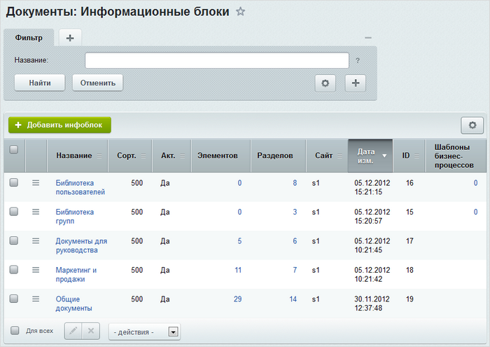
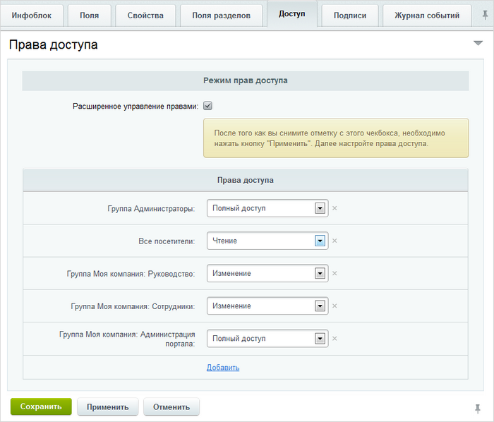
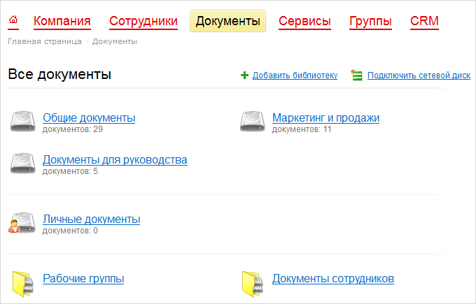
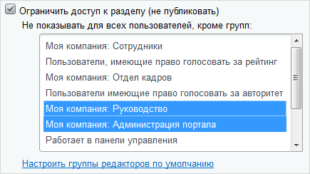
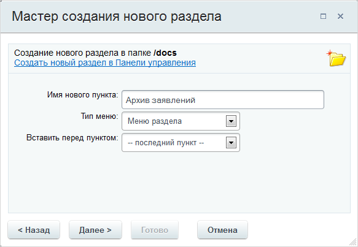
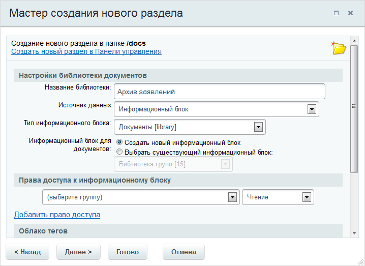
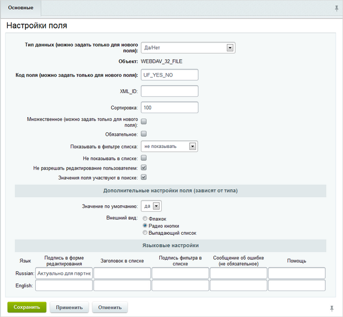
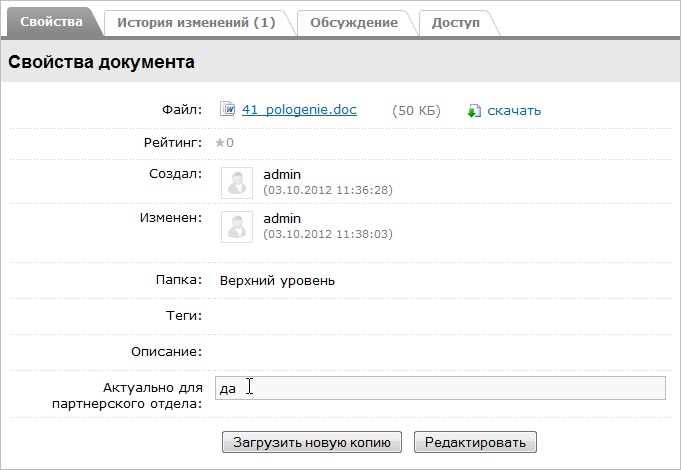
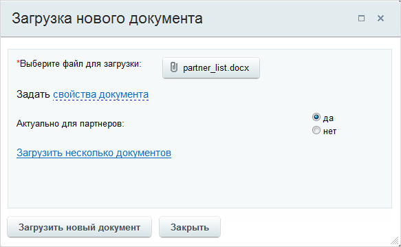

# Создание библиотек документов

**Навигация**
- [← Оглавление курса](index.md)
- [← Предыдущий: 3180 — Настройка модуля](lesson_3180.md)
- [Следующий: 3212 — Выставление прав доступа →](lesson_3212.md)

Официальная страница урока: https://dev.1c-bitrix.ru/learning/course/index.php?COURSE_ID=48&LESSON_ID=2670

### Создание библиотеки в административном разделе

С помощью средств модулей **Библиотека документов** и **Информационные блоки** в продукте реализована возможность работы с библиотекой документов компании.

Для организации библиотеки должен быть [создан тип инфоблока](http://dev.1c-bitrix.ru/learning/course/index.php?COURSE_ID=48&CHAPTER_ID=890), например **Документы**, а для всех видов библиотек портала - соответствующие инфоблоки.

Например:

- инфоблок **Библиотека групп** для файлов рабочих групп (закладка **Файлы** на странице рабочей группы);
- инфоблок **Библиотека пользователей** для организаций персональных файловых хранилищ (закладка **Файлы** на личной странице);
- инфоблок **Документы для руководства** для файлов руководящего состава;
- инфоблок **Маркетинг и продажи** для хранения документов отдела маркетинга;
- инфоблок **Общие документы** для коллективной библиотеки документов групп пользователей.

**Примечание**: при создании инфоблока особое внимание уделите закладке

			**Доступ**

                    

		, на которой задаются права доступа групп пользователей к инфоблоку (в данном случае,  к инфоблоку **Общие документы**):

Например, изменять документы общей библиотеки могут только пользователи группы **Руководство** и **Сотрудники**, полный доступ имеют группы **Администраторы** и **Администрация портала**, а для остальных пользователей доступен только просмотр документов.

В публичной части портала закрытые для просмотра пользователю библиотеки будут не видны.

Внешнее представление и управление библиотеками документов в публичном разделе можно осуществить с помощью комплексного компонента **Библиотека (bitrix:webdav)**.
Разместите компонент на странице, в настройках в качестве источника выберите **Информационный блок** и укажите тип инфоблоков и инфоблок, в котором будут храниться файлы (например, **Документы** и **Общие документы** соответственно).

### Создание библиотеки средствами портала

Когда создан публичный интерфейс работы с документами, то всю работу по добавлению новых библиотек документов удобно выполнять с помощью средств публичного раздела портала. В главном меню перейдите в раздел с документами:

На корпоративном портале по способу доступа изначально есть три вида документов:

- общие документы (доступные всем);
- документы рабочих групп (доступные участникам групп);
- личные документы (доступные одному человеку).

Можно создать библиотеку документов с доступом для любых выбранных вами людей.

Нажмите ссылку **Добавить библиотеку**, откроется окно мастера:

- Укажите заголовок раздела, он будет отображаться как пункт меню раздела **Документы** на портале. Если вы не хотите, чтобы заголовок раздела был виден как пункт меню, снимите галочку в опции **добавить пункт меню**.
- Если отключена генерация имени папки из названия раздела, то введите самостоятельно латинскими буквами имя папки для создания публичного интерфейса библиотеки. В этой папке будет создана индексная страница с размещенным на ней компонентом **Библиотека (bitrix:webdav)**.
  Если необходимо отредактировать индексную страницу, то отметьте соответствующую опцию.
- Если вы хотите ограничить доступ к создаваемому разделу для каких-либо групп сотрудников, отметьте галочкой опцию
  			**Ограничить доступ к разделу**
                      
  		, и в открывшемся списке выберите  группы, которым разрешен доступ (чтобы выбрать несколько групп, удерживайте нажатой клавишу **Ctrl**):
  Ссылка **Настроить группы редакторов по умолчанию** служит, чтобы перейти к настройкам модуля **Управление структурой** и указать каким группам сотрудников при создании файлов и папок автоматически устанавливать полный к ним доступ.

Нажмите кнопку **Далее**. Если вы не снимали галочку в опции **Добавить пункт меню**, то отобразится форма настройки отображения пункта меню:

Здесь вы можете изменить имя нового пункта, а также выбрать в каком меню его отображать и каким по очереди.

Нажмите **Далее** и вы попадете в форму настройки библиотеки документов:

Измените в случае необходимости имя библиотеки, выберите тип инфоблока и укажите, создавать новый, или использовать существующий инфоблок для хранения данных.

**Примечание**: если в качестве источника данных выбрать **Физическая папка на диске**, то некоторые поля будут убраны.

Здесь же вы можете настроить права доступа к библиотеке для групп сотрудников:

- **Чтение** - разрешается просмотр документов библиотеки.
- **Бизнес-процессы** - разрешается запускать бизнес-процессы с документами библиотеки.
- **Запись** - разрешается загружать документы.

Нажмите кнопку **Далее**, чтобы указать свойства раздела, а для создания библиотеки нажмите **Готово**.

### Настройка библиотеки документов

Со страницы библиотеки документов можно перейти к ее настройкам, нажав на контекстной панели кнопку **Еще** и выбрав пункт **Настройки**:

Откроется форма, на которой вы можете [задать права доступа](lesson_3212.md#infoblock) к инфоблоку, его участие в документообороте и бизнес-процессах, а также добавить пользовательские поля:

Пользовательские поля поддерживаются в общей библиотеке и библиотеках групп, но не в персональных хранилищах, и необходимы для указания каких-либо свойств или параметров загружаемых файлов.

Рассмотрим пример добавления пользовательского поля, в котором будет указываться актуальность загружаемого документа для партнерского отдела.

Нажмите ссылку **Добавить пользовательское поле**, откроется форма добавления:

Заполните поля в соответствии со скриншотом:

- в поле **Тип данных** выберите **Да/Нет**;
- введите код поля (**UF_YES_NO**);
- сделайте создаваемое поле необязательным для заполнения;
- запретите его редактирование пользователями.
  **Примечание:** если вы в дальнейшем измените данный параметр пользовательского поля, то изменение коснется всех загруженных ранее документов.
  **Примечание:** при разрешенном редактировании его можно произвести на закладке
  			свойств документа
                      
  		, выбрав **Свойства и описание** в меню действий документа:
- для возможности поиска по значениям создаваемого вами поля отметьте галочкой опцию **Значения поля участвуют в поиске**;
- в качестве внешнего вида выберите **Радио кнопки**;
- в языковых настройках введите то, как будет подписано данное поле при загрузке документа. В нашем случае это **Актуально для партнерского отдела**.

Об остальных полях формы вы можете прочитать в [пользовательской документации](/user_help/settings/settings/userfield_edit.php).

Нажмите **Сохранить** и поле будет добавлено в общий список, расположенный на странице административного раздела Настройки &gt; Настройки продукта &gt; Пользовательские поля. Теперь при загрузке каких-либо файлов в библиотеку документов на данном инфоблоке, ваше пользовательское поле будет

			доступно для заполнения

                    

		. Указанное значение будет отображаться в форме свойств документа (пункт **Свойства и описание** в меню действий документа).
