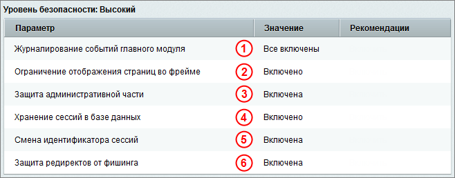
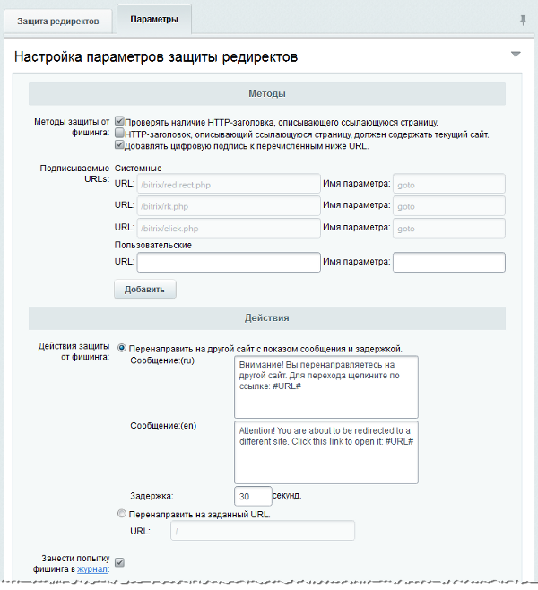

# Высокий уровень

**Навигация**
- [← Оглавление курса](index.md)
- [← Предыдущий: 2669 — Стандартный уровень](lesson_2669.md)
- [Следующий: 2674 — Повышенный уровень →](lesson_2674.md)

Официальная страница урока: https://dev.1c-bitrix.ru/learning/course/index.php?COURSE_ID=48&LESSON_ID=2673

|  | ### Высокий уровень |
| --- | --- |

Чтобы защита веб-проекта осуществлялась на высоком уровне безопасности, сначала необходимо настроить **стандартный уровень безопасности**, а затем выполнить настройку параметров для высокого уровня:

***** для быстрого перехода к описанию настройки нужного Вам параметра кликните по одной из ссылок ниже:

- 1 [Журналирование событий главного модуля](#events);
- 2 [Защита административной части](#admin);
- 3 [Хранение сессий в базе данных](#session);
- 4 [Смена идентификатора сессий](#session);
- 5 [Защита редиректов от фишинга](#redirect).
- 6 [Защита от фреймов](#security_frame).

**Внимание:** если некоторые параметры высокого уровня безопасности принимают несоответствующие значения, то защита сайта будет осуществляться на **стандартном** или **начальном** (если настроены не все параметры стандартного уровня) уровне, но с учетом настроенных параметров на стандартном, высоком и повышенном уровнях.

### 1 Журналирование событий главного модуля

Параметр **Журналирование событий главного модуля** подразумевает целый ряд настроек **Главного модуля** (Настройки &gt; Настройки продукта &gt; Настройки модулей &gt; Главный модуль):

Чтобы защита сайта велась на высоком уровне, должны быть отмечены **все** опции секции **События для записи в журнал**. Даже если не будет отмечена только одна опция, то считается, что параметр **Журналирование событий главного модуля** принимает несоответствующее значение, и защита сайта будет осуществляться на стандартном (или начальном) уровне безопасности.

### 2 Защита административной части

Защита административной части сайта осуществляется с помощью ограничения доступа со всех, кроме указанных в настройках IP-адресов. Включение или отключение защиты выполняется на странице **Защита административного раздела** (Настройки &gt; Проактивная защита &gt; Защита административного раздела) с помощью кнопки **Включить защиту** (или **Выключить защиту**).

**Внимание:** перед включением защиты административной части необходимо внести в список **IP-адреса и диапазоны, с которых разрешен доступ к административной части** свой IP-адрес и

			дополнительные адреса

Например, при работе с сайтами через **Контроллер:**

если на управляющем сайте включена **Защита административной части**, то не забудьте внести IP подчиненного сайта в список разрешенных, иначе при работе с подчиненным сайтом через контроллер может возникнуть ошибка **Ответ контроллера подписан некорректно**.

[Подробнее](lesson_2886.md)...

		 (или диапазоны), с которых разрешен доступ.

Снять уже установленное ограничение по IP-адресам можно посредством создания специального файла, путь к которому задается в

			настройках

		 модуля **Проактивная защита**. По умолчанию файл имеет имя следующего формата: **ipcheck_disable_&lt;случайный_набор_из_32_символов&gt;**.

### 3 , 4 Хранение сессий и смена идентификатора

**Сессия пользователя** – это ключевой объект атаки на веб-сайт с целью похищения сессии авторизованного пользователя и в особенности администратора. В базовой поставке продукта защита сессий настраивается в политике безопасности каждой группы пользователей с помощью параметров:

- Время жизни сессии (минут);
- Маска сети для привязки сессии.

Но такие строгие настройки не всегда получается ввести, например в силу того, что пользователи могут работать с разных IP-адресов. Модуль **Проактивная защита** позволяет выполнить защиту сессий с помощью следующих инструментов:

- хранение сессий в базе данных модуля безопасности;
- смена идентификатора сессий через указанное время.

Включение (или отключение) механизма хранения данных сессий пользователей в базе данных выполняется в файле

			`bitrix/.settings.php`

                    Ядро поддерживает четыре варианта для хранения (файлы, redis, database, memcache) данных сессии. Способ хранения описывается в bitrix/.settings.php в секции 'session'.

[Подробнее ...](https://dev.1c-bitrix.ru/learning/course/index.php?COURSE_ID=43&LESSON_ID=14026)

		.

Хранение данных сессий в таблице модуля **Проактивная защита** позволяет избежать чтения этих данных через скрипты других виртуальных серверов, исключив ошибки конфигурирования виртуального хостинга, ошибки настройки прав доступа во временных каталогах и ряд других проблем настройки операционной среды. Кроме того, это разгружает файловую систему, перенося нагрузку на сервер базы данных.

**Внимание!** При переключении режима хранения сессий все пользователи потеряют авторизацию (данные сессий будут уничтожены).

**Примечание**: допустимо хранение сессий в

			memcached

Для включения хранения сессий в memcached необходимо в файле /bitrix/php_interface/dbconn.php установить определенные константы..

[Подробнее](https://dev.1c-bitrix.ru/learning/course/index.php?COURSE_ID=43&LESSON_ID=2465)...

		.

Настройка механизма смены идентификатора сессий выполняется на закладке **Смена идентификатора** формы настройки защиты сессий.

Чтобы выполнялась смена идентификатора, необходимо:

- указать **Время жизни идентификатора, в секундах**, т.е. через какой промежуток времени будет изменяться идентификатор сессий;
- нажать кнопку **Включить смену идентификатора**.

Смена идентификатора создает дополнительную нагрузку на сервер, но позволяет сделать похищение авторизованной сессии неэффективным.

**Примечание:** Хранение сессий также рекомендуется при конфигурации с несколькими веб-серверами

			веб-кластера

По умолчанию данные о сессиях пользователей хранятся в файловой системе сервера. Информацию об этом можно увидеть на странице
**Хранение сессий в базе данных** (Настройки &gt; Веб-кластер &gt; Сессии).

[Подробнее](https://dev.1c-bitrix.ru/learning/course/index.php?COURSE_ID=35&CHAPTER_ID=04750&LESSON_PATH=3906.6663.4750)...

[/learning/course/index.php?COURSE_ID=41&LESSON_ID=2728](lesson_2728.md).

### 5 Защита редиректов от фишинга

Фишинг

**Фишинг**  (англ. phishing, от password — "пароль" и fishing — "рыбная ловля, выуживание") - вид интернет-мошенничества, целью которого является получение доступа к конфиденциальным данным пользователей (например, логинам и паролям).

		 основан на незнании пользователями основ сетевой безопасности. Они воспринимают просьбы от якобы используемого ими сервиса сообщить свои учетные данные, пароль и др. как вполне легальные.

Такая мера получения несанкционированного доступа характерна для проектов с большой посещаемостью и большим числом пользователей, когда есть вероятность, что в общей «толпе» окажется достаточное количество некомпетентных пользователей.

Включение или отключение защиты редиректов от фишинга выполняется на странице **Защита редиректов** (Настройки &gt; Проактивная защита &gt; Защита редиректов) с помощью

			кнопки

		 **Включить защиту редиректов от фишинга** (или **Выключить защиту редиректов от фишинга**).

Параметры защиты от фишинга настраиваются на закладке **Параметры**:

Защита редиректов от фишинга может осуществляться:

- Проверкой наличия HTTP-заголовка, описывающего страницу;
- Проверкой наличия в HTTP-заголовке записи о текущем сайте, который описывает ссылающуюся страницу;
- Добавлением цифровой подписи к ссылкам, генерируемым на сайте.

При включенной защите все системные ссылки обязательно подписываются дополнительным параметром индивидуальным для сайта и для этого перехода. Кроме того, можно защитить пользовательские ссылки перенаправлений, добавив их в поле **Подписываемые URLs** в секции **Пользовательские**(добавление полей ввода осуществляется с помощью кнопки **Добавить**).

Защита редиректов может выражаться одним из следующих действий:

- Перенаправлением на другой сайт с показом соответствующего сообщения и выполнением задержки на несколько секунд.
  Текст сообщения задается с помощью поля **Сообщение**, а период задержки пользователя – в поле **Задержка**.

или

- Перенаправлением на заведомо безопасный адрес, например, на главную страницу сайта.
  В этом случае необходимо задать адрес страницы сайта с помощью поля **URL**.

**Примечание:** Начиная с версии модуля 14.0.3, для страниц в публичной части сайта с сообщениями функционала "*Защита редиректов от фишинга*" и "*Проактивный фильтр*" добавлены теги `noindex` и `nofollow`.

**Примечание:** Начиная с версии модуля 20.0.0 cтраница защиты от редиректов отдает

			HTTP-статус

                    **Код состояния HTTP** (англ. HTTP status code) — часть первой строки ответа сервера при запросах по протоколу HTTP.
[Подробнее...](https://ru.wikipedia.org/wiki/%D0%A1%D0%BF%D0%B8%D1%81%D0%BE%D0%BA_%D0%BA%D0%BE%D0%B4%D0%BE%D0%B2_%D1%81%D0%BE%D1%81%D1%82%D0%BE%D1%8F%D0%BD%D0%B8%D1%8F_HTTP)

		  `404 Not Found`.

Для фиксирования попыток фишинга через редирект необходимо отметить опцию **Занести попытку фишинга в журнал**.

### 6 Защита от фреймов

Ограничение отображения страниц сайта во фреймах сторонних доменов позволяет защитить ресурс от Clickjacking'a (подсовывание невидимого фрейма с целевого ресурса для получения клика от пользователя), Framesniffing'а и существенно снижает риск проведения Cross-site scripting атак.

Включение или отключение ограничения отображения страниц сайта во фреймах на сторонних доменах

			осуществляется

		 на странице **Защита от фреймов** (Настройки &gt; Проактивная защита &gt; Защита от фреймов), закладка **Защита от фреймов**.

На закладке **Исключения** можно указать страницы, для которых настройки ограничения применяться не будут.

Страницы можно указать по маскам (например: `/bitrix/*` или `*/news/*`) как для всех сайтов, так и для конкретного.

|  | #### Документация по теме: |
| --- | --- |

- [Защита административного раздела](https://dev.1c-bitrix.ru/user_help/settings/security/security_iprule_admin.php)
- [Защита сессий](https://dev.1c-bitrix.ru/user_help/settings/security/security_session.php)
- [Защита редиректов](https://dev.1c-bitrix.ru/user_help/settings/security/security_redirect.php)
- [Защита от фреймов](https://dev.1c-bitrix.ru/user_help/settings/security/security_frame.php)
