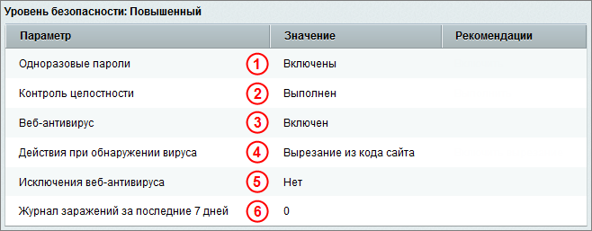
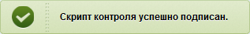
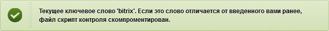

# Повышенный уровень

**Навигация**
- [← Оглавление курса](index.md)
- [← Предыдущий: 2673 — Высокий уровень](lesson_2673.md)
- [Следующий: 6686 — Система одноразовых паролей →](lesson_6686.md)

Официальная страница урока: https://dev.1c-bitrix.ru/learning/course/index.php?COURSE_ID=48&LESSON_ID=2674

|  | ### Повышенный уровень |
| --- | --- |

Чтобы защита веб-проекта осуществлялась на повышенном уровне безопасности, сначала необходимо настроить защиту на **стандартном** и **высоком** уровне, а затем настроить параметры повышенного уровня:

***** для быстрого перехода к описанию настройки нужного Вам параметра кликните по одной из ссылок ниже:

- 1 [Двухэтапная авторизация](#otp);
- 2 [Контроль целостности](#verifier);
- 3 **,** 4 **,** 5 **,** 6 [Веб-антивирус](#antivirus).

**Внимание:** если хотя бы один параметр повышенного уровня безопасности принимает несоответствующее значение, то защита сайта будет осуществляться на том уровне, который настроен полностью, но при этом будут учтены настройки параметров всех уровней.

<!-- &lt;h3&gt;&lt;a name="otp"&gt;&lt;/a&gt;Одноразовые пароли&lt;/h3&gt;
&lt;p&gt;Система одноразовых паролей дополняет стандартную систему авторизации, что значительно усиливает систему безопасности интернет-проекта. Для включения системы необходимо использовать аппаратное устройство (например, &lt;a href="https://www.aladdin-rd.ru/catalog/jacarta-webpass"&gt;JaCarta WebPass&lt;/a&gt;) или соответствующее программное обеспечение, реализующее &lt;b&gt;OTP&lt;/b&gt; (&lt;b&gt;One-Time Password&lt;/b&gt;). Использование системы одноразовых паролей настоятельно рекомендуется администраторам сайта для повышения уровня безопасности.&lt;/p&gt;

&lt;p&gt;Включение или отключение системы использования одноразовых паролей выполняется на странице &lt;b&gt;Одноразовые пароли&lt;/b&gt; (&lt;span class="path"&gt;Настройки &gt; Проактивная защита &gt; Одноразовые пароли&lt;/span&gt;) с помощью кнопки &lt;b&gt;Разрешить использование одноразовых паролей&lt;/b&gt; (или &lt;b&gt;Выключить использование одноразовых паролей&lt;/b&gt;).&lt;/p&gt;
  &lt;p&gt;&lt;img src="/images/admin_expert/security/otp.png"&gt;&lt;/p&gt;

&lt;p&gt;Если использование одноразовых паролей включено, то в форме редактирования параметров пользователя (&lt;span class="path"&gt;Настройки &gt; Пользователи &gt; Список пользователей&lt;/span&gt;) появляется дополнительная закладка &lt;b&gt;Одноразовые пароли&lt;/b&gt;, т.е. механизм использования одноразового пароля настраивается отдельно для каждого пользователя.&lt;/p&gt;
  &lt;p&gt;&lt;img src="/images/admin_expert/security/user_otp_sm.png"&gt;&lt;/p&gt;

&lt;p&gt;Чтобы аутентификация пользователя выполнялась с использованием одноразовых паролей, выполните следующие действия: &lt;/p&gt;
&lt;ul class="fa fa-circle sz-sm"&gt;
  &lt;li&gt;Отметьте опцию &lt;b&gt;Включить составной пароль&lt;/b&gt;.&lt;/li&gt;
  &lt;li&gt;В поле &lt;b&gt;Секретный ключ&lt;/b&gt; введите секретный ключ, который поставляется вместе с устройством OTP.&lt;/li&gt;
  &lt;li&gt;Выполните инициализацию устройства, т.е. введите два последовательно сгенерированных одноразовых паролей, полученных с устройства (например, 111111 и 222222).&lt;/li&gt;
  &lt;li&gt;Сохраните внесенные изменения.&lt;/li&gt;
&lt;/ul&gt;

&lt;p&gt;Теперь пользователь сможет авторизоваться только с использованием логина и составного пароля, состоящего из своего пароля и одноразового пароля устройства. Одноразовый пароль (см. 2 на рисунке ниже) вводится в поле &lt;b&gt;Пароль&lt;/b&gt; стандартной формы авторизации на сайте сразу после обычного пароля (см. 1 на рисунке ниже) без пробелов.&lt;/p&gt;
  &lt;p&gt;&lt;img src="/images/admin_expert/security/auth_form.png"&gt;&lt;/p&gt;

&lt;p&gt;Система авторизации с использованием одноразовых паролей разработана в рамках инициативы &lt;a href="https://openauthentication.org/"&gt;OATH&lt;/a&gt;. Реализация основана на алгоритме HMAC и хэш-функции SHA-1. Для расчета значения OTP принимаются два входных параметра - секретный ключ (начальное значение для генератора) и текущее значение счетчика (количество необходимых циклов генерации). Начальное значение хранится как в самом устройстве, так и на сайте после инициализации устройства. Счетчик в устройстве увеличивается при каждой генерации OTP, на сервере - при каждой удачной аутентификации по OTP. &lt;/p&gt;
&lt;p&gt;Таким образом, если на устройстве была нажата кнопка несколько раз (например, случайно), но не было выполнено ни одной удачной аутентификации по OTP, то при превышении числа нажатий значения, заданного в параметре &lt;b&gt;Размер окна проверки паролей&lt;/b&gt;, произойдет нарушение синхронизации счетчика генерации, и пользователь не сможет выполнить вход на сайт.&lt;/p&gt;
  &lt;p&gt;&lt;img src="/images/admin_expert/security/otp_params.png"&gt;&lt;/p&gt;

&lt;p&gt;В этом случае необходимо выполнить повторную синхронизацию пользователя с устройством – привести значение на сервере в соответствие значению, хранящемуся в устройстве. Для этого администратор системы или сам пользователь (при наличии соответствующих разрешений) должен сгенерировать два последовательных значения одноразовых паролей и ввести их в форму редактирования параметров пользователя.&lt;/p&gt;
&lt;p&gt;Чтобы избежать нарушений синхронизации, можно увеличить значение параметра &lt;b&gt;Размер окна проверки паролей&lt;/b&gt;, например, указать 100 или 1000.&lt;/p&gt;

&lt;p&gt;&lt;div class="hint"&gt;&lt;b&gt;Примечание&lt;/b&gt;: Кроме физических устройств для системы одноразовых паролей можно использовать программные средства. Существует разработанные компанией "1С-Битрикс" приложения для &lt;b&gt;Apple iOS&lt;/b&gt;, &lt;b&gt;Android OS&lt;/b&gt;. Подробнее про работу с ними смотрите в курсе &lt;a href="https://dev.1c-bitrix.ru/learning/course/index.php?COURSE_ID=34&LESSON_ID=1974" target="_blank"&gt;Контент-менеджер&lt;/a&gt;.&lt;/div&gt;&lt;/p&gt; -->

### 1 Двухэтапная авторизация

Двухэтапная авторизация позволяет дополнить стандартную систему авторизации и позволяет значительно усилить систему безопасности сайта.

При каждой авторизации пользователь должен дополнительно, помимо **логина** и **пароля** ввести **секретный код** со специального устройства или мобильного приложения, который каждый раз имеет новое значение. Такой подход исключает возможность несанкционированного доступа, в случае, например, кражи основного пароля.

Подробнее про механизм двухэтапной авторизации можно посмотреть в

			соответствующей главе

                    Система одноразовых паролей дополняет стандартную систему авторизации и позволяет значительно усилить систему безопасности продуктов *«1С-Битрикс»*.

При каждой авторизации пользователь получает новый секретный код, что исключает возможность его получения злоумышленниками. При включении системы OTP в продукте *«1C-Битрикс»* можно авторизоваться только с использованием дополнительного одноразового пароля.

[Подробнее](https://dev.1c-bitrix.ru/learning/course/index.php?COURSE_ID=35&CHAPTER_ID=05001&LESSON_PATH=3906.4829.4547.5001)...

		.

### 2 Контроль целостности

Форма, расположенная на странице **Контроль целостности** (Настройки &gt; Проактивная защита &gt; Контроль целостности), служит для выполнения проверки целостность ядра, системных областей, публичной части продукта.

Для защиты веб-проекта на повышенном уровне безопасности необходимо регулярно (примерно раз в неделю) выполнять проверку целостности системы. Кроме того, проверку целостности следует выполнять перед установкой обновлений системы, а после установки обновлений необходимо собрать новую информацию по файлам.

**Примечание:** некоторые обновления модуля могут потребовать переподписания скрипта контроля.

## Первый запуск проверки целостности

- Введите и запомните пароль, состоящий из латинских букв и цифр, длиной не менее 10 символов.
- Подтвердите его в поле **Пароль еще раз**.
- Задайте **Ключевое слово**, отличное от пароля, и запомните его.
- Нажмите кнопку **Далее**.

Если вы не ошиблись при подтверждении пароля, то отобразится сообщение об успешном подписании скрипта.

Теперь можно приступать к сбору информации по файлам, чтобы в дальнейшем выполнить проверку целостности системы.

## Сбор информации по файлам

- На закладке **Выбор действия** отметьте опцию **Собрать информацию по файлам**:
- Нажмите кнопку **Далее**. Откроется форма сбора данных.
- Задайте параметры для сбора информации:

  - **Область сбора данных** – отметьте необходимые для обработки папки системы.
  - **Расширения файлов** – укажите расширения файлов, по которым должна быть собрана информация. Расширения файлов указываются через запятую без пробелов. По умолчанию информация собирается для файлов с расширениями **php, js, htaccess**.
  - **Пароль для шифрования** – введите и запомните пароль, который будет использоваться для шифрования и последующего дешифрования собранного верификационного файла.
  - **Время выполнения шага** – укажите количество секунд для выполнения одного шага сбора данных.
- Нажмите кнопку **Далее**. Начнется процесс сбора данных, по окончании которого в целях безопасности рекомендуется скачать файл с данными на локальный компьютер.

Файл с верификационными данными собран, теперь можно выполнить проверку целостности системы.

## Проверка целостности системы

При любом (кроме первого) запуске проверки целостности системы сначала проверяется сам скрипт контроля на наличие в нем изменений.

- Введите пароль, которым вы подписали скрипт контроля, и нажмите кнопку **Далее**.

В сообщении о результатах проверки скрипт должен указать кодовое слово, которое вы ввели в момент подписания.

**Примечание:** если вы не увидели своего кодового слова в сообщении о результатах проверки, то скрипт контроля целостности файлов скомпрометирован (т.е. он был изменен и его результатам доверять нельзя). В этом случае необходимо заменить скрипт контроля целостности системы (например, можно сделать откат до более ранней версии модуля).

- На закладке **Выбор действия** отметьте опцию **Проверить файлы**.
- Нажмите кнопку **Далее**. Откроется форма выбора файла с верификационными данными.
- Выберите один из лог-файлов, хранящихся в системе, либо загрузите лог-файл с вашего компьютера с помощью кнопки **Обзор**. Откроется форма проверки данных.
- В поле **Пароль для дешифрования** укажите пароль, который вы задавали при создании файла с верификационными данными.
- Укажите время выполнения одного шага проверки (чем меньше время выполнения одного шага, тем больше нагрузка на сервер).
- Нажмите кнопку **Далее**. Начнется процесс проверки целостности системы, по окончании которого будет выведен отчет:

### 3 , 4 , 5 , 6 Веб-антивирус

> **Веб-антивирус** - система противодействия заражениям сайтов. Веб-антивирус выявляет в html-коде потенциально опасные участки и "вырезает" подозрительные объекты из кода сайта, тем самым препятствуя проникновению вирусов на компьютер пользователя.

**Внимание!** веб-антивирус не является заменой обычного антивируса.

Включение или отключение веб-антивируса выполняется на странице **Веб-антивирус** (Настройки &gt; Проактивная защита &gt; Веб-антивирус) с помощью

			кнопки

		 **Включить веб-антивирус** (или **Выключить веб-антивирус**).

<!-- &lt;p&gt;&lt;div class="hint"&gt;&lt;b&gt;Примечание:&lt;/b&gt; чтобы защита сайта осуществлялась на повышенном уровне веб-антивирус должен быть включен.&lt;/div&gt;&lt;/p&gt; -->

По умолчанию веб-антивирус всегда включен. Отключая его, Вы снижаете контроль за безопасностью своего сайта. Несмотря на ограничения доступа из Всемирной сети, корпоративный проект можно инфицировать.

С целью уменьшения нагрузки на сервер веб-антивирус не проводит автоматически проверку с заданной периодичностью, а проверяет код непосредственно в момент его отдачи браузеру. Вирус будет обнаружен именно в этот момент, а уведомления об обнаруженном вирусе администратор сайта будет получать в интервале, заданном в настройках веб-антивируса. Прежде всего настройте периодичность оповещения и параметры реакции антивируса на обнаруженный подозрительный код.

Перейдите на страницу Настройки &gt; Проактивная защита &gt; Веб-антивирус, на вкладку

			Параметры.

		  Откроется форма настройки параметров реагирования на угрозы.

В поле **Интервал оповещения (минуты)** можно изменить периодичность уведомления администратора при обнаружении модулем вируса. Значение можно оставить по умолчанию.

Вне зависимости от выбранного режима работы (только **Оповестить** или **Вырезать**) пользователь не получает сообщения. Но в первом случае система выдает посетителю сайта вместе с кодом запрошенной страницы код подозрительного объекта (и компьютер сотрудника тоже может заразиться вирусом). Во втором случае подозрительный код вырезается из отдаваемой пользователю страницы. В любом случае администратор получает уведомление (на почту и в **Журнал вторжений**).

**Примечание**: Строго говоря, вирус не присутствует на сайте. На сайте есть ссылка на связку скриптов и вирус, которыми заражаются посетители проекта. Заражение может реализоваться двумя способами:

- **Первый**: на каком-либо сайте выставляется ссылка на вирус. Задача вируса — заразить посетителей. Если этот сайт посещает некоторый человек с устаревшим браузером, то связка скриптов (эксплоитов) "пробивает" браузер и заражает ПК посетителя. Компьютер посетителя пополняет армию
  ботов в какой-нибудь зомби-сети.
- **Второй**: на этот сайт заходит не просто посетитель, а администратор другого сайта и тоже заражается. В этом случае вирус не просто пополняет зараженным компьютером армию ботов, а находит на компьютере сохраненные пароли от серверов, обслуживаемых этим администратором. Пароли передаются автору вируса, который заходит на сайты с помощью похищенных паролей и добавляет на них ссылки на свой вирус.

С полем **Действия** при обнаружении вируса нужно быть внимательными. Проблема заключается в том, что любая система может допускать ложные срабатывания. Количество ложных срабатываний веб-антивируса минимально, но, к сожалению, они все же встречаются. Иными словами, если вы выберете параметр **Вырезать** из кода сайта, то в случае ошибки можете нанести ущерб самим себе.

## Как отличить ошибку от ложного срабатывания?

Работа веб-антивируса основана на эвристическом анализе потенциально опасных блоков в HTML-коде. В целом распознавание "вирусных" и легитимных блоков может быть сложной задачей даже для человека, а не только для программы.

Ключевое отличие блоков, действительно содержащих ссылки на вирусы, от ложных срабатываний — это то, что ошибочно принятые за вирус блоки были явно добавлены вашим программистом. Кто добавил "вирусные" блоки и откуда они взялись, вы не знаете.

Если вы уверены, что блок, на который срабатывает веб-антивирус, легитимный и не содержит ссылки на загрузку вирусов, то данное срабатывание антивируса является ложным. В этом случае вам необходимо взять некоторую строку из этого блока (достаточно длинную и достаточно уникальную) и добавить ее в исключения веб-антивируса на одноименной вкладке страницы **Веб-антивирус**. В результате антивирус перестанет срабатывать на любые обрабатываемые им блоки, содержащие указанную строку.

Маска исключений должна быть достаточно уникальной, но при этом покрывать все блоки данного типа (если они генерируются динамически). Вероятность того, что при добавлении достаточно длинной строки (содержащей, например, имена нормальных переменных или функций из корректного блока) случайно будет разрешен вирус, невелика.

Если срабатывание антивируса не ложное, то все будет намного сложнее. Удалить обнаруженный код — дело несложное. Нужно понять, как он оказался на вашем сайте. Почти со стопроцентной уверенностью можно утверждать, что "вирусный" блок был помещен злоумышленником с помощью пароля, похищенного через компьютер какого-либо сотрудника, имеющего доступ на сервер через **FTP** (**SSH**, **SFTP** и т. п.). Этот компьютер заражен вирусом, укравшим пароль от сервера.

## При обнаружении вируса на сайте

- необходимо проверить все компьютеры людей, имеющих доступ к сайту (в том числе к **Панели администрирования**), с помощью персонального антивирусного программного обеспечения;
- после того как все такие компьютеры были вылечены, нужно сменить все пароли от вашего сервера всем пользователям;
- только после этого можно вычищать весь сторонний код на сервере. При вычищении кода обратите внимание на сроки обнаружения заражения и сроки создания резервной копии (бэкапа) сайта. Если по каким-то причинам резервное копирование делалось после даты заражения, бэкапом пользоваться нельзя.

Для отслеживания изменившихся файлов рекомендуется использовать инструмент **Контроль целостности**. Если же вы не используете данный инструмент, то в общем случае поиск всех изменений, оставленных хакером, может быть таким:

- поиск по всем файлам на сервере, содержащем строки из блока, на который сработал веб-антивирус;
- поиск и ручная проверка всех недавно изменившихся файлов;
- анализ логов HTTP-сервера.

При этом остается надеяться, что хакер оказался не слишком хитрым, ограничился внедрением JavaScript со ссылками на вирус и не оставил за собой скрытых бэкдоров (что, в общем-то, бывает достаточно редко).

**Примечание:** для детектирования вирусов, внедренных до старта буферизации вывода, необходимо задать

- либо в **php.ini**:
- или в файле **.htaccess**:

<!-- &lt;p&gt;Действия системы, выполняемые при обнаружении вируса, задаются на закладке &lt;b&gt;Параметры&lt;/b&gt;:&lt;/p&gt;
  &lt;p&gt;&lt;img src="/images/admin_expert/security/web_antivirus_params.png" alt="Настройка параметров оповещения о заражении" border="0" height="223" width="593"&gt;&lt;/p&gt;

&lt;ul class="fa fa-circle sz-sm"&gt;
  &lt;li&gt;&lt;b&gt;Вырезать из кода сайта&lt;/b&gt; - опасные данные будут вырезаны из кода сайта;&lt;/li&gt;
  &lt;li&gt;&lt;b&gt;Только занести в журнал и оповестить администратора&lt;/b&gt; - запись об обнаружении вируса будет занесена в &lt;b&gt;Журнал событий&lt;/b&gt;. Администратору будут посылаться оповещения по e-mail через интервал времени, заданный в поле &lt;b&gt;Интервал времени&lt;/b&gt;.&lt;/li&gt;
&lt;/ul&gt;
&lt;p&gt;Закладка &lt;b&gt;Исключения&lt;/b&gt; позволяет настроить исключения для веб-антивируса, т.е. веб-антивирус не будет применяться к блокам html-кода, указанным на данной закладке.&lt;/p&gt;
  &lt;p&gt;&lt;img src="/images/admin_expert/security/web_antivirus_exept.png" alt="Настройка параметров оповещения о заражении" border="0" height="219" width="593"&gt;&lt;/p&gt; -->

|  | #### Документация по теме: |
| --- | --- |

- [Веб-антивирус](https://dev.1c-bitrix.ru/user_help/settings/security/security_antivirus.php)
- [Двухэтапная авторизация](https://dev.1c-bitrix.ru/user_help/settings/security/security_otp.php)
- [Контроль целостности](https://dev.1c-bitrix.ru/user_help/settings/security/security_file_verifier.php)
