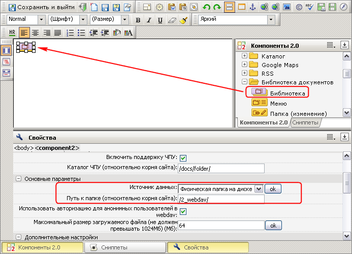
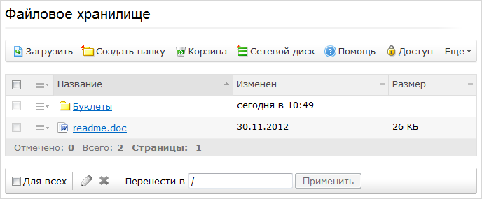

# Файловое хранилище

**Навигация**
- [← Оглавление курса](index.md)
- [← Предыдущий: 20446 — Поиск PDF документов](lesson_20446.md)
- [Следующий: 4678 — Настройка модуля Бизнес-процессы →](lesson_4678.md)

Официальная страница урока: https://dev.1c-bitrix.ru/learning/course/index.php?COURSE_ID=48&LESSON_ID=2679

**Внимание!** Модуль **Библиотека документов** устарел. С версии КП 15.0 мы рекомендуем использовать модуль [Битрикс24.Диск](https://dev.1c-bitrix.ru/learning/course/index.php?COURSE_ID=48&CHAPTER_ID=02746&LESSON_PATH=3918.4635.2746).

Функционал модуля **Библиотека документов** позволяет организовать на портале файловое хранилище, т.е. к порталу может быть подключена некоторая физическая папка с имеющимися в ней файлами и документами.

**Чем файловое хранилище отличается от библиотеки документов**

Файловое хранилище позволяет подключить существующий архив документации, получив готовый Web-интерфейс доступа к архиву.

Библиотека документов на инфоблоках обладает очень широким функционалом. Например: комментирование документов, разграничение доступа для отдельных отделов, рабочих групп и даже отдельных пользователей к папкам и даже к отдельным документам, история версий при изменении документов (можно просмотреть, откатиться на любую из предыдущих версий), возможность использовать гибкий и очень мощный функционал бизнес-процессов. И многое другое. Разумеется, с дополнительным функционалом библиотека менее производительна.

Подключение физической папки к порталу и организация интерфейса для работы с ней выполняется с помощью комплексного компонента **Библиотека** (**bitrix:webdav**).

**Внимание!** Начиная с версии КП 15.0 компоненты модуля **Библиотека документов** отключены. Мы рекомендуем использовать REST-методы, доступные при работе с [Диском](https://dev.1c-bitrix.ru/rest_help/disk/index.php).

При размещении компонента на странице в его настройках следует в качестве источника данных указать **Физическая папка на диске** и задать относительно корня сайта путь к необходимой папке:

Также следует поставить галочку в опции **Включить поддержку ЧПУ**, а в поле **Каталог ЧПУ (относительно корня сайта)** необходимо ввести путь к папке с публичным интерфейсом относительно корня сайта.

В результате к порталу будет подключена указанная папка и все ее содержимое будет доступно в рамках библиотеки документов портала:

Работа с файлами и подпапками данной папки возможна как с помощью средств портала, так и традиционными средствами операционной системы.

**Примечание**: в библиотеке документов на основе физической папки **отсутствует** документооборот/бизнес-процессы, а также недоступен просмотр и изменение некоторых свойств файла.
