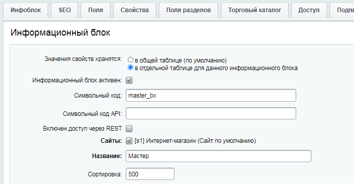
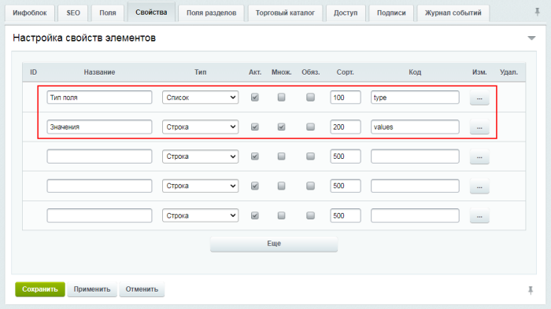
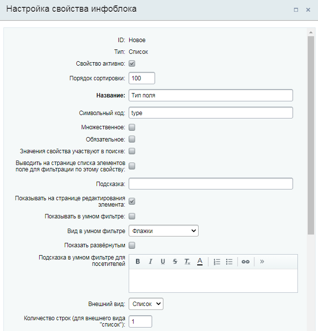
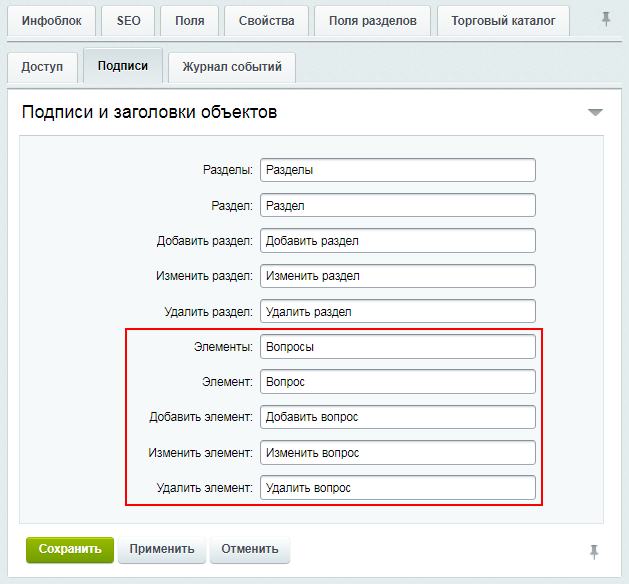
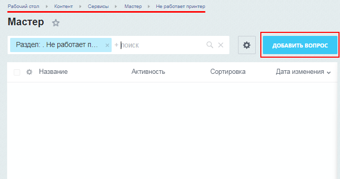

# Создание мастера

**Навигация**
- [← Оглавление курса](index.md)
- [← Предыдущий: 9109 — Настройки модуля Техподдержка](lesson_9109.md)
- [Следующий: 2619 — Справочники →](lesson_2619.md)

Официальная страница урока: https://dev.1c-bitrix.ru/learning/course/index.php?COURSE_ID=48&LESSON_ID=2686

### Создание инфоблока

С помощью средств модуля **Информационные блоки** в продукте реализована возможность создания мастера техподдержки.

Для этого необходимо создать тип инфоблока и инфоблок, в котором будут храниться вопросы мастера.

Рассмотрим подробнее процесс создания необходимого инфоблока:

1. Сначала создайте новый
  			тип инфоблоков
  Вам предстоит работа с новым видом информации? Создайте под него свой тип инфоблоков.
  [Подробнее](https://dev.1c-bitrix.ru/learning/course/index.php?COURSE_ID=34&LESSON_ID=2010)...
  		 (например, **Сервисы**):
  
2. Далее создайте
  			инфоблок
  Откройте страницу Контент &gt; Инфоблоки &gt; Типы инфоблоков &gt; название_типа, где вместо *название_типа* у вас отображается реальное название нужного типа инфоблоков (учтите, что после создания инфоблока его тип уже нельзя будет поменять).
  [Подробнее](https://dev.1c-bitrix.ru/learning/course/index.php?COURSE_ID=34&LESSON_ID=4534)...
  		 (например,
  			Мастер
  
  		).
  Добавьте
  			свойства элементов
  Согласитесь, что посетителям сайта приятнее читать статьи, где указан автор и добавлены фотографии. Выбирать товары в интернет-магазине удобнее, если приведены их характеристики. Создавайте в инфоблоке свойства и храните информацию в элементах наиболее полно.
  [Подробнее](https://dev.1c-bitrix.ru/learning/course/index.php?COURSE_ID=34&LESSON_ID=9407)...
  		 инфоблока: **Тип поля** и **Значения**:
  
  ## Посмотреть полные настройки свойства Тип поля
  
  
  ## Посмотреть полные настройки свойства Значения
  
  Во вкладке
  			Подписи
  
  		 можно для удобства переопределить слово *Элемент*, заменив его на слово *Вопрос* (чтобы вместо фразы *Добавить элемент* отображалось *Добавить вопрос* и т.п.).

### Создание вопросов мастера

Перейдите в созданный инфоблок (Контент &gt; Сервисы &gt; Мастер).

Первый шаг мастера - указание причины обращения в техподдержку. Для создания такой причины нажмите кнопку

			Добавить раздел

		, расположенную на контекстной панели. Причина обращения в техподдержку прописывается в поле **Название**:

**Примечание**: Количество разделов, подразделов каждого раздела зависит от конкретного вопроса. Таким образом, количество шагов мастера создания обращения зависит от вложенности разделов (разделы могут иметь разный уровень вложенности). В нашем примере всего один уровень вложенности, поэтому в мастере будет два шага: первый шаг - выбор причины обращения в техподдержку, второй шаг - ответ на вопросы.

Перейдите в созданный раздел. Для создания поясняющих вопросов нажмите кнопку

			Добавить вопрос

		, расположенную на контекстной панели. В открывшейся форме обязательно заполните поле **Название**, выберите **Тип поля** (например, **выпадающий список**) и укажите возможные значения поля:

В результате на странице

			Мастер

		 (Контент &gt; Сервисы &gt; Мастер) будут содержаться пункты созданных шагов мастера.

При переходе по любой из ссылок отобразятся

			вопросы

		 для детального описания проблемы.

### Отображение в публичной части

Посмотрим, как будет выглядеть в публичном разделе создание обращения через мастер (

			публичный интерфейс

Создание интерфейса техподдержки в публичном разделе сайта или коробочной версии Битрикс24 выполняется посредством размещения компонентов модуля **Техподдержка** на страницах сайта.

[Подробнее](lesson_2641.md)...

		 создан с помощью компонента

			Техподдержка с мастером

						[Описание компонента «Техподдержка с мастером (комплексный компонент)» в пользовательской документации.](http://dev.1c-bitrix.ru/user_help/detail.php?ID=136599)

		):

<!-- &lt;iframe title="Пример работы Техподдержки с мастером" src="//www.youtube.com/embed/TlJCs0tBOG0?feature=oembed&rel=0" allowfullscreen="" width="853" height="480" frameborder="0"&gt;
	 
	&lt;/iframe&gt; -->
