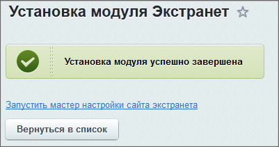
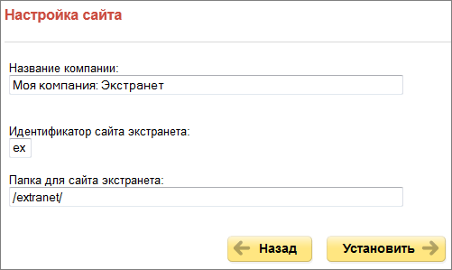
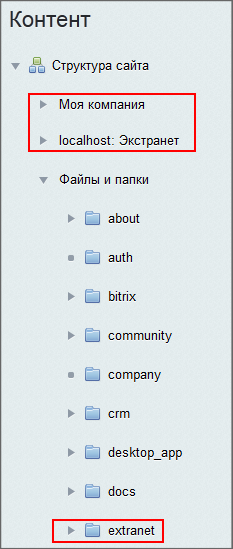
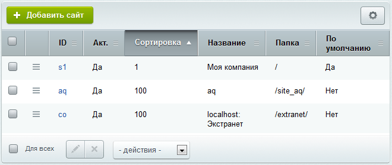

# Установка модуля и настройка сайта экстранета

**Навигация**
- [← Оглавление курса](index.md)
- [← Предыдущий: 8399 — Настройки](lesson_8399.md)
- [Следующий: 2714 — Настройки модуля →](lesson_2714.md)

Официальная страница урока: https://dev.1c-bitrix.ru/learning/course/index.php?COURSE_ID=48&LESSON_ID=2710

### Установка модуля

При установке продукта *«Битрикс24 в коробке»* выполняется автоматическая установка модуля **Экстранет**. Администратору нужно только пройти **Мастер настройки сайта экстранета**. Если в силу каких-то причин (например, переход с младшей редакции на старшую) модуль не был установлен, то для установки модуля перейдите на страницу **Управление модулями** (Настройки &gt; Настройки продукта &gt; Модули).

Найдите в общем списке модуль **Экстранет** и нажмите на кнопку **Установить**. По окончании установки будет выведено соответствующее сообщение и ссылка для запуска мастера настройки сайта экстранета:

### Мастер настройки сайта экстранета

**Примечание**: Кроме описанного ниже способа настройки сайта экстранета в общем списке мастеров доступен мастер настройки сайта экстранета (Настройки &gt; Настройки продукта &gt; Список мастеров).

Выполните запуск мастера. Первый шаг мастера информирует о начале процесса установки и выводит основную информацию о мастере. Нажмите кнопку **Далее**.

На последующих двух шагах выберите дизайн сайта и цветовую схему. Нажмите кнопку **Далее**.

На следующем шаге выполняется настройка основных параметров сайта экстранета.

- **Название компании** - введите название компании или фразу, которая будет отображаться на сайте экстранета.
- **Идентификатор сайта экстранета** - двухсимвольный код сайта на латинице (первым символом обязательно должна быть буква).
- **Папка для сайта экстранета** - имя папки, в которой будет размещен сайт экстранета.

Нажмите кнопку **Установить**. Начнется процесс установки и настройки данных сайта экстранета.

По окончании процесса установки система автоматически перейдет к последнему шагу, уведомляющему об успешном окончании работы мастера настройки сайта экстранета. Для выхода из мастера служит кнопка **Вернуться на портал**.

**Примечание.** Идеология работы с Экстранетом не требует перехода на него как на отдельный сайт. Все работы сотрудники компании (пользователи корпоративного портала) могут выполнять из самого корпоративного портала. Если по каким-то причинам потребовался переход на сайт Экстранета, то для этого достаточно дописать в адресной строке: /extranet. Собственно в Экстранете работают только приглашённые со стороны на корпортал пользователи.

Перейдя в административный раздел, вы можете убедиться, что экстранет реализуется на основе многосайтовости

			первого типа

                    

		. На странице Список сайтов (Настройки &gt; Настройки продукта &gt; Сайты &gt; Список сайтов) сайт Экстранета также

			отображается

                    

		.

Кроме того, в процессе работы мастера создаются все необходимые объекты сайта экстранета: информационные блоки, форумы и группа блогов для блогов пользователей экстранета.

**Примечание.** Дополнительная информация по структуре сайта экстранета представлена в [Поддержке24](https://helpdesk.bitrix24.ru/open/7215253/).
