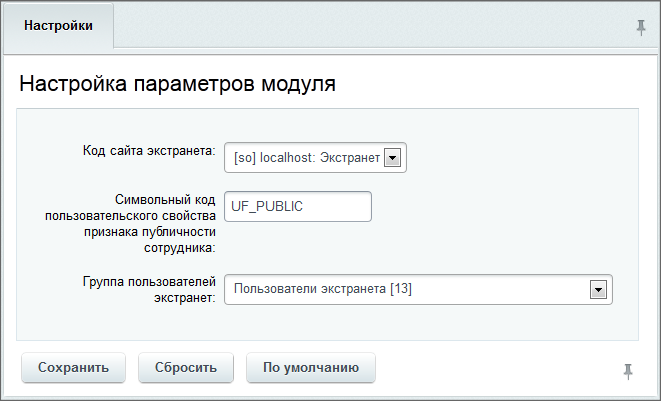

# Настройки модуля

**Навигация**
- [← Оглавление курса](index.md)
- [← Предыдущий: 2710 — Установка модуля и настройка сайта экстранета](lesson_2710.md)
- [Следующий: 2727 — Права доступа пользователей экстранета →](lesson_2727.md)

Официальная страница урока: https://dev.1c-bitrix.ru/learning/course/index.php?COURSE_ID=48&LESSON_ID=2714

Настройка параметров модуля производится автоматически в процессе работы мастера настройки сайта экстранета. Впоследствии изменять значение параметров не рекомендуется.

Исключением является случай, если администратор системы самостоятельно настраивает сайт экстранета без помощи мастера. При этом данные сайта экстранета необходимо указать в настройках модуля **Экстранет** (Настройки &gt; Настройки продукта &gt; Настройки модулей &gt; Экстранет):

- **Код сайта экстранета** - из созданных в системе сайтов выбирается сайт, который будет являться сайтом экстранета.
- **Символьный код пользовательского свойства признака публичности сотрудника** - задается код пользовательского свойства для признака публичности сотрудника.
- **Группа пользователей экстранет** - выбирается группа, пользователи которой будут являться пользователями сайта экстранета.

**Важно!** Пользовательское [свойство публичности](lesson_2724.md) сотрудника и [группа пользователей](lesson_2727.md), обладающая доступом к экстранету, должны быть созданы предварительно.
