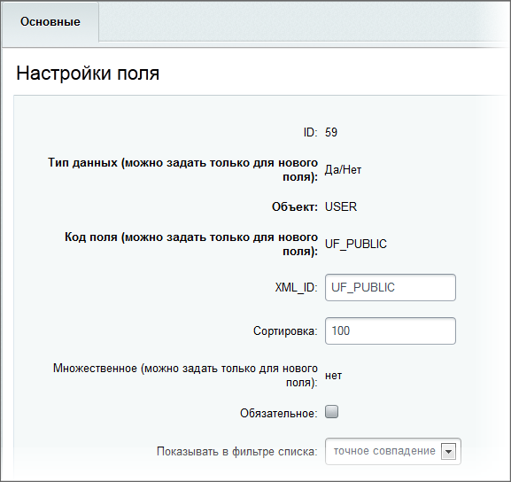

# Публичный сотрудник

**Навигация**
- [← Оглавление курса](index.md)
- [← Предыдущий: 2727 — Права доступа пользователей экстранета](lesson_2727.md)
- [Следующий: 11527 — Возможности модуля →](lesson_11527.md)

Официальная страница урока: https://dev.1c-bitrix.ru/learning/course/index.php?COURSE_ID=48&LESSON_ID=2724

Для сайта экстранета вводится понятие **публичный сотрудник**, которое отсутствует на корпоративном портале.

> **Публичный сотрудник** - это обязательно сотрудник компании, обладающий свойством публичности на сайте экстранета, т.е данный сотрудник всегда доступен для общения и включения в любую рабочую группу экстранета.

Если сайт экстранета был настроен с помощью мастера, то свойство публичности **UF_PUBLIC** было создано в процессе его работы. В противном случае необходимо перейти на страницу **Пользовательские поля** (Настройки &gt; Настройки продукта &gt; Пользовательские поля) и создать данное свойство:

**Примечание**: при деинсталляции и повторной установке модуля данное свойство остается в прежнем виде.

Чтобы некоторого пользователя назначить публичным сотрудником экстранета, необходимо выполнить следующие действия:

- Перейдите на страницу **Список пользователей** (Настройки &gt; Пользователи &gt; Список пользователей).
- Откройте форму редактирования необходимого пользователя и перейдите на закладку **Дополнительно**.
- Отметьте опцию **Публичный сотрудник**.
- Сохраните внесенные изменения.

В результате пользователям экстранета всегда будет доступен публичный сотрудник.

<!-- УСТАРЕЛА ИНФОРМАЦИЯ, такого гаджета уже нет

&lt;p&gt;&lt;img src="/images/portal_admin/admin_sys/extranet/public_clerk.png"&gt;&lt;/p&gt; -->
