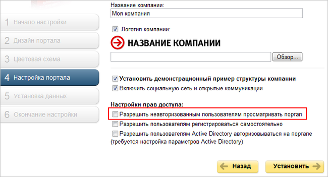

# Права доступа пользователей экстранета

**Навигация**
- [← Оглавление курса](index.md)
- [← Предыдущий: 2714 — Настройки модуля](lesson_2714.md)
- [Следующий: 2724 — Публичный сотрудник →](lesson_2724.md)

Официальная страница урока: https://dev.1c-bitrix.ru/learning/course/index.php?COURSE_ID=48&LESSON_ID=2727

**Примечание:** обычно в целях безопасности доступ к корпоративному порталу для неавторизованных пользователей запрещен. Данная возможность настраивается при установке портала:

Если опция **Разрешить неавторизованным посетителям просматривать портал** будет отмечена, то неавторизованным пользователям будет доступен внутренний портал компании в рамках прав группы **Все пользователи (в том числе неавторизованные)**.

Поскольку и сотрудники компании, и внешние пользователи имеют ограниченный доступ к сайту экстранета, то для этого в системе должны быть созданы соответствующие группы пользователей.

Если сайт экстранета настраивался с помощью мастера, то все необходимые группы пользователей были созданы автоматически (Настройки &gt; Пользователи &gt; Группы пользователей):

- **Пользователи экстранета** - группа пользователей экстранета.
  **Примечание:** чтобы иметь возможность просматривать сайт экстранета, и внешние пользователи, и сотрудники компании должны иметь привязку как минимум к этой группе.
- **Могут создавать рабочие группы в экстранете** - пользователи данной группы обладают правом создания рабочих групп в экстранете.
- **Администраторы сайта экстранета** - имеют полный доступ к экстранету.

Если сайт экстранета настраивается вручную, то все необходимые группы пользователей необходимо создать самостоятельно.

**Примечание:** вся необходимая информация по работе с группами доступна в уроке [Группы пользователей](lesson_2487.md).
