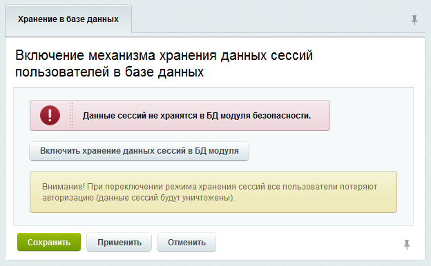

# Хранение сессий в базе данных

**Навигация**
- [← Оглавление курса](index.md)
- [← Предыдущий: 2690 — Шардинг](lesson_2690.md)
- [Следующий: 2997 — Безопасность →](lesson_2997.md)

Официальная страница урока: https://dev.1c-bitrix.ru/learning/course/index.php?COURSE_ID=48&LESSON_ID=2728

|  | ### Если несколько веб-серверов |
| --- | --- |

По умолчанию данные о сессиях пользователей хранятся в файловой системе сервера. Информация об этом есть на странице **Хранение сессий в базе данных** (Настройки &gt; Веб-кластер &gt; Сессии)

Если веб-сервер единственный, то такой способ хранения сессий в файлах наиболее удобен. Основной его плюс - наиболее высокая производительность. Как показывают различные нагрузочные тесты, скорость генерации страниц сайта при хранении сессий в базе снижается на 3-5%.

Если веб-серверов несколько, то возможно что один запрос пользователя (например, непосредственно авторизация) попадёт на один сервер, а следующий или какие-либо другие запросы - на другие серверы, где посетитель еще не будет авторизован. Подобные ситуации доставят целый ряд неудобств для посетителей сайта. Также, в случае хранения сессий в файлах будет некорректно вестись статистика посетителей.

Пользовательская сессия должна быть "прозрачной" для всех серверов веб-кластера. Поэтому рекомендуется включить хранение сессий в **базе данных**. Включение механизма хранения данных сессий пользователей в базе данных выполняется с помощью кнопки **Включить хранение данных сессий в БД модуля**.

**Внимание!** При переключении режима хранения сессий все пользователи потеряют авторизацию (данные сессий будут уничтожены).

**Примечание:** Для снижения нагрузки на базу данных и обеспечения "прозрачности сессии", можно сессии в базе не хранить, а вместо этого настроить и использовать в **nginx** модуль [ip_hash](http://nginx.org/ru/docs/http/ngx_http_upstream_module.html#ip_hash).
