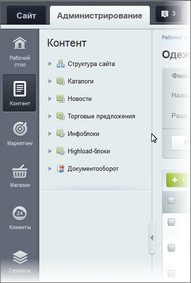

# Меню функций

**Навигация**
- [← Оглавление курса](index.md)
- [← Предыдущий: 7977 — Административное меню](lesson_7977.md)
- [Следующий: 1975 — Основная рабочая область →](lesson_1975.md)

Официальная страница урока: https://dev.1c-bitrix.ru/learning/course/index.php?COURSE_ID=48&LESSON_ID=2735

### Видеоурок

### Меню функций

Содержимое Меню функций зависит от того, какой блок выбран в

			Административном меню

                    Весь большой и разнообразный функционал 1С-Битрикс для удобства работы с ним разбит в Административном меню на логические блоки. В зависимости от того, установлены ли те или иные модули, состав административного меню может различаться...

[Подробнее ...](lesson_7977.md)

		. Например, выбрав **Контент**, вы получите такой вид панели:

|  | Выбирая пункты дерева-меню, переходим непосредственно к тем функциям, которым они соответствуют. При этом  Основная рабочая область Рабочая область - это место, где производится большинство операций по управлению сайтом.  [Подробнее](lesson_1975.md)... будет отображать интерфейс для работы именно с этими функциями. 
 В случае необходимости Административное меню и Меню функций сворачиваются/разворачиваются с помощью соответствующих стрелок. Стрелки появляются при наведении указателя мыши к черте, разделяющей Меню функций и Рабочую область. С помощью  кнопки  можно свернуть Меню функций, с помощью курсора придать ему нужную ширину. |
| --- | --- |
