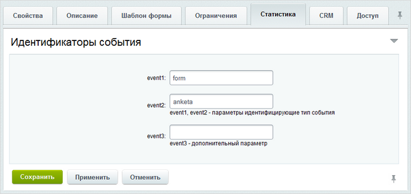

# Динамика заполнения веб-форм

**Навигация**
- [← Оглавление курса](index.md)
- [← Предыдущий: 10279 — Настройка шаблонов уведомлений](lesson_10279.md)
- [Следующий: 3124 — Статусы, создание и настройка →](lesson_3124.md)

Официальная страница урока: https://dev.1c-bitrix.ru/learning/course/index.php?COURSE_ID=48&LESSON_ID=2765

|  | ### Как отследить динамику ответов? |
| --- | --- |

Если стоит задача отследить насколько активно посетители заполняют вашу форму, то это делается с помощью модуля **Веб-аналитика**. Этот модуль позволяет анализировать динамику заполнения веб-форм, а также получать информацию о посетителях, заполнивших формы. Регистрация веб-формы в модуле выполняется с помощью

			типов событий

                    Событие – любое действие пользователя, совершаемое им на сайте. Событие можно назначить практически на любое действие: сообщение на форуме, клик по баннеру, заполнение формы и.т.д.

[Подробнее](https://dev.1c-bitrix.ru/learning/course/index.php?COURSE_ID=139&CHAPTER_ID=02104&LESSON_PATH=11427.4544.2104)...

		, назначаемых каждой веб-форме на закладке **Статистика**:

**Внимание:** Модуль **Веб-аналитика** доступен только в лицензиях Бизнес и Энтерпрайз.
