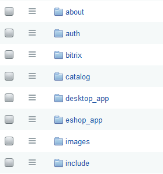
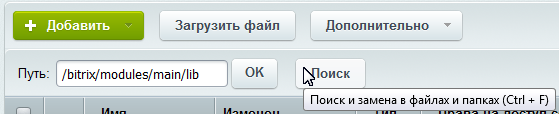

# Навигация и поиск

**Навигация**
- [← Оглавление курса](index.md)
- [← Предыдущий: 1841 — Форма редактирования элемента](lesson_1841.md)
- [Следующий: 2531 — Рабочий стол →](lesson_2531.md)

Официальная страница урока: https://dev.1c-bitrix.ru/learning/course/index.php?COURSE_ID=48&LESSON_ID=2771

### Как быстро попасть на нужную страницу

В Административном разделе предусмотрено несколько способов навигации и поиска. Традиционно навигация осуществляется с помощью пунктов **Административного меню** и **Меню функций**. Но есть и быстрый способ навигации - с помощью навигационной цепочки:

### "Умный" поиск - быстрый поиск

На любой странице Административного раздела можно воспользоваться "умным" поиском, который при наборе слова уже начинает предлагать возможные варианты страниц, где встречается набираемое слово:

### Поиск по файлам

В рамках

			файловой структуры

                    **Физическая структура** - это порядок размещения

физических файлов в папках сайта на сервере.
 В том числе файлов с программным кодом.

Мы рекомендуем
работать с физической структурой с большой осторожностью.

Вы можете повредить системные файлы и всё сломается:).

		 есть механизм поиска файлов, размещающийся на контекстной панели в виде кнопки

			Поиск

                    

		. Нажатие на эту кнопку открывает окно поиска:

Поиск ищет как по имени, так и по содержимому. Ограничения можно наложить следующие:

- По папке или сайту;
- Дате изменения;
- Размеру файла;
- Регистру.

Кнопка **Подсчёт** покажет общее число файлов, удовлетворяющих указанным условиям поиска.

С помощью поиска можно произвести замену слова или фразу в файле. Для этого воспользуйтесь закладкой **Замена**.
