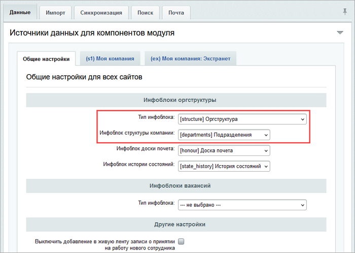
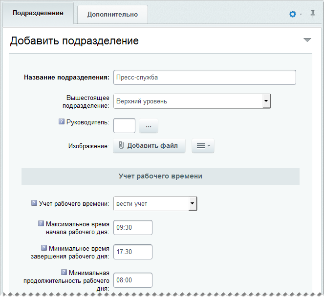
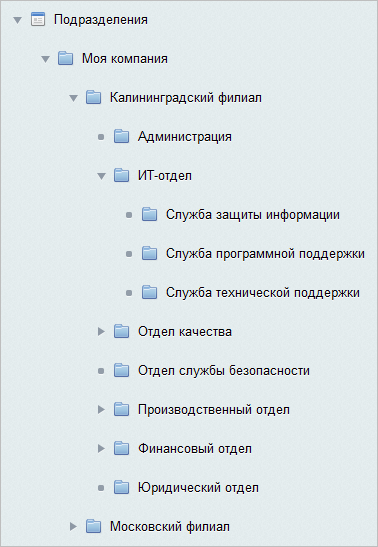
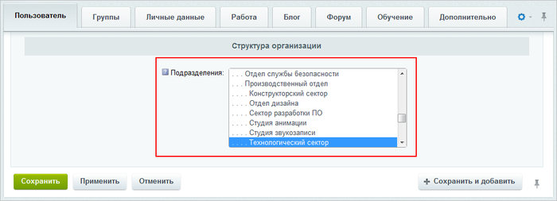

# Структура компании

**Навигация**
- [← Оглавление курса](index.md)
- [← Предыдущий: 4873 — Зарплата и отпуск](lesson_4873.md)
- [Следующий: 2778 — График отсутствий →](lesson_2778.md)

Официальная страница урока: https://dev.1c-bitrix.ru/learning/course/index.php?COURSE_ID=48&LESSON_ID=2777

Для организации структуры должен быть создан тип инфоблока, например **Оргструктура**, и инфоблок **Подразделения**, в котором будет храниться структура компании. Создание структуры компании может быть выполнено одним из способов: автоматически или вручную.

<!-- &lt;p&gt;&lt;div class="note"&gt;&lt;b&gt;Примечание&lt;/b&gt;: Работа со структурой компании в публичной части описана в курсе &lt;b&gt;Пользователь корпоративного портала&lt;/b&gt;, урок &lt;a href="/learning/course/index.php?COURSE_ID=45&LESSON_ID=2311"&gt;Структура компании&lt;/a&gt;.  &lt;/div&gt;&lt;/p&gt; -->

**Примечание**: Если во время установки продукта была отмечена опция **Установить демонстрационный пример структуры компании**, то будет загружен демонстрационный пример структуры компании и пользователей, т.е. в инфоблок **Подразделения** будут добавлены разделы и подразделы, а результат можно будет просмотреть на странице **Структура компании**. В противном случае, инфоблок и страница будут пустыми.

### Создание структуры автоматически

Создание структуры компании выполняется автоматически при импорте пользователей в систему (при этом **Тип инфоблока** и **Инфоблок**, в который будет загружена структура компании при импорте пользователей, указываются в настройках модуля **Интранет**):

При выполнении импорта пользователей из **AD/LDAP** необходимо настроить параметры импорта структуры с сервера:

**Примечание:** Подробнее про настройки импорта пользователей из AD/LDAP смотрите в уроке [Регистрация сервера](lesson_2547.md) главы **AD/LDAP**.

### Создание структуры вручную

Создание структуры компании выполняется вручную посредством добавления разделов и подразделов в созданный инфоблок.

Для добавления филиалов, подразделений, отделов перейдите на страницу **Подразделения** (Контент &gt; Оргструктура &gt; Подразделения). Нажмите на кнопку **Добавить подразделения**, расположенную на контекстной панели. Откроется форма создания подразделения (раздела):

Обязательно заполните поле **Название подразделения**.

**Примечание**: если создается запись о филиале компании, то в поле **Вышестоящее подразделение** выберите **Верхний уровень**, а если создаются подразделения и отделы – выберите **филиал**, к которому они принадлежат.

Сохраните внесенные изменения. В Административном разделе, например, созданная структура может иметь следующий вид:

Для добавления сотрудника в созданное подразделение/отдел перейдите на страницу **Список пользователей** (Настройки &gt; Пользователи &gt; Список пользователей). Создайте или найдите пользователя в списке. Откройте форму создания (редактирования) пользователя и перейдите на закладку **Пользователь**.
В поле **Подразделения** укажите, к какому подразделению (филиалу, отделу) принадлежит пользователь, выбрав соответствующее значение в поле:

### Публикация структуры

Для отображения структуры компании в публичном разделе служит компонент **Структура компании (bitrix:intranet.structure)**.

**Примечание:** Подробнее о параметрах компонента смотрите в [пользовательской документации](https://dev.1c-bitrix.ru/user_help/components/intranet/intranet_search/intranet_structure.php).

#### Создание визуальной структуры компании

Просмотр структуры компании также возможен с помощью визуального представления. Для этого следует создать новую страницу и разместить на ней компонент **Визуальная структура компании** (**bitrix:intranet.structure.visual**).

**Примечание:** Внешний вид и работа с компонентом в публичной части рассмотрена в статье [helpdesk.bitrix24.ru](https://helpdesk.bitrix24.ru/open/1406987/). Подробнее о параметрах компонента смотрите в [пользовательской документации](https://dev.1c-bitrix.ru/user_help/components/intranet/intranet_search/intranet_structure_visual.php).
