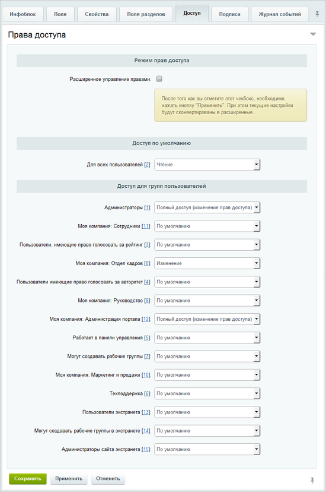
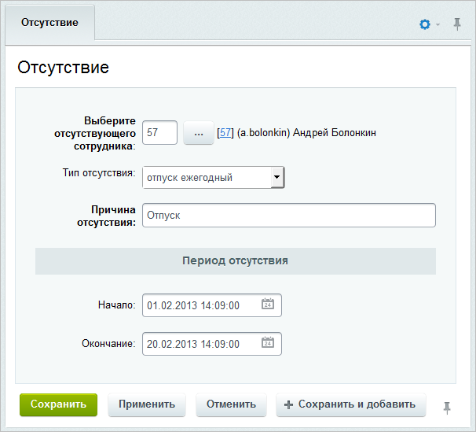

# График отсутствий

**Навигация**
- [← Оглавление курса](index.md)
- [← Предыдущий: 2777 — Структура компании](lesson_2777.md)
- [Следующий: 2785 — Доска почета →](lesson_2785.md)

Официальная страница урока: https://dev.1c-bitrix.ru/learning/course/index.php?COURSE_ID=48&LESSON_ID=2778

### Создание инфоблока

Для представления информации об отсутствующих сотрудниках должен быть создан тип инфоблока, например **Оргструктура**, и инфоблок **График отсутствий**, в котором будут храниться записи об отсутствии сотрудников по той или иной причине.

Группы пользователей портала, которые могут создавать/изменять записи, определяются в настройках доступа инфоблока:

В данном случае создавать/изменять записи об отсутствующих сотрудниках могут пользователи группы **Отдел кадров**, а полный доступ к инфоблоку имеют **Администраторы** и **Администрация портала**.

### Создание записи

Для добавления записи об отсутствии сотрудника перейдите на страницу **График отсутствий** (Контент &gt; Оргструктура &gt; График отсутствий) и нажмите кнопку **Добавить отсутствие**, расположенную на контекстной панели. Откроется форма создания новой записи:

- В поле **Выберите отсутствующего сотрудника** укажите сотрудника, который отсутствует.
- Выберите **Тип отсутствия**. Каждому типу соответствует свой цвет на графике.
- Обязательно заполните поле **Причина отсутствия**. Введенный текст будет отображен на графике в качестве названия отсутствия сотрудника.
- Укажите **Период отсутствия** (поля **Начало** и **Окончание**) отсутствия сотрудника.

Сохраните внесенные данные с помощью кнопки **Сохранить**.

### Просмотр в публичном разделе

Для отображения графика отсутствий компании в публичном разделе служит компонент **Календарь отсутствий (bitrix:intranet.absence.calendar)**.

**Примечание**: Дополнительную информацию о графике отсутствий смотрите в статье [helpdesk.bitrix24.ru](https://helpdesk.bitrix24.ru/open/5349195/). Подробнее о параметрах компонента смотрите в [Пользовательской документации](https://dev.1c-bitrix.ru/user_help/components/intranet/intranet_user/intranet_absence_calendar.php).
