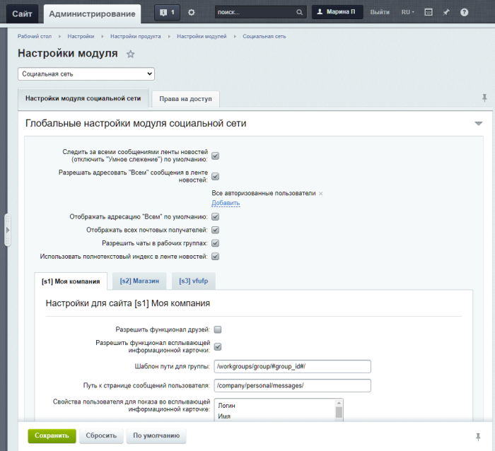
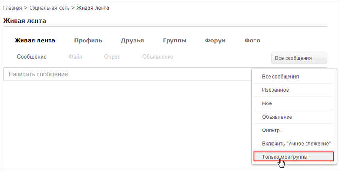
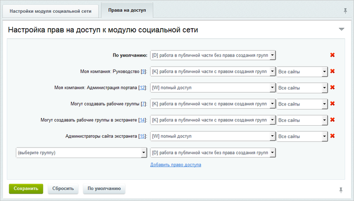
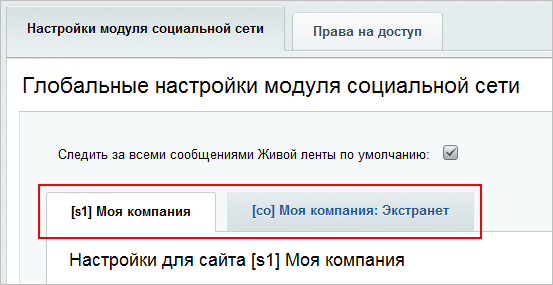

# Настройки модуля

**Навигация**
- [← Оглавление курса](index.md)
- [← Предыдущий: 3534 — Типы событий](lesson_3534.md)
- [Следующий: 2780 — Управление темами групп →](lesson_2780.md)

Официальная страница урока: https://dev.1c-bitrix.ru/learning/course/index.php?COURSE_ID=48&LESSON_ID=2779

Управления общими настройками модуля выполняется на странице Настройки &gt; Настройки продукта &gt; Настройки модулей &gt; Социальная сеть.

### Настройки модуля социальной сети

На вкладке **Настройки модуля социальной сети** содержатся глобальные настройки модуля:

**Примечание:** Информацию о всех настройках модуля **Социальная сеть** вы найдете в [Пользовательской документации](http://dev.1c-bitrix.ru/user_help/service/socialnetwork/settings.php) по продукту. Далее в уроке рассмотрим лишь некоторые настройки модуля.

- **Следить за всеми сообщениями Живой ленты по умолчанию** - при отмеченной опции в социальной сети каждое новое событие (комментарий, сообщение и т.п) будет "поднимать" данное событие наверх ленты новостей. Пользователь сам решает следить или нет с помощью кнопки **Больше не следить** под сообщением ленты новостей. При отключенной опции, чтобы следить за событием, необходимо нажать кнопку **Следить** под нужным сообщением из новостной ленты.
- **Разрешать адресовать "Всем" сообщения в Живой ленте** - при отмеченной опции появляется возможность указать пользователей или группы пользователей, которым разрешено адресовать сообщения для **всех пользователей портала/сайта**.
- **Отображать адресацию "Всем" по умолчанию** - при отмеченной опции по умолчанию будет включена адресация **Всем** при создании нового сообщения. Опция появляется при включенной опции **Разрешать адресовать "Всем" сообщения в Живой ленте**. Важно понимать, что если опция включена, то всегда есть риск, что пользователь отправит своё сообщение на всех
  			случайно
                      Например, сотрудник финансового отдела создаёт сообщение с финансовыми показателями компании и забывает проверить и изменить адресата. Т.к. по умолчанию установлена отправка **Всем**, сообщение увидят все пользователи.
  		.
- **Отображать в Живой ленте по умолчанию только мои записи, записи моих групп и адресованные лично мне** - опция включает режим, при котором выбираются только записи, события, относящиеся к рабочим группам пользователя, а также его собственные или адресованные лично ему.
  **Примечание:** Опция доступна только в продукте *«1С-Битрикс: Управление сайтом»*.
  Режим включается/выключается глобально администратором. При выключенном режиме у каждого пользователя есть возможность включить его индивидуально в Живой ленте (пункт
  			Только мои группы
                      
  		 в меню **Все сообщения**).

## Подробнее о параметрах, настраиваемых для каждого сайта в отдельности

- Для включения функционала **Друзья** установите флаг в поле **Разрешить функционал друзей**;
- С помощью поля **Шаблон пути для группы** задаётся шаблон адресов для групп;
- В поле **Путь к странице сообщений пользователя** указывается адрес страницы к просмотру переписки с пользователями;
- В поле **Свойства пользователя для показа во всплывающей информационной карточке** выбираются свойства пользователя, которые должны быть отображены во всплывающей карточке;
- Дополнительные свойства пользователя, которые должны быть показаны во всплывающей информационной карточке, указываются соответственно в поле **Доп. свойства пользователя для показа во всплывающей информационной карточке**;
- С помощью опций **Выводить рейтинг во всплывающей информационной карточке** и **Использовать рейтинг** включаются использование рейтингов в карточках пользователя и указываются их виды;
- С помощью секции **Настройки для пользователей** вы можете запретить или разрешить использование того или иного функционала на личных страницах пользователей путем установки или снятия флагов в соответствующих полях, а также для каждого функционала задать настройки по умолчанию;
- Настройка секции **Настройки для групп** аналогична настройке секции **Настройки для пользователей** и дополнительно определяет возможность работы с контентом архивных рабочих групп.

### Права на доступ

Вкладка

			**Права на доступ**

                    

		 предназначена для настройки прав на доступ групп пользователей к модулю. Возможно назначение следующих прав:

- **[D] Работа в публичной части без права создания групп** – пользователям разрешается просмотр страниц социальной сети с возможностью редактирования своего профиля. (По умолчанию стоит у всех групп.)
- **[K] Работа в публичной части с правом создания групп** – пользователям разрешается просмотр страниц социальной сети с возможностью редактирования своего профиля и создания рабочих групп.
- **[R] Просмотр административной части** – управление элементами социальной сети из публичной части и разрешение просмотра в административном разделе без права модификации.
- **[W] Полный доступ** – полный доступ к ресурсам модуля.

**Примечание:**Управлять определенным функционалом можно как для всех сайтов сразу, так и для конкретных сайтов путем установки флагов в соответствующие поля.

#### Документация по теме

- [Настройки модуля](https://dev.1c-bitrix.ru/user_help/service/socialnetwork/settings.php)
