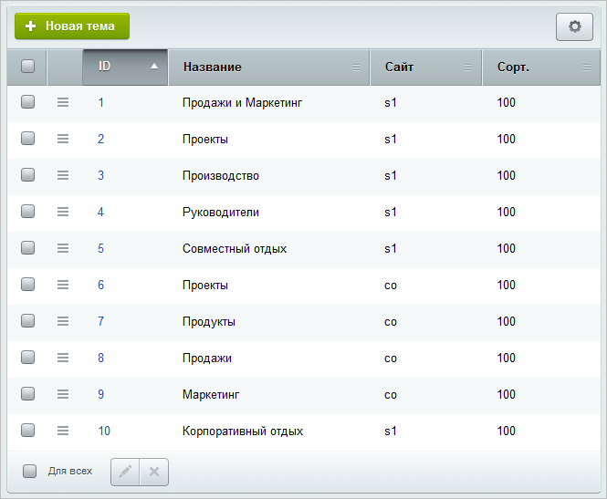
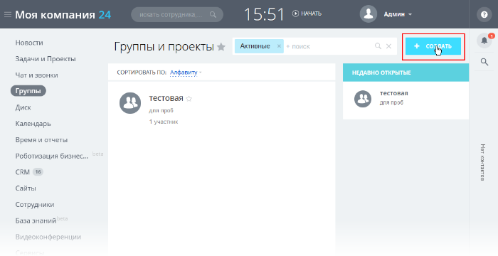
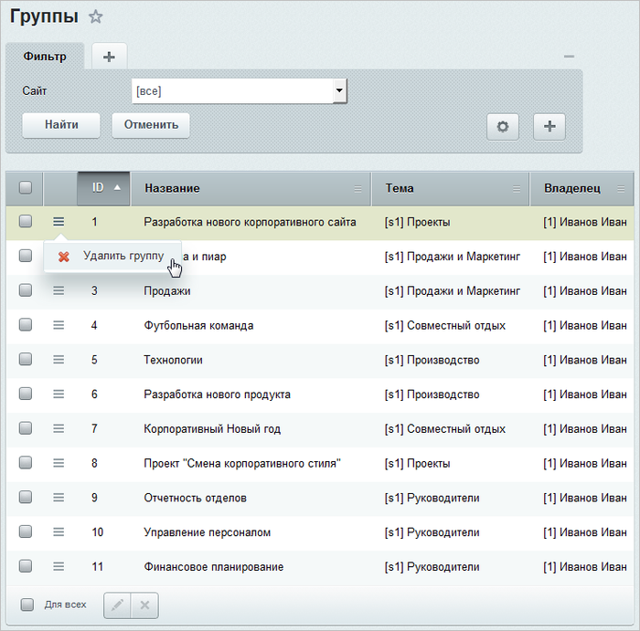

# Управление темами групп

**Навигация**
- [← Оглавление курса](index.md)
- [← Предыдущий: 2779 — Настройки модуля](lesson_2779.md)
- [Следующий: 2781 — Личная страница сотрудника →](lesson_2781.md)

Официальная страница урока: https://dev.1c-bitrix.ru/learning/course/index.php?COURSE_ID=48&LESSON_ID=2780

### Создание новой темы


В модуле **Социальная сеть** введено понятие темы групп.


> **Тема групп** – это совокупность рабочих групп, обладающих некоторой общей тематикой, признаком.


Таким образом, чтобы иметь возможность создать рабочую группу, необходимо сначала создать в системе темы групп. Управлять темами могут только те пользователи, которые имеют полный доступ к модулю.


**Важно!** Создание, редактирование и удаление **тем** рабочих групп осуществляется только в административном разделе, а самих рабочих групп – в публичном разделе.


Чтобы создать новую тему групп в административном разделе, перейдите на страницу административного интерфейса Сервисы &gt; Социальная сеть &gt; Темы и нажмите кнопку **Новая тема** на контекстной панели.


Откроется форма создания новой темы:


Укажите **Название темы**, выберите **Сайт темы**, на котором будут доступны рабочие группы данной темы, и задайте индекс сортировки в поле **Сортировка**. Сохраните внесенные изменения, созданная тема добавится в

			список тем групп.





### Создание новой рабочей группы


Теперь можно создать новую рабочую группу, привязанную к данной теме. Они создаются из

			публичного интерфейса

                    Группа создаётся по кнопке **Создать** на странице **Группы** стандартного интерфейса корпоративного
портала Битрикс24.



На сайте, созданном на основе "1С-Битрикс: Управление сайтом", кнопка создания может выглядеть
по разному, в зависимости от дизайна сайта.

		. В административном разделе они выводятся в списке на странице **Группы** (Сервисы &gt; Социальная сеть &gt; Группы). В этом списке возможно только удаление группы:





**Примечание:**в «Битрикс24 в коробке» меню раздела **Рабочие группы** является динамическим и хранится в файле `/workgroups/.left.menu_ext.php`. В коде должны быть правильно определены шаблоны путей к теме групп и к группе:

```


$strGroupSubjectLinkTemplate = COption::GetOptionString("socialnetwork", "subject_path_template", "/workgroups/group/search/#subject_id#/", SITE_ID);
$strGroupLinkTemplate = COption::GetOptionString("socialnetwork", "group_path_template", "/workgroups/group/#group_id#/", SITE_ID);
```


### Документация по теме


- [Создание и редактирование темы](https://dev.1c-bitrix.ru/user_help/service/socialnetwork/socnet_subject_edit.php)
