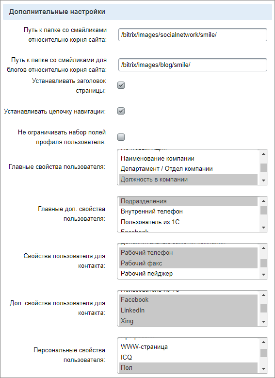
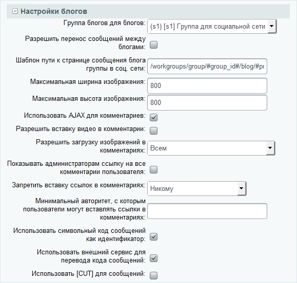
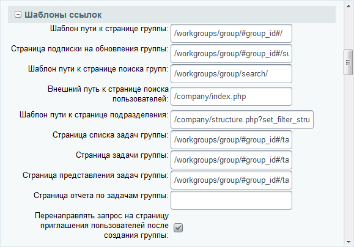
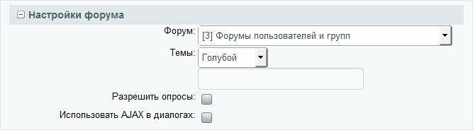
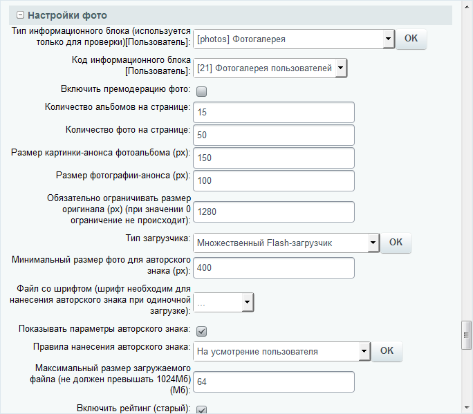
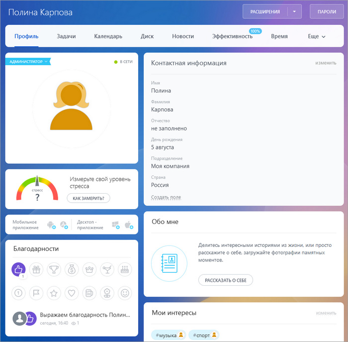

# Личная страница сотрудника

**Навигация**
- [← Оглавление курса](index.md)
- [← Предыдущий: 2780 — Управление темами групп](lesson_2780.md)
- [Следующий: 2782 — Страница рабочей группы →](lesson_2782.md)

Официальная страница урока: https://dev.1c-bitrix.ru/learning/course/index.php?COURSE_ID=48&LESSON_ID=2781

Личная страница сотрудника создается с помощью комплексного компонента **Социальная сеть - пользователь (bitrix:socialnetwork_user)**. Компонент позволяет, создавая физически одну страницу, организовать полноценную социальную сеть сотрудников.

### Создание личной страницы сотрудника

Обширные настройки компонента дают возможность:

- гибко управлять отображаемыми данными пользователей;
- настраивать
  			ЧПУ
  Средства *«1С-Битрикс: Управление сайтом»* позволяют сделать ссылки более понятными с помощью специальной функции. Функция встроена во все комплексные компоненты (и отдельные простые) и преобразует стандартный веб-адрес в так называемый человеко-понятный URL (сокращенно ЧПУ).
  [Подробнее](https://dev.1c-bitrix.ru/learning/course/index.php?COURSE_ID=34&LESSON_ID=3579)...
  		 и
  			AJAX
  **AJAX** – подход к построению интерактивных пользовательских интерфейсов веб-приложений, заключающийся в «фоновом» обмене данными браузера с веб-сервером.
  [Подробнее](https://ru.wikipedia.org/wiki/AJAX)...
  		;
- управлять функционалом личной фотогалереи, блога, календарей, задач и файлов.

Создайте новую страницу и разместите на ней компонент [Социальная сеть - Пользователь](/user_help/service/socialnetwork/components_2_kp/socnet_user.php) (**bitrix:socialnetwork_user**), далее проведите настройку параметров компонента:

- Настройте параметры по управлению адресами страниц в режиме ЧПУ или без использования ЧПУ (группа свойств **Управление адресами страниц**).
- В полях группы свойств **Дополнительные настройки** отметьте те свойства пользователей, которые должны быть отображены в различных секциях личной страницы или отметьте опцию
  			Не ограничивать набор полей профиля пользователя
                      При включенной опции будет снято ограничение набора полей профиля пользователя и станут недоступны поля **настройки свойств пользователя**:
  - Главные свойства пользователя;
  - Главные доп. свойства пользователя;
  - Свойства пользователя для контакта;
  - Доп. свойства пользователя для контакта;
  - Персональные свойства пользователя;
  - Персональные доп. свойства пользователя.
  		:
  
- Выберите группу блогов, в которой будут храниться блоги пользователей, а также другие
  			настройки блогов
                      
  		.
- В полях группы свойств **Шаблоны ссылок** обязательно укажите шаблоны путей к страницам рабочей группы:
  
  Главную страницу группы необходимо создать с помощью компонента **Социальная сеть – группы**.
- В группе свойств
  			**Настройки форума**
                      
  		 укажите форум, в котором будут храниться личные темы и сообщения сотрудников, выберите цветовую тему оформления форума, а также, если необходимо, включите поддержку опросов:
- Далее в соответствующих группах свойств выполните настройку остальных функционалов социальной сети: **Календарь**, **Задачи**, **Файлы** и **Фото**.
  Для каждого функционала укажите необходимый
  			**тип инфоблока** и **инфоблок**
                      Например, группа свойств **Настройки фото** может быть настроена следующим образом:
  
  		, в котором будут храниться соответственно личные календари событий, задачи, файлы и фотографии сотрудников.

**Примечание:** детальное описание каждого параметра компонента приведено в [документации по продукту](http://dev.1c-bitrix.ru/user_help/service/socialnetwork/components_2_kp/socnet_user.php).

### Работа со страницей в публичной части

После того, как все параметры компонента настроены необходимым для вас образом, сохраните страницу. В результате в публичной части она будет иметь следующий вид:

На странице с профилем сотрудника представлена служебная, контактная и личная информация.

При необходимости видимость полей (как системных, так и пользовательских) можно отключить/включить  по команде Общий вид карточки &gt; Настройка показа полей (правый нижний угол профиля).

<!-- УСТАРЕВШАЯ ИНФОРМАЦИЯ

&lt;p&gt;Вся информация представлена с помощью специальных блоков, управление которыми аналогично настройке персонального рабочего стола. Кнопки &lt;b&gt;Добавить гаджет&lt;/b&gt; и &lt;b&gt;Сбросить текущие настройки&lt;/b&gt; доступны всем сотрудникам портала. Если пользователь имеет полный доступ к социальной сети, то ему становится доступной кнопка &lt;b&gt;Сохранить как настройки по умолчанию&lt;/b&gt;. Данная кнопка позволяет настроить внешний вид по умолчанию для личных страниц пользователей.&lt;/p&gt;

&lt;p&gt;Каждый сотрудник может управлять своими данными и настройками доступа к имеющимся функционалам с помощью ссылок &lt;b&gt;Изменить профиль&lt;/b&gt; и &lt;b&gt;Изменить настройки&lt;/b&gt; соответственно. Ссылка &lt;b&gt;Изменить приватность&lt;/b&gt; позволяет настроить уровни доступа к функционалу личной страницы.&lt;/p&gt;

&lt;p&gt;&lt;div class="hint"&gt;&lt;b&gt;Примечание: &lt;/b&gt;Если в блоке &lt;b&gt;Управление&lt;/b&gt; на закладке &lt;b&gt;Основное&lt;/b&gt; нет ссылки &lt;b&gt;Изменить профиль&lt;/b&gt;, то необходимо дать права &lt;b&gt;[P] Изменение своего профайла&lt;/b&gt; в опции &lt;b&gt;Главный модуль&lt;/b&gt;, на закладке &lt;b&gt;Доступ группы&lt;/b&gt; (&lt;span class="path"&gt;Настройки &gt; Пользователи &gt; Группы пользователей &gt; [группа_пользователей]&lt;/span&gt;), в которую входит данный сотрудник. &lt;/div&gt;&lt;/p&gt;

&lt;p&gt;Ссылка &lt;b&gt;Подписка&lt;/b&gt; предназначена для просмотра подписки на обновления групп и сотрудников. Просмотр обновлений групп и сотрудников осуществляется по ссылке &lt;b&gt;Обновления&lt;/b&gt;.&lt;/p&gt;

&lt;p&gt;Если сотрудник относится к группе пользователей, обладающей правом &lt;b&gt;Работа в публичной части с правом создания групп&lt;/b&gt;, то сотрудник может создавать рабочие группы, приглашать в нее других сотрудников.&lt;/p&gt;
&lt;p&gt;В зависимости от разрешенных функционалов портала сотрудник сможет размещать фотографии, создавать темы на форуме и сообщения в блоге, управлять персональным календарем, задачами и файловым хранилищем.&lt;/p&gt; -->

**Примечание.** Подробная информация по использованию страницы с профилем представлена на [helpdesk.bitrix24.ru](https://helpdesk.bitrix24.ru/open/5392179/).
