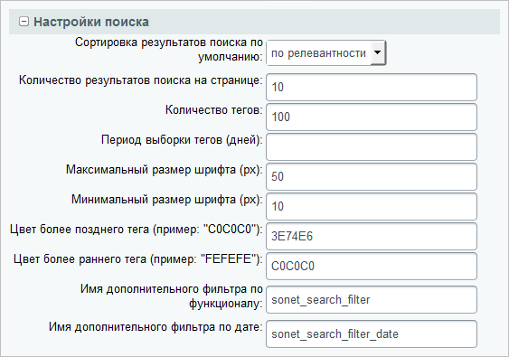
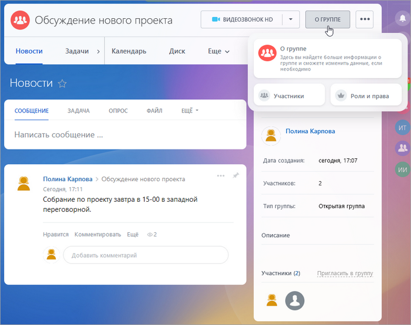

# Страница рабочей группы

**Навигация**
- [← Оглавление курса](index.md)
- [← Предыдущий: 2781 — Личная страница сотрудника](lesson_2781.md)
- [Следующий: 3114 — Смайлы социальной сети →](lesson_3114.md)

Официальная страница урока: https://dev.1c-bitrix.ru/learning/course/index.php?COURSE_ID=48&LESSON_ID=2782

Страница рабочей группы сотрудников создается с помощью комплексного компонента **Социальная сеть - группы (bitrix:socialnetwork_group)**. Компонент позволяет, создавая физически одну страницу, организовать полноценную социальную сеть рабочих групп сотрудников.

### Создание страницы рабочей группы сотрудников

Обширные [настройки компонента](http://dev.1c-bitrix.ru/user_help/service/socialnetwork/components_2_kp/socnet_group.php) дают возможность:

- гибко управлять отображаемыми данными групп;
- управлять функционалом группы: календарем событий, задачами, форумом, блогом, файлами, фотографиями и ее участниками.

Создайте новую страницу, разместите на ней компонент и проведите настройку параметров компонента:

**Примечание:** настройка основных параметров данного компонента производится аналогично настройке параметров компонента **Социальная сеть - пользователь  (bitrix:socialnetwork_user)** (см. урок [Личная страница сотрудника](lesson_2781.md)), а настройка параметров поиска информации в рабочей группе выполняется в секции

			**Настройки поиска**

                    

		.

### Страница рабочей группы в публичной части

В результате страница детального просмотра группы будет иметь следующий вид:

<!-- ИНФОРМАЦИЯ УСТАРЕЛА

&lt;p&gt;Вся информация представлена с помощью специальных блоков, управление которыми аналогично настройке персонального рабочего стола. Кнопки &lt;b&gt;Добавить гаджет&lt;/b&gt; и &lt;b&gt;Сбросить текущие настройки&lt;/b&gt; доступны всем участникам группы. Если пользователь имеет полный доступ к социальной сети, то ему становится доступной кнопка &lt;b&gt;Сохранить как настройки по умолчанию&lt;/b&gt;. Данная кнопка позволяет настроить внешний вид по умолчанию для страниц рабочих групп.&lt;/p&gt;

&lt;p&gt;Модератор группы, а также администратор портала могут выполнять все операции над группой с помощью ссылок, расположенных под картинкой группы. Участникам группы и сотрудникам компании могут быть доступны лишь некоторые ссылки в соответствии с их правами доступа.&lt;/p&gt;

&lt;p&gt;Если необходимо написать текстовое сообщение участникам группы, то следует воспользоваться ссылкой &lt;b&gt;Написать сообщение&lt;/b&gt;.&lt;/p&gt;

&lt;p&gt;Ссылка &lt;b&gt;Редактировать группу&lt;/b&gt; позволяет перейти к странице редактирования параметров группы. Для управления функционалом группы используйте ссылку &lt;b&gt;Изменить настройки&lt;/b&gt;. Для удаления группы воспользуйтесь ссылкой &lt;b&gt;Удалить группу&lt;/b&gt;.&lt;/p&gt;

&lt;p&gt;С помощью ссылки &lt;b&gt;Редактировать модераторов&lt;/b&gt; можно управлять составом модераторов. Для управления участниками группы предназначена ссылка &lt;b&gt;Редактировать состав&lt;/b&gt;.&lt;/p&gt;

&lt;p&gt;Блокировать провинившихся сотрудников рабочей группы можно с помощью ссылки &lt;b&gt;Черный список&lt;/b&gt;. Приглашение новых сотрудников в группу осуществляется с помощью ссылки &lt;b&gt;Пригласить в группу&lt;/b&gt;.&lt;/p&gt;

&lt;p&gt;Ссылка &lt;b&gt;Проверить запросы на вступление&lt;/b&gt; в группу позволяет просмотреть сотрудников, желающих вступить в группу, а ссылка &lt;b&gt;Приглашения в группу&lt;/b&gt; служит для просмотра отправленных пользователям приглашений на вступление в данную группу. Оформить подписку на обновления можно с помощью ссылки &lt;b&gt;Подписаться&lt;/b&gt;.&lt;/p&gt; -->

**Примечание:** подробная информация по рабочим группам представлена на [helpdesk.bitrix24.ru](https://helpdesk.bitrix24.ru/open/1272898/).
