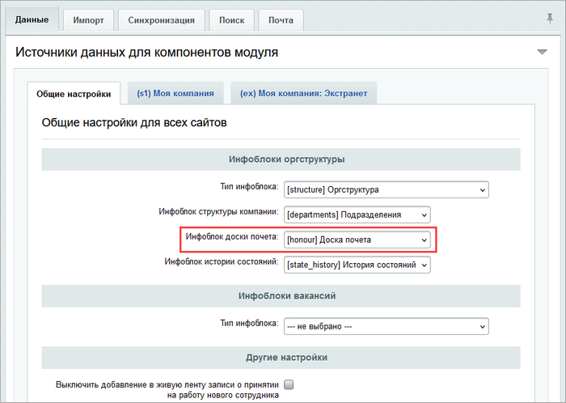
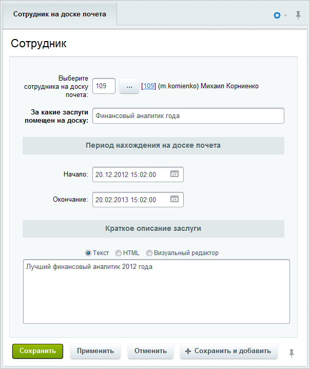

# Доска почета

**Навигация**
- [← Оглавление курса](index.md)
- [← Предыдущий: 2778 — График отсутствий](lesson_2778.md)
- [Следующий: 4483 — Основные понятия →](lesson_4483.md)

Официальная страница урока: https://dev.1c-bitrix.ru/learning/course/index.php?COURSE_ID=48&LESSON_ID=2785

### Создание инфоблока

Для представления информации о сотрудниках должен быть создан тип инфоблока, например **Оргструктура**, и инфоблок **Доска почета**, в котором будут храниться записи о сотрудниках, помещенных на доску почета по той или иной причине.

Чтобы информация о помещенных на доску почета сотрудниках отображалась на портале корректно, следует созданный инфоблок указать в настройках модуля **Интранет** в поле **Инфоблок доски почета**:

Группы пользователей портала, которые могут создавать/изменять записи, определяются в

			настройках доступа инфоблока

                    

		.

В данном случае создавать/изменять записи могут пользователи группы **Отдел кадров**, а полный доступ к инфоблоку имеют **Администраторы** и **Администрация портала**.

### Занесение сотрудника на доску почета

Для занесения сотрудника на доску почета в административном разделе перейдите на страницу **Доска почета** (Контент &gt; Оргструктура &gt; Доска почета) и нажмите кнопку **Добавить на доску почета**, расположенную на контекстной панели. Откроется форма создания новой записи:

- В поле **Выберите сотрудника на доску почета** укажите сотрудника, который будет помещен на доску почета.
- С помощью поля **За какие заслуги помещен на доску** укажите заслугу, за которую сотрудник помещен на доску почета.
- Укажите **Период нахождения на доске почета** (поля **Начало** и **Окончание**).
- Укажите **Краткое описание заслуги**. Указанный текст будет выведен в качестве заголовка визитки сотрудника на странице просмотра сотрудников, помещенных на доску почета.

Сохраните внесенные изменения с помощью кнопки **Сохранить**.

### Просмотр в публичном разделе

Список отмеченных сотрудников выводится с помощью компонента **Доска почета (bitrix:intranet.structure.honour)**.

**Примечание**: Подробнее про работу с компонентом в публичной части сайта смотрите в статье [helpdesk.bitrix24.ru](https://helpdesk.bitrix24.ru/open/8510111/). Подробнее о параметрах компонента смотрите в [Пользовательской документации](https://dev.1c-bitrix.ru/user_help/components/intranet/intranet_user/intranet_structure_honour.php).
