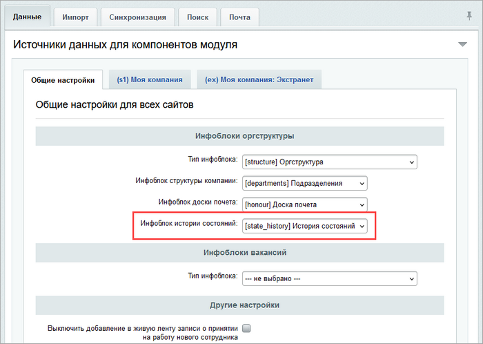
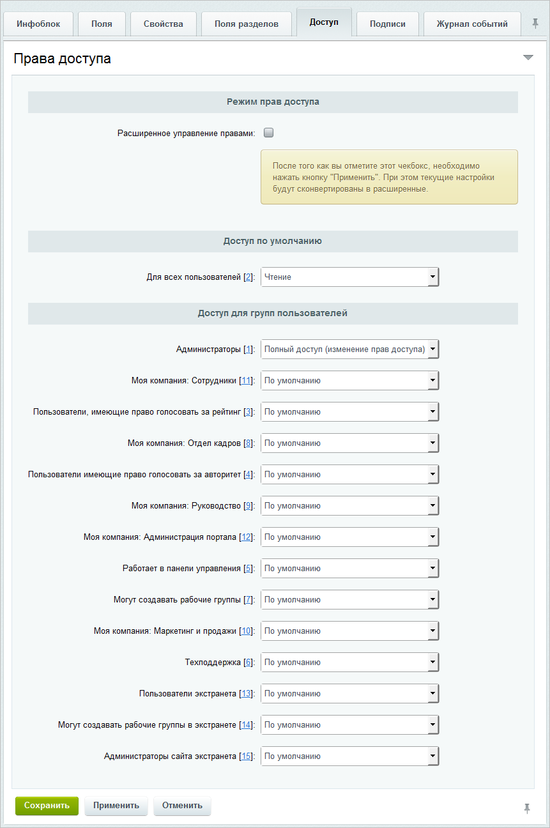
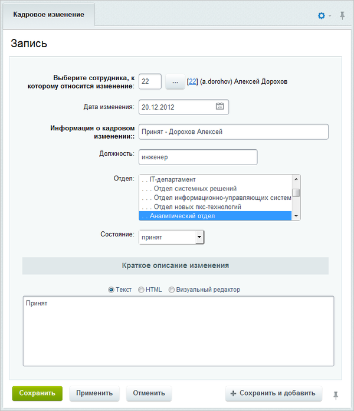
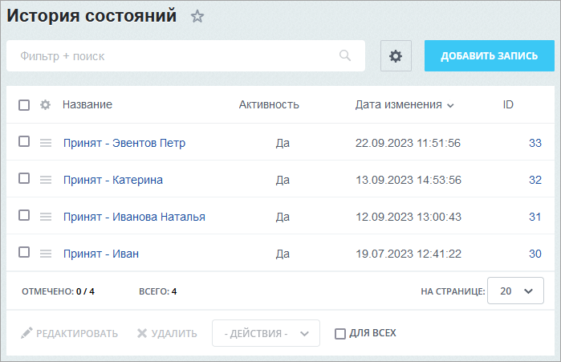

# Кадровые изменения

**Навигация**
- [← Оглавление курса](index.md)
- [← Предыдущий: 2449 — Календари](lesson_2449.md)
- [Следующий: 12147 — Настройки модуля календарей →](lesson_12147.md)

Официальная страница урока: https://dev.1c-bitrix.ru/learning/course/index.php?COURSE_ID=48&LESSON_ID=2786

### Создание инфоблоков

Для представления информации об изменениях, произошедших в карьере сотрудников, необходимо создать тип инфоблока, например **Оргструктура**, и инфоблок **История состояний**, в котором будут храниться записи о кадровых изменениях сотрудников.

Чтобы информация о карьерном изменении отображалась на портале корректно, следует созданный инфоблок указать в настройках модуля **Интранет** в поле **Инфоблок истории состояний**:

Группы пользователей портала, которые могут создавать/изменять записи, определяются в настройках доступа инфоблока:

По умолчанию только администраторы системы могут управлять кадровыми изменениями сотрудников.

### Создание записи

Для добавления записи о кадровой перестановке сотрудника перейдите на станицу **История состояний** (Контент &gt; Оргструктура &gt; История состояний). Нажмите кнопку **Добавить запись**, расположенную на контекстной панели. Откроется форма создания новой записи:

- В поле **Выберите сотрудника, к которому относится изменение** и заполните поле **Дата изменения**.
- Обязательно заполните поле **Информация о кадровом изменении**, например, **Переведен**, **Принят** и т.д.
- В поле **Краткое описание изменения** укажите краткую информацию о записи.
- Сохраните внесенные данные с помощью кнопки **Сохранить**.

### Публикация кадровых изменений

Для отображения кадровых изменений компании в публичном разделе служит компонент [Кадровые изменения](https://dev.1c-bitrix.ru/user_help/components/intranet/intranet_user/intranet_structure_events.php) (**bitrix:intranet.structure.events**).

**Примечание**: Подробнее про работу с компонентом в публичной части сайта смотрите в статье [helpdesk.bitrix24.ru](https://helpdesk.bitrix24.ru/open/8509587/).

**Примечание**: Администратору системы доступны следующие кнопки управления, расположенные на странице в публичной части:

- **Добавить запись** - добавить запись о кадровой перестановке в публичном разделе;
- **Управление** - перейти к
  			управлению записями
  
  		 о кадровых перестановках в административном разделе.
