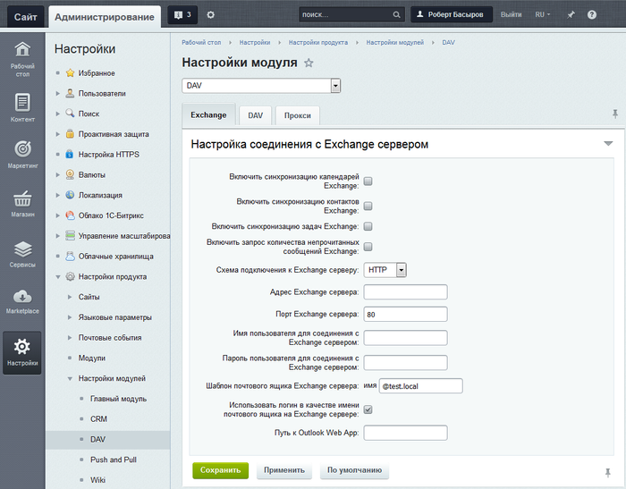
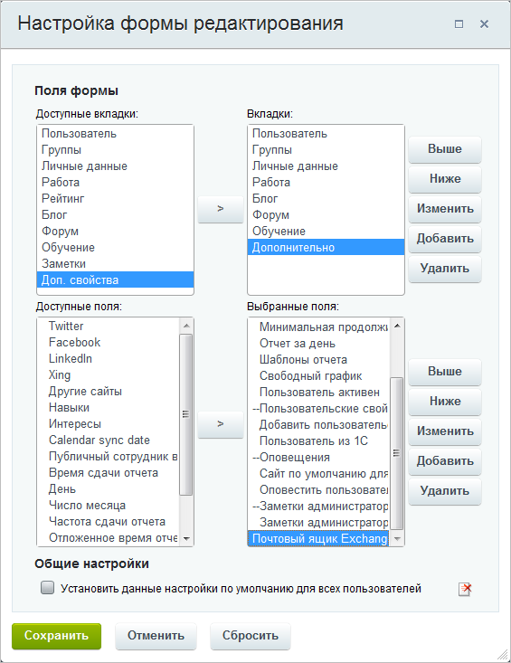
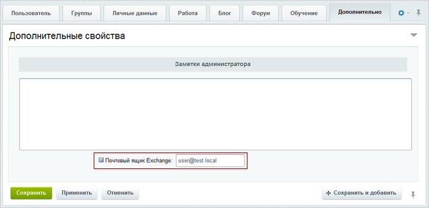
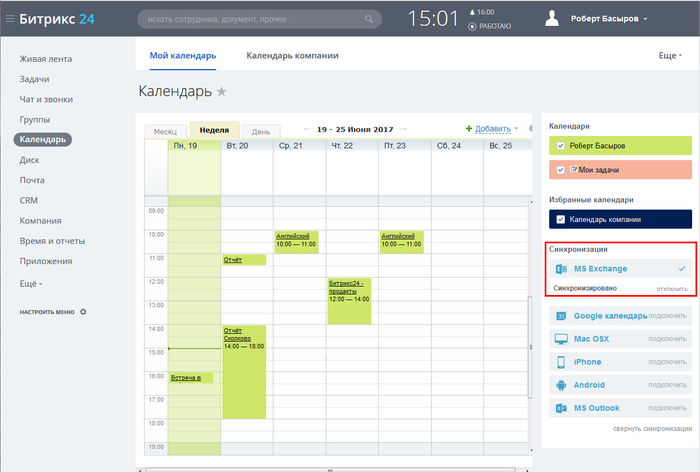

# Настройка модуля DAV

**Навигация**
- [← Оглавление курса](index.md)
- [← Предыдущий: 2095 — Поисковая оптимизация](lesson_2095.md)
- [Следующий: 9095 — Настройки модуля Валюты →](lesson_9095.md)

Официальная страница урока: https://dev.1c-bitrix.ru/learning/course/index.php?COURSE_ID=48&LESSON_ID=2808

Для настройки протоколов DAV перейдите на страницу настроек модуля (Настройки &gt; Настройки продукта &gt; Настройки модулей &gt; DAV ). На открывшейся странице настроек параметров модуля заполните следующие поля формы:


- На вкладке Exchange указываются настройки соединения с Exchange сервером:
  

  - Включить синхронизацию календарей, контактов и задач Exchange с помощью соответствующих опций
  - Включить запрос количества непрочитанных сообщений Exchange — если эта опция включена, то будет отправляться запрос к MS Exchange на предмет непрочитанных сообщений, оповещение о которых будут выводиться в панели статусов публичной части портала
  - Схема подключения к Exchange серверу — позволяет выбрать протокол подключения к серверу Exchange: HTTP или HTTPS
  - Адрес Exchange сервера — указывается адрес Exchange сервера
  - Порт Exchange сервера — указывается порт Exchange сервера
  - Имя пользователя для соединения с Exchange сервером — указывается имя пользователя с полными правами управления учетными записями в MS Exchange
    ## Как дать права на конкретные ящики
    Можно использовать метод:
    ```
    - Add-MailboxPermission -identity "Имя пользователя" -accessrights:fullaccess -user "Имя учетной записи для синхронизации"
    ```
    Так вы дадите полные права учетной записи не на всю базу, а только на конкретные ящики.
  - Пароль пользователя для соединения с Exchange сервером — указывается пароль пользователя
    **Примечание**: Если синхронизация не происходит и в логах есть строка `ERROR [SS1] Unsupported authentication method (supported: basic, digest)` — включите опцию Разрешить авторизацию HTTP Digest в настройках Главного модуля на вкладке Авторизация.
  - Шаблон почтового ящика Exchange сервера — указывается шаблон почтового ящика в MS Exchange (Например: @test.local).
  - Использовать логин в качестве имени почтового ящика на Exchange сервере — при отмеченной опции будет использоваться логин пользователя портала в качестве имени почтового ящика на сервере MS Exchange (Например: логин пользователя на портале — user, шаблон почтового ящика в MS Exchange — @test.local, то итоговый почтовый ящик в MS Exchange пользователя будет **user@test.local**).
    ## Внимание! Если опция Использовать логин в качестве имени почтового ящика на Exchange сервере отключена
    **Внимание!** Если опция **Использовать логин в качестве имени почтового ящика на Exchange сервере отключена**, то для правильной работы MS Exchange с пользователями необходимо:
      - В форме редактирования профиля каждого пользователя в закладке **Дополнительно** с помощью кнопки **Настроить** на контекстной панели вызвать диалоговое окно для настройки формы отчета данной формы:
        
        и включить пользовательское поле **Почтовый ящик Exchange** (код поля: `UF_BXDAVEX_MAILBOX`). После чего нажать кнопку **Сохранить**.
        Либо нажать кнопку **Отменить действия настроек полей формы на время сессии**.
      - В закладке **Дополнительно** указать e-mail в появившемся поле **Почтовый ящик Exchange** для каждого пользователя:
        
      - Нажать кнопку **Сохранить**.
    **Эти действия необходимо провести с профилем каждого сотрудника!**


<!-- &lt;li&gt;&lt;b&gt;Путь к Outlook Web App&lt;/b&gt; - указывается путь к Outlook Web App (OWA) - специальному приложению, которое позволяет работать в браузере с MS Exchange. После чего в панели статусов появится ссылка для перехода к OWA.&lt;/li&gt; -->


**Примечание**: при включении этой опции становится невозможным подключение E-mail трекера в CRM.


Таким образом, например в разделе **Календарь** появится иконка **MS Exchange**:





Если у вас отсутствует такая иконка вообще, то соединение c Exchange невозможно либо неправильно настроено.


**Обратите внимание!** Модуль DAV пока не работает с облачным Exchange, то есть с Microsoft Exchange Online и, соответственно, интеграция с облачными сервисами Microsoft 365 невозможна.


Включение синхронизации календарей между порталом и внешними системами включается на закладке **DAV**. Используется протокол CalDAV. После включения опции в Календаре пользователя станет доступной кнопка подключения Google календаря.

<!-- &lt;p&gt;После чего в публичной части в разделе &lt;b&gt;Календарь&lt;/b&gt; пользователя появятся ссылка &lt;b&gt;Внешние календари (CalDAV)&lt;/b&gt; и иконка &lt;b&gt;Соединить с мобильными устройствами&lt;/b&gt;:&lt;/p&gt;
&lt;p&gt;&lt;img src="/images/portal_admin/dav/v12/dav_caldav_sm.png"&gt;&lt;/p&gt; -->


**Примечание:**О работе с календарями и мобильными устройствами см. раздел [Календарь](https://helpdesk.bitrix24.ru/section/91477/) в статьях **helpdesk.bitrix24.ru**.


Настройки для работы модуля DAV с помощью прокси-сервера указываются на закладке **Прокси**, где указываются параметры для подключения.
