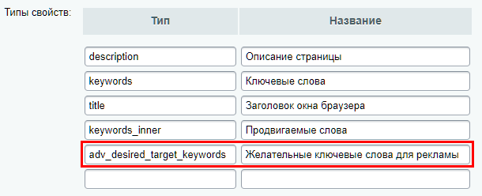
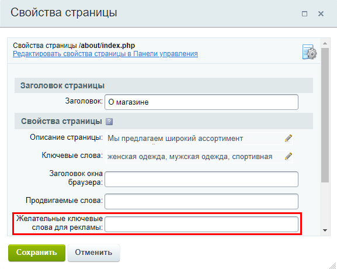

# Ключевые слова: настройка свойств страницы

**Навигация**
- [← Оглавление курса](index.md)
- [← Предыдущий: 2842 — Размещение компонента](lesson_2842.md)
- [Следующий: 2914 — Вывод нескольких тизеров в верхней части сайта →](lesson_2914.md)

Официальная страница урока: https://dev.1c-bitrix.ru/learning/course/index.php?COURSE_ID=48&LESSON_ID=2843

В уроке мы поговорим с вами о настройке

			ключевых слов для рекламы

                    Одна из форм таргетинга рекламы на сайте – это управление показом баннеров с помощью **ключевых слов**. Особенность данного метода заключается в том, что он позволяет организовать рекламную кампанию, направленную на четко определенную целевую группу пользователей сайта.

Подробнее в курсе [Продвижение сайта и маркетинг](https://dev.1c-bitrix.ru/learning/course/index.php?COURSE_ID=139&LESSON_ID=11835).

		. Задание ключевых слов возможно для любой страницы сайта, главное – это предусмотреть место для ввода этих слов.


### Настройка ключевых слов


Для управления показом баннеров необходимо провести некоторые дополнительные настройки системы. Для показа в **Рекламной области** конкретный **Баннер** может выбираться из общего списка по ключевым словам: желательным или обязательным. Задание таких ключевых слов возможно для любой страницы сайта.


В коде системы предусмотрено одно специальное свойство страницы: **adv_desired_target_keywords**. Оно отвечает за желаемые ключевые слова.


А также есть два метода добавления ключевых слов:


- [SetDesiredKeywords](/api_help/advertising/classes/cadvbanner/setdesiredkeywords.php) – для добавления желательных ключевых свойств;
- [SetRequiredKeywords](/api_help/advertising/classes/cadvbanner/setrequiredkeywords.php) – для добавления обязательных ключевых слов.


Свойство станет доступно в форме настройки свойств страницы, если заранее выполнить небольшие настройки модуля **Управление структурой** *(это рекомендуемый способ)*. А с помощью методов для страницы получится задать, как желаемые, так и обязательные ключевые слова, модифицируя код конкретной страницы *(этот способ для разработчиков)*.


**Важно знать!** Если желательные и обязательные слова не реализованы ни одним из перечисленных способов, то показ баннеров может быть осуществлен по стандартному свойству страницы **Ключевые слова**. Слова, перечисленные в этом свойстве, будут считаться желательными.


### Видеоурок


<!-- &lt;iframe title="Настройка ключевых слов для показа баннерной рекламы" src="//www.youtube.com/embed/KpnbZzFLZO4?feature=oembed&rel=0" allowfullscreen="" width="853" height="480" frameborder="0"&gt;
&lt;/iframe&gt; -->


### Способ №1 (рекомендуется)


Первый способ реализуется настройками в Административной части сайта. Но даёт возможность ввода только желательных слов.


Для создания поля в окне настройки страницы:


- Перейдите на страницу Настройки &gt; Настройки продукта &gt; Настройки модулей &gt; Управление структурой;
- В группе параметров **Настройки для сайтов** в полях **Типы свойств** впишите тип свойства **adv_desired_target_keywords** и дайте ему понятное название. Например, *«Желательные ключевые слова для рекламы»*:
  
- Сохраните внесенные данные и перейдите в публичный раздел;
- Откройте форму редактирования свойств страницы. Там вы должны увидеть добавленное поле для ввода ключевых слов:
  


Теперь любой пользователь, у которого есть доступ к редактированию страницы, сможет указать для неё желательные ключевые слова. Например, это актуально для Контент-менеджеров.


### Способ №2 (для разработчиков)


Методы добавления ключевых слов достаточно добавить в код страницы с перечислением ключевых слов. Для этого откройте страницу на редактирование в режиме PHP кода. Примеры кода:


- Для желательных ключевых слов:
  ```
  CAdvBanner::SetDesiredKeywords (array("partners", "cooperation", "Contacts"), "RIGHT");
  ```
- Для обязательных ключевых слов:
  ```
  CAdvBanner::SetRequiredKeywords (array("partners", "cooperation"));
  ```


Методы содержат следующие параметры:


- **keywords** – одно или несколько ключевых слов страницы. Перечисляются в кавычках и через запятую;
- **TYPE_SID** – тип баннера, для которого будут заданы ключевые слова. Если данный параметр оставить пустым, то ключевые слова будут заданы для всех типов баннеров.


**Примечание**. Следует отметить, что параметр **keywords** может включать в себя и более сложные конструкции. Подробнее об этом описано в документации по методам [SetDesiredKeywords](/api_help/advertising/classes/cadvbanner/setdesiredkeywords.php) и [SetRequiredKeywords](/api_help/advertising/classes/cadvbanner/setrequiredkeywords.php).


### Заключение


Итак, вы узнали о способах задания ключевых слов для показа рекламы. Проще и удобнее использовать первый способ с готовым свойством. Но если на сайте потребуется использование обязательных ключевых слов – воспользуйтесь вторым способом.
