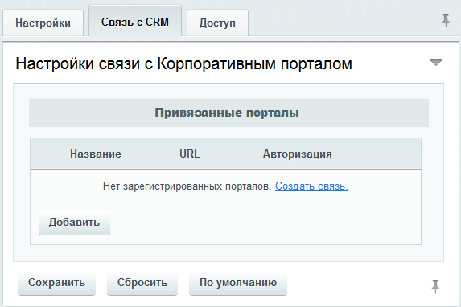

# Настройки модуля

**Навигация**
- [← Оглавление курса](index.md)
- [← Предыдущий: 7156 — Возможности веб-форм](lesson_7156.md)
- [Следующий: 2926 — Упрощенный режим →](lesson_2926.md)

Официальная страница урока: https://dev.1c-bitrix.ru/learning/course/index.php?COURSE_ID=48&LESSON_ID=2858

### Настройки модуля

Настройка модуля **Веб-формы** осуществляется на странице Настройки &gt; Настройки продукта &gt; Настройки модулей &gt; Веб-формы:

Поясним некоторые опции вкладки **Настройки**:

- **Использовать упрощенный режим редактирования форм** - включение/выключение
  			расширенного режима
                      Расширенный режим работы с веб-формами, помимо управления вопросами и результатами веб-форм, позволяет настраивать статусы результатов и создавать вычисляемые поля веб-форм.
  [Подробнее...](/learning/course/index.php?COURSE_ID=34&CHAPTER_ID=02927&LESSON_PATH=3905.4753.5749.2927&clear_cache=Y)
  		 работы с веб-формами. После выключения упрощённого режима возврат к нему не рекомендуется: возможно искажение данных.
- **Максимальное кол-во записей выбираемых в SQL запросах** - число записей, которое будет разрешено выбирать за один запрос SQL (устаревший параметр);
- **Право по умолчанию для вновь создаваемых веб-форм** - определяются возможные действия для пользователя с создаваемой формой.

### Связь с CRM

На вкладке **Связь с CRM** модуль **Веб-формы** можно

			интегрировать с CRM корпоративного портала

                    Веб-форма может передавать данные в CRM корпоративного портала в качестве нового лида.
[Подробнее...](lesson_3642.md)

		, после чего любую веб-форму можно настроить так, что результаты ее заполнения будут отправляться в качестве полей нового лида в CRM.

Чтобы добавить новое соединение нажмите кнопку **Добавить**, после чего появится окно

			привязки CRM

                    Доступно с CRM версии 11.5 и выше.

		:

Поясним некоторые поля:

- **Сервер CRM** - адрес вашего корпоративного портала или **Битрикс24**.
- **Путь** - адрес страницы с компонентом интеграции относительного корневого каталога сервера (он уже по умолчанию должен присутствовать в поле и вводить его не надо).

### Доступ

На вкладке **Доступ** указывается уровень доступа к настройкам форм и результатам заполнения.

Чтобы добавить право доступа для какой-либо группы пользователей, нажмите ссылку **Добавить право доступа**. В противном случае ко всем группам пользователей, кроме администраторов, будет применено право доступа **По умолчанию**.

Если указать право доступа **[R] доступ открыт**, группа пользователей получит доступ к веб-формам в меню, но дальнейшие права доступа к каждой веб-форме нужно настраивать отдельно. Если же указать **[W] полный доступ**, группа пользователей получит полный доступ ко всем веб-формам независимо от настроек доступа каждой отдельной веб-формы.

### Документация по теме

- [Настройки модуля](http://dev.1c-bitrix.ru/user_help/service/form/settings.php)
