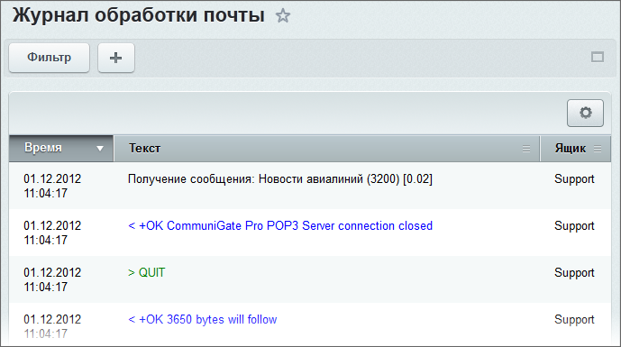

# Журнал работы

**Навигация**
- [← Оглавление курса](index.md)
- [← Предыдущий: 2665 — Правила](lesson_2665.md)
- [Следующий: 7475 — Почтовые сервисы →](lesson_7475.md)

Официальная страница урока: https://dev.1c-bitrix.ru/learning/course/index.php?COURSE_ID=48&LESSON_ID=2865

|  | ### Где фиксируется работа с почтой |
| --- | --- |

**Журнал обработки почты** (Сервисы &gt; Почта &gt; Журнал работы) отображает все события, связанные с функционированием модуля почты и получением сообщений:

- запросы системы к почтовому серверу;
- ответы почтового сервера;
- применение правил и действий.

В записях журнала цветом выделены записи о следующих событиях:

- зеленым цветом - запросы к серверу;
- синим цветом - ответы от сервера;
- красным цветом - описание возникших ошибок.

|  | #### Документация по теме: |
| --- | --- |

- [Журнал работы](https://dev.1c-bitrix.ru/user_help/service/mail/mail_log.php)
