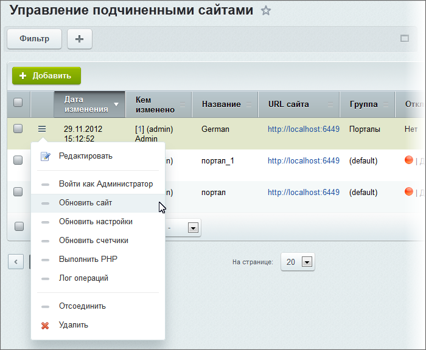
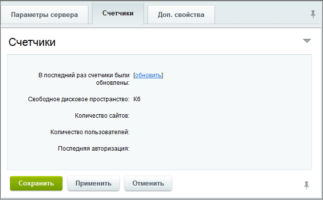

# Сайты

**Навигация**
- [← Оглавление курса](index.md)
- [← Предыдущий: 2901 — Настройки модуля](lesson_2901.md)
- [Следующий: 2887 — Группы →](lesson_2887.md)

Официальная страница урока: https://dev.1c-bitrix.ru/learning/course/index.php?COURSE_ID=48&LESSON_ID=2886

### Список подчиненных сайтов

На странице Сервисы &gt; Контроллер &gt; Сайты администратору контроллера отображается список всех сайтов, подчиненных контроллеру.

Сайт может присутствовать в списке, но быть отключенным от контроллера, если это потребовалось
администратору.

Администратор может деактивировать сайт вручную или задать период его активности, когда контроллер автоматически будет сверять период с текущей датой и временем на сервере.

Поддерживается неограниченное количество подчиненных сайтов.

**Внимание!** Если подчиненный сайт подключен к контроллеру и неактивен, значит, он недоступен для любых посетителей.

### Меню действий

Основные операции с подчиненными сайтами выполняются через меню действий.

**Примечание:** Некоторые пункты меню доступны только для подключенного сайта.

- **Редактировать** – переход к форме редактирования параметров сайта;
  **Примечание:** Для изменения параметров уже подключенного сайта используется  форма схожая с формой
  			Регистрация нового клиента
                      
  		, но в ней будет доступна дополнительная вкладка **Счетчики**.
- **Войти как Администратор** – переход в публичный раздел сайта-клиента в качестве администратора.
- **Обновить сайт** – установка обновлений на сайт клиента.  При использовании этой функции автоматически создастся задача на обновление. Запуск процесса обновления производится со страницы **Задачи**. Результат обновления виден в **Журнале**.
- **Обновить настройки** – выполнение установки
  			настроек
                      Многие настройки группы подразумевают соответствующее изменение настроек на удаленном сайте.
  [Подробнее...](lesson_2887.md#settings_update)
  		 на сайт клиента.
    **Обновить счётчики** – обновление счётчиков,
  			заданных для группы сайтов
                      Для облегчения управления множествами подчиненных сайтов администратору контроллера предлагается возможность их размещения в группах, для каждой из которых можно установить требуемую групповую политику.
  [Подробнее...](lesson_2887.md#counter_settings)
  		, к которой относится выбранный клиент.
    **Выполнить PHP** – переход на страницу удаленного выполнения команды для данного сайта.
    **Лог операций** – переход на страницу
  			журнала
                      Функционал **Журнал** предназначен для отладки работы. В нём фиксируются результаты выполнения всех операций над сайтами, включенными в контроллер, в том числе: журналирование примечаний при смене группы и обновление счетчиков при занесении заметки в журнал.
  [Подробнее...](lesson_2889.md)
  		 работы контроллера с установленным фильтром на данном клиенте.
    **Отсоединить** – отключение клиента от контроллера. (Отсоединение так же возможно и в форме редактирования клиента с помощью кнопки **Отсоединить** на контекстной панели.)
    **Удалить** – удаление записи данного клиента.
  **Примечание:**
       Если при удалении клиент не был отсоединен, то запись об этом клиенте из контроллера будет удалена, а сам сайт будет работать с теми настройками, которые были установлены контроллером.
       Если же перед удалением клиент был отсоединен, то на сайте будут возвращены настройки, установленные до подключения к контроллеру.

### Подключение подчиненного сайта к контроллеру

Для подключения сайта к контроллеру необходимо выполнить следующее:

- Нажать кнопку **Добавить** на контекстной панели страницы **Сайты**
- Заполнить поля формы **Регистрация нового клиента**
  

  - **URL-адрес сайта и его название**
    Именно по URL-адресу контроллер впоследствии обращается к удаленному сайту и выполняет
    все настройки, ограничения и команды. Название и описание помогают ориентироваться в
    общем списке сайтов.
  - **Логин и пароль администратора**
    Знание параметров учетной записи администратора – это первичное условие для
    подключения самостоятельного сайта к контроллеру. Иными словами, владельцы
    удаленного сайта, предоставляя административные права администратору контроллера, фактически дают свое согласие на удаленный режим управления их веб-проектом. Тем не менее, рекомендуется дополнительно оформлять данное соглашение юридически.
  - **Группа**
    Привязка сайта к определенной группе означает автоматическое применение к нему всех групповых настроек и политик безопасности, которыми эта группа обладает.
              По умолчанию привязка осуществляется к группе, указанной в настройках модуля.
    **Примечание:** Если сайт привязывается к новой группе, то соответствующая ей политика безопасности будет применена к сайту на основании настроек заданной группы.
  - **Активность**
    Администратор контроллера может управлять активностью подключаемого сайта. Активность
    сайта фактически означает его работоспособность, т.е. возможность принимать и обрабатывать запросы клиентов. Активность может быть установлена на заданный период времени, если, например, предполагается оплачиваемый период удаленного управления или решаются другие задачи.
  - Чтобы сайт-клиент был открыт для доступа посетителям, необходимо отметить опцию **Активен (открыт для доступа посетителям)**.
  - С помощью опции **Период активности** можно задать период, в течение которого подключаемый сайт будет активен.
- Нажать кнопку **Сохранить**. В случае удачного подключения к сайту он будет отображен в общем списке.

**Примечание:** При редактировании параметров сайта будет доступна еще одна закладка – **Счетчики**, на которой отображается следующая информация о подчиненном сайте:

Обновление данных происходит как вручную (с помощью ссылки [обновить]), так и автоматически, но при условии, что в настройках группы (Сервисы &gt; Контроллер &gt; Группы) на закладке [Счетчики](lesson_2887.md#counters) отмечены опции для получения соответствующей информации.

Подробное описание всех полей формы можно посмотреть в [пользовательской документации](http://dev.1c-bitrix.ru/user_help/service/controller/controller_member_edit.php#counters).

Также возможен вариант подключения сайта к контроллеру непосредственно из административной части подчиненного сайта (если на нем не установлен модуль **Контроллер**).

Для этого:

- Перейдите на страницу настроек **Главного модуля** подчиненного сайта, секция **Служебные процедуры**, закладка **Контроллер**:
  
- Укажите параметры подключения к сайту-контроллеру: **URL контроллера**, **Логин администратора контроллера** и **Пароль** администратора контроллера;
- Укажите параметры: **Название текущего сайта** и **URL сайта**;
- Задайте **Настройки прокси (если требуется)** и нажмите кнопку **Сохранить настройку прокси**;
- Нажмите кнопку **Добавить этот сайт к контроллеру**.

Если неверно или не полностью заполнены данные, будет выведено соответствующее уведомление.

**Важно!** Если на управляющем сайте включена

			Защита административной части

Защита административной части осуществляется с помощью ограничения доступа со всех, кроме указанных в настройках IP-адресов. Включение или отключение защиты выполняется на странице **Защита административного раздела** (Настройки &gt; Проактивная защита &gt; Защита административного раздела) с помощью кнопки **Включить защиту** (или **Выключить защиту**).

[Подробнее](lesson_2673.md#admin)...

		, то не забудьте внести IP подчиненного сайта в список разрешенных, иначе при работе с подчиненным сайтом через контроллер может возникнуть ошибка **Ответ контроллера подписан некорректно**.

### Документация по теме

- [Управление подчиненными сайтами](https://dev.1c-bitrix.ru/user_help/service/controller/controller_member_admin.php)
