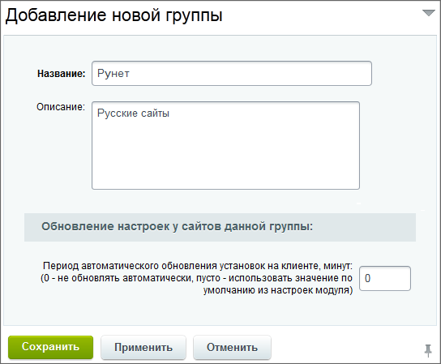
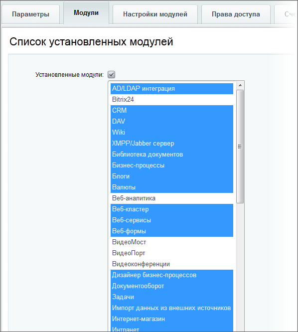

# Группы

**Навигация**
- [← Оглавление курса](index.md)
- [← Предыдущий: 2886 — Сайты](lesson_2886.md)
- [Следующий: 2888 — Задачи →](lesson_2888.md)

Официальная страница урока: https://dev.1c-bitrix.ru/learning/course/index.php?COURSE_ID=48&LESSON_ID=2887

### Список групп и меню действий

Для облегчения управления множествами подчиненных сайтов администратору контроллера предлагается возможность их размещения в группах, для каждой из которых можно установить требуемую групповую политику.

На странице **Группы** (Сервисы &gt; Контроллер &gt; Группы) находится список всех групп, присутствующих в контроллере.

#### Меню действий

Для каждой группы в меню действий доступны следующие пункты:

- **Редактировать** - переход к форме редактирования параметров группы сайтов;
- **Копировать** - копирование группы сайтов;
- **Удалить** - удаление группы.
  **Примечание:** Удаление группы, к которой относится хотя бы один сайт, а также группы, используемой по умолчанию, невозможно.

### Создание группы

Для создания новой группы необходимо нажать кнопку **Добавить** на контекстной панели страницы **Группы** и заполнить поля формы:

- Закладка **Параметры**
  
  На вкладке **Параметры**, помимо названия и описания группы, доступна группа параметров **Обновление настроек у сайтов данной группы**.
  Дело в том, что многие настройки группы подразумевают соответствующее изменение настроек на удаленном сайте. Например, права доступа локальных групп пользователей или список активных модулей. В этой связи изменение настроек группы заставляет модуль **Контроллер сайтов** обратиться к каждому из удаленных веб-проектов, авторизоваться, установить сеанс удаленного управления и выполнить необходимые команды. Поэтому если к группе привязано большое количество веб-проектов, то изменение ее настроек может инициировать очень ресурсоемкий процесс, сопряженный с большой нагрузкой на сам контроллер.
  Для решения этой проблемы был предусмотрен механизм отложенного применения групповых настроек. При сохранении группы с новыми настройками, задачи перенастройки параметров каждого сайта помещаются в планировщик задач и исполняются с равномерной нагрузкой на сервер в течение указанного в параметре **Период автоматического обновления установок на клиенте, минут** значения.
- Закладка **Модули**
  
  В данном диалоге можно управлять списком модулей, которые будут активны на подчиненных сайтах текущей группы.
  > Термин **Неактивный модуль** означает, что данный модуль на удаленном сайте исключен из функциональности. Это не означает его деинсталляцию в продукте, включая удаление связанных с ним данных. Модуль просто исключается из визуализации в административной панели и прекращает свою работу (не отвечает на запросы ядра).
  Зачастую не все модули приобретенной редакции используются в интернет-проекте и в этом случае исключение этих модулей из административной части избавляет техническую поддержку от массы лишних вопросов, а веб-проект - от непреднамеренного внесения ошибок.
- Закладка **Настройки модулей**
  Данная закладка позволяет задать некоторые параметры настройки **Главного модуля** и настройки модуля **Управление структурой** на подчиненном веб-проекте:
  **Внимание!** Перечисленные настройки контроллера имеют приоритет над локальными настройками сайтов, подключенных к контроллеру. Пока сайт подключён к контроллеру, будут действовать настройки контроллера. При отключении сайта от контроллера вступят в силу локальные настройки.
  **Примечание:** Недостающие настройки можно реализовать с помощью **PHP-скриптов инсталляции/деинсталляции** групповой политики на закладке **Дополнительно**.

  - **Автокеширование компонентов** - не позволяет локальному администратору переключать настройку автокеширования в компонентах, тем самым влияя на производительность и визуализацию динамического контента.
  - **Режим вывода ошибок** - настройка визуализации ошибок на удаленном сайте. Поставив **Ошибки и предупреждения**, локальный администратор может инициировать вызов служебных сообщений PHP в публичной части сайта, что нецелесообразно. Данная настройка может этому воспрепятствовать. Возможны и другие примеры использования этой настройки.
  - **E-mail адреса для дублирования исходящих писем** - используется при необходимости администратору контроллера получать на заданный e-mail все почтовые сообщения, генерируемые веб-проектами, отнесенными к данной группе.
  - **Дисковая квота** - максимальный размер дискового пространства, занимаемый веб-сайтами, отнесенными к данной группе. В рассмотрение включается и размер публичных файлов, включая содержимое папок `/bitrix/` и `/upload/`, и размер базы данных веб-проекта. При превышении дисковой квоты удаленный веб-сайт будет генерировать сообщения об ошибках при операциях добавления новых данных.
  - **Настройки регистрации** новых пользователей в удаленных проектах позволяют администратору контроллера разрешить или запретить самостоятельную регистрацию новых пользователей на удаленном сайте, разрешить/запретить запоминание авторизации, принудительно включить CAPTCHA для защиты от автоматических регистраций и др. настройки.
  - **Настройки системы обновлений** позволяют указать настройки обращения к серверу обновлений для сайтов, отнесенных к данной группе. Это может быть стандартный сервер обновлений компании «1С-Битрикс» либо произвольный сервер (например, сам контроллер), с которого локальные веб-сайты будут скачивать обновления ядра и модулей продукта.
  - Список **Доступные компоненты в визуальном редакторе** дает возможность администратору контроллера указать список компонентов, которыми могут оперировать пользователи подчиненного сайта. Минимально необходимый список компонентов исключит возможность ошибок и некорректного отображения страниц удаленного веб-сайта.
- Закладка **Права доступа**.
  На данной закладке администратору контроллера предоставляется возможность внести изменения в стандартную систему разграничения прав доступа на сайте, включенном в контроллер.
  Все эти настройки помогают исключить возможность внесения нежелательных изменений локальными пользователями при управлении сайтом.
  При установленном флаге **Отнимать полный доступ у администраторов** можно задать для администраторов локальных сайтов иные права на модули, чем предусмотрено локальными настройками сайтов.
  Аналогичным образом администратор контроллера может переопределить права и для других групп на подчиненном сайте.
- Закладка **Счетчики**
  На данной закладке можно выбрать счетчики и указать период их автоматического обновления.
  **Примечание**: Кроме периодического обновления счётчики могут обновляться вручную, а также при смене группы.
  Информация по ним будет доступна в режиме редактирования сайта (Сервисы &gt; Контроллер &gt; Сайты) на закладке **Счетчики**.
- Закладка **Дополнительно**
  На данной вкладке предоставляется возможность указать PHP-скрипты, которые будут выполнены на подчиненных сайтах при установке или отмене данной групповой политики.
  Данная закладка - это расширение настроек групповой политики, которые были перечислены выше. Технический специалист, используя документацию к продукту, может самостоятельно разработать любой функционал, который будет выполнен на удаленном сайте при установке или отмене этой групповой политики.
- Закладка **Доп. поля**.
  На закладке создаются
  			пользовательские поля
                      **Пользовательское поле** - инструмент, позволяющий добавлять к объектам системы поля, не предусмотренные штатным функционалом.
  [Подробнее...](https://dev.1c-bitrix.ru/learning/course/index.php?COURSE_ID=43&CHAPTER_ID=04804)
  		 для группы сайтов. При копировании группы пользовательские поля так же копируются.

### Документация по теме

- [Управление группами сайтов](https://dev.1c-bitrix.ru/user_help/service/controller/controller_group_admin.php)
- [Создание и редактирование группы сайтов](https://dev.1c-bitrix.ru/user_help/service/controller/controller_group_edit.php)
