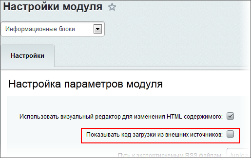
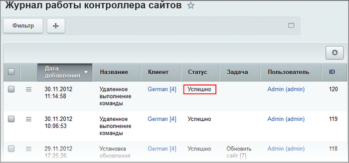
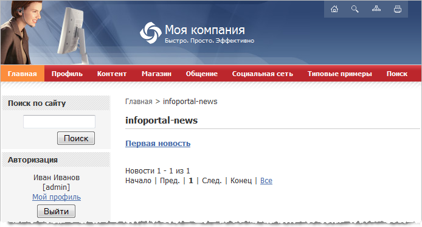

# Публикация новостей с контроллера на подключенных сайтах

**Навигация**
- [← Оглавление курса](index.md)
- [← Предыдущий: 3587 — Авторизация](lesson_3587.md)
- [Следующий: 2879 — Частые вопросы →](lesson_2879.md)

Официальная страница урока: https://dev.1c-bitrix.ru/learning/course/index.php?COURSE_ID=48&LESSON_ID=2920

|  | Идея публикации новостей заключается в формировании на контроллере **xml** файла, передаче его на подключенные к контроллеру сайты и импорте метаданных инфоблока и значений полей/свойств элемента. |
| --- | --- |

**Внимание!** Есть вероятность того, что большие по объему новости не будут опубликованы на подчиненном сайте. Это зависит от настроек сайта и хостинга, так как вся новость передается в большом POST запросе.

**Внимание!** Действие по публикации новостей требует на клиенте версию главного модуля не ниже 11.0.9.

Для публикации новостей с контроллера на подключенных сайтах выполните следующее:

- Подключите к контроллеру сайт, на который будут транслироваться новости
- На контроллере и на подключенных сайтах в настройках модуля инфоблоков (по крайней мере, на время) отметьте опцию **Показывать код загрузки из внешних источников**
  
- Настройте инфоблок на контроллере:
  Укажите **Символьный код** - именно по нему будет выполняться синхронизация элементов;
  В поле **Участвует в документообороте или бизнес процессах** выберите опцию **Бизнес процессы**;
  
  Затем нажмите кнопку **Применить**.
  На появившейся вкладке **Шаблоны бизнес-процессов** для бизнес-процесса **Публикация на подключенных сайтах** отметьте опции **Создание** и **Изменение** и сохраните изменения настроек инфоблока.
- На подключенном сайте создайте инфоблок с таким же значением внешнего кода, как и на контроллере. Кроме привязки к сайту, названия и внешнего кода настройте и права доступа к инфоблоку.
  Создайте страницу, если необходимо, и разместите на ней компонент **Новости**, в настройках которого укажите созданный инфоблок.
- На сайте контроллера добавьте новость
  
  
- После чего на подключенном сайте появится новость
  
