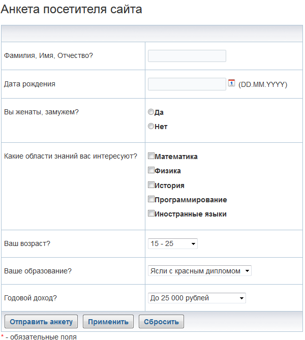
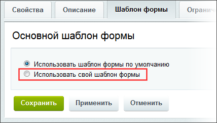
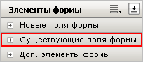
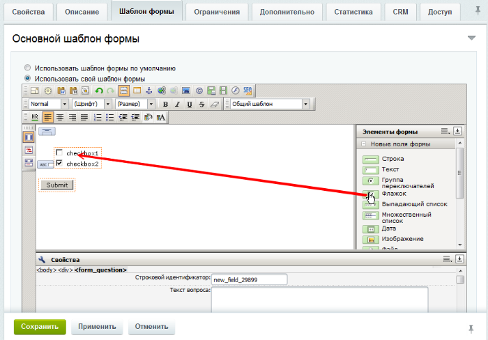
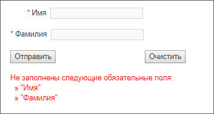

# Создание шаблона веб-формы

**Навигация**
- [← Оглавление курса](index.md)
- [← Предыдущий: 9185 — Как включить звонки на 48 человек](lesson_9185.md)
- [Следующий: 2929 — Публикация веб-формы →](lesson_2929.md)

Официальная страница урока: https://dev.1c-bitrix.ru/learning/course/index.php?COURSE_ID=48&LESSON_ID=2928

### Введение

Если не нравится, как отображается ваш шаблон в

			стандартном варианте

                    

		, перейдите на закладку **Шаблон формы** в режиме редактирования веб-формы и создайте свой шаблон, выбрав пункт

			Использовать свой шаблон формы

                    

		.

Если форма и вопросы к ней уже созданы, то вопросы сразу отобразятся в визуальном редакторе в панели

			Элементы формы

                    

		. Если вопросы не созданы, то их можно создавать прямо в процессе создания шаблона. Создание вопросов при создании шаблона - не самый удобный способ, к тому же в этом случае доступен не весь функционал вопросов, в частности нельзя задать валидаторы. Поэтому рекомендуем вопросы

			создать

                    О том, как создать вопросы, читайте в [уроке](lesson_5155.md).

		 заранее.

### Видеоурок

### Создание шаблона и вопросов

Создадим шаблон и вопросы формы. Для этого в рабочей области разместим элементы из разделов

			Дополнительные элементы формы

                    

		 и

			Новые поля формы

                    

		 панели **Элементы формы** и определим их свойства. Суть элементов ясна из их названия и дополнительных пояснений не требует.

Разместите наверху поля элемент **Заголовок формы**, а внизу - **Кнопка Отправить**.

**Примечание**: если при создании веб-формы ставили флажок **Использовать CAPTCHA**, то обязательно разместите элемент CAPTCHA. Иначе при сохранении формы флаг **Использовать CAPTCHA** пропадёт.

Создадим вопрос с множественным выбором. В разделе **Новые поля формы** найдите элемент **Флажок** и перенесите его на поле формы. А в разделе **Дополнительные элементы формы** найдите элемент **Подпись поля формы** и поместите его перед Флажком.

Кликните на элементе Флажок, откроется панель **Свойства**:

Заполните поля. Обязательно заполните **Строковой идентификатор**, **Текст вопроса** и **Ответы**.

Кликните на элементе Подпись поля формы, откроется панель **Свойства**. В форме укажите Строковой идентификатор, который только что указали для элемента флажок.

Создайте по аналогии все остальные вопросы формы, разместите их нужным образом на странице, добавьте картинки, измените шрифты и используйте другие возможности

			визуального редактора

                    Визуальный редактор - инструмент, позволяющий отображать редактируемый текст в точности так же, как он будет выглядеть на странице, без использования HTML кода. [Подробнее...](https://dev.1c-bitrix.ru/learning/course/index.php?COURSE_ID=34&CHAPTER_ID=06299&LESSON_PATH=3905.6299)

		, тогда веб-форма в публичном разделе станет такой как вам хочется её видеть. Например, такой:

### Как разместить сообщение об ошибке

Чтобы пользователь видел, что поле является обязательным к исполнению, воспользуйтесь элементом **Символ "Обязательное поле"**. Для вывода сообщения о том, что не все обязательные поля использованы используйте элемент **Ошибки формы**:

Такой результат получим в публичной части при нажатии кнопки **Отправить**:

### Дополнительно

- [Пример для упрощенного режима: анкета регистрации](https://dev.1c-bitrix.ru/learning/course/index.php?bitrix_include_areas=Y&COURSE_ID=34&LESSON_ID=12645&LESSON_PATH=3905.4753.5749.12643.12645) - практический пример создания веб-формы с собственным шаблоном.
