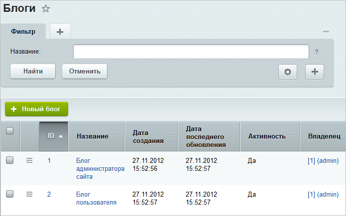
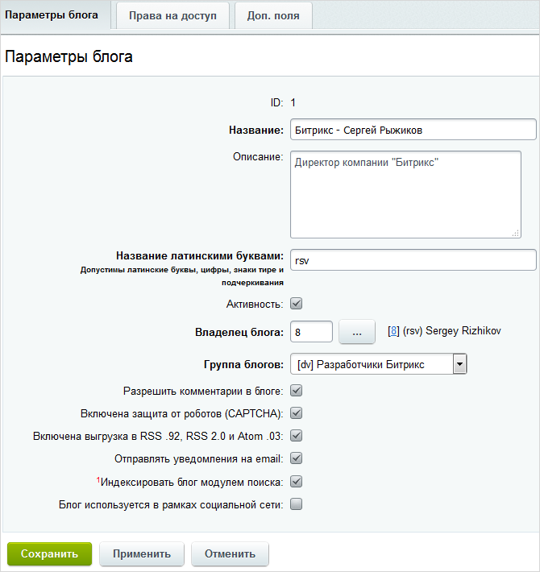
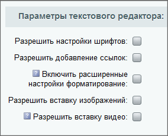
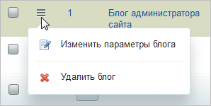

# Блоги

**Навигация**
- [← Оглавление курса](index.md)
- [← Предыдущий: 2934 — Группы блогов](lesson_2934.md)
- [Следующий: 2936 — Комментарии →](lesson_2936.md)

Официальная страница урока: https://dev.1c-bitrix.ru/learning/course/index.php?COURSE_ID=48&LESSON_ID=2935

В предыдущем уроке мы разобрали, как создавать группу блогов. В этом уроке рассмотрим, как создавать сами блоги.

### Видеоурок

### Создание и редактирование блога

Создание и редактирование блогов осуществляется на

			странице

		  **Блоги** (Сервисы &gt; Блоги &gt; Блоги):

Чтобы создать новый блог, нажмите кнопку **Новый блог**, расположенную на контекстной панели. Откроется форма, состоящая из трех закладок:

1. **Параметры блога:**
  
  Значения остальных параметров понятны интуитивно.
  **Примечание**: При включении индексации блога не забудьте
  			переиндекcировать
                      Переиндексацию модуля проводит администратор сайта на странице Настройки &gt; Поиск &gt; Переиндексация:
  
  [Подробнее](lesson_2048.md) в курсе "Администратор. Базовый"...
  		 модуль.
  При создании можно ограничить возможности текстового редактора для тех, кто комментирует сообщения. Это выполняется в секции
  			Параметры текстового редактора
                      
  		.

  - **Владелец блога** - выбирается пользователь, который будет вести блог и **модерировать** его.
    **Внимание**: в системе предусмотрено следующее правило создания блогов: каждый пользователь (т.е. посетитель с уникальным логином и паролем) может завести **только один блог**.
    Будьте внимательны, доступна возможность указать для нескольких блогов одного и того же владельца. Но писать сообщения ему будет доступно только в одном блоге.
  - **Включена выгрузка в RSS .92, RSS 2.0 и Atom .03** - данная опция определяет возможность экспорта данных блога в форматы RSS .92, RSS 2.0 и Atom .03. Если флаг установлен, то на страницах блога будут отображаться кнопки для экспорта данных в соответствующие форматы.
2. **Права на доступ:**
  На закладке выполняется настройка прав на доступ к блогу:
  
  **Примечание**: по умолчанию в блоге присутствуют две группы пользователей: **Все пользователи** и **Авторизованные пользователи**. Дополнительно блогер может создать в своем дневнике другие группы, например, Друзья, Посетители и т.д. Это выполняется с помощью функционала публичного раздела. Настройка прав всех групп пользователей возможна как из административного раздела, так и из публичного раздела.
3. **Доп. поля:**
  На закладке **Доп. поля** можно добавить и настроить
  			Пользовательское поле
                      Если в системе нет поля для нужных данных, можно создать своё поле – **Пользовательское поле**.
  [Подробнее](lesson_8637.md)...
  		, но эту работу выполняет администратор сайта.

### Редактирование и удаление

Чтобы отредактировать или удалить существующий блог, воспользуйтесь соответствующими пунктами меню действий.

Форма редактирования блога аналогична форме создания.

### Документация по теме

- [Список блогов](https://dev.1c-bitrix.ru/user_help/service/blogs/blog_blog.php)
- [Создание и редактирование блога](https://dev.1c-bitrix.ru/user_help/service/blogs/blog_blog_edit.php)
