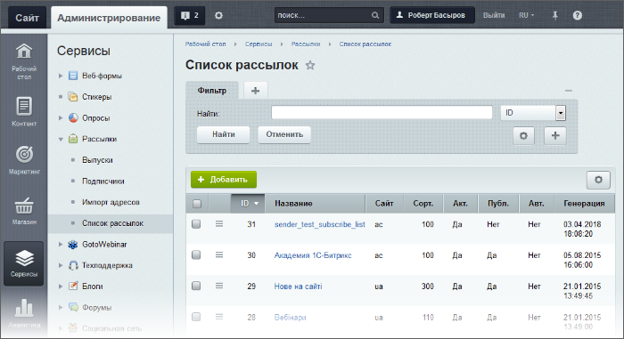
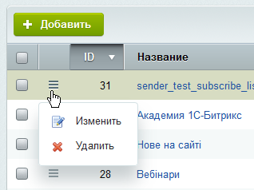

# Рассылки

**Навигация**
- [← Оглавление курса](index.md)
- [← Предыдущий: 11967 — Отчеты 1С](lesson_11967.md)
- [Следующий: 5173 — Импорт адресов →](lesson_5173.md)

Официальная страница урока: https://dev.1c-bitrix.ru/learning/course/index.php?COURSE_ID=48&LESSON_ID=2948

Что такое рассылки, выпуски и подписчики?

### Общая информация

> **Рассылки** - это тематические рубрики, на которые могут подписаться посетители *Bitrix Framework*. Возможна одновременная подписка на несколько рассылок.

> **Подписчики** - посетители *Bitrix Framework*, подписавшиеся на рассылки. Подписчики могут быть как зарегистрированными пользователями, так и анонимными. Анонимными подписчиками признаются подписчики, не зарегистрированные в *Bitrix Framework*.

> **Выпуски** - почтовые сообщения, рассылаемые подписчикам. Выпуск может быть направлен:
>
> - Подписчикам на определённые рассылки;
> - Пользователям определённых групп прав;
> - На произвольные адреса.

Управление рассылками осуществляется на странице **Список рассылок** (Сервисы &gt; Рассылки &gt; Список рассылок):

Новая рассылка создаётся по кнопке **Добавить**. Редактируется с помощью команд

			меню действий

                    

		 либо с помощью двойного клика по соответствующей записи.

### Какие бывают рассылки

Рассылки различаются по следующим критериям: **доступности** и **способу отправки**.

**Доступность**:

- **публичные** – пользователи самостоятельно оформляют подписку на интересующие их рубрики, а также изменяют параметры уже оформленных подписок. Подписка может быть оформлена как зарегистрированным, так и анонимным пользователем.
- **закрытые** – подписка пользователей на закрытые рассылки выполняется администратором.

**Способ отправки**:

- ручной
                      Как создать ручную рассылку см. [Подробнее...](/learning/course/index.php?COURSE_ID=48&CHAPTER_ID=1029)
  		 – при создании выпуска определяется на какие рассылки будет отправлено сообщение подписчикам.
- автоматический
                      Как создать автоматическую рассылку см. [Подробнее...](/learning/course/index.php?COURSE_ID=48&CHAPTER_ID=1030)
  		  – генерация и рассылка сообщений выполняется автоматически по заданному шаблону и расписанию (в указанные дни и время суток).

### Документация по теме

- [Список рассылок](https://dev.1c-bitrix.ru/user_help/service/subscribe/rubric_admin.php)
- [Создание и редактирование рассылки](https://dev.1c-bitrix.ru/user_help/service/subscribe/rubric_edit.php)
- [Проверка шаблона рассылки](https://dev.1c-bitrix.ru/user_help/service/subscribe/template_test.php)
- [Настройки модуля](http://dev.1c-bitrix.ru/user_help/service/subscribe/settings.php)
