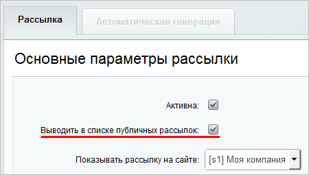
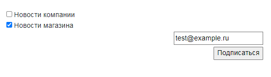
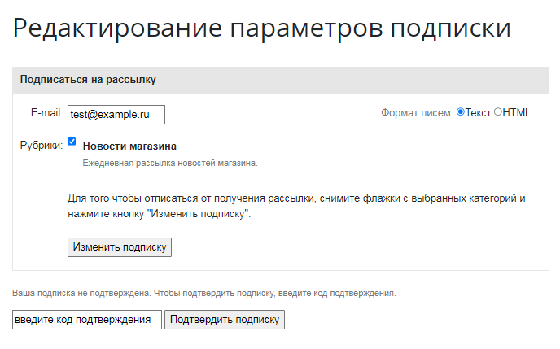
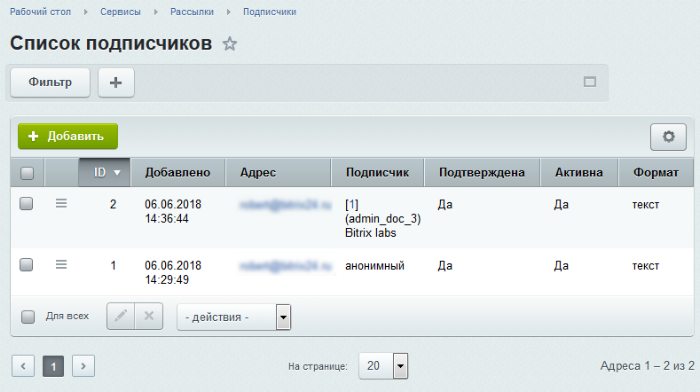
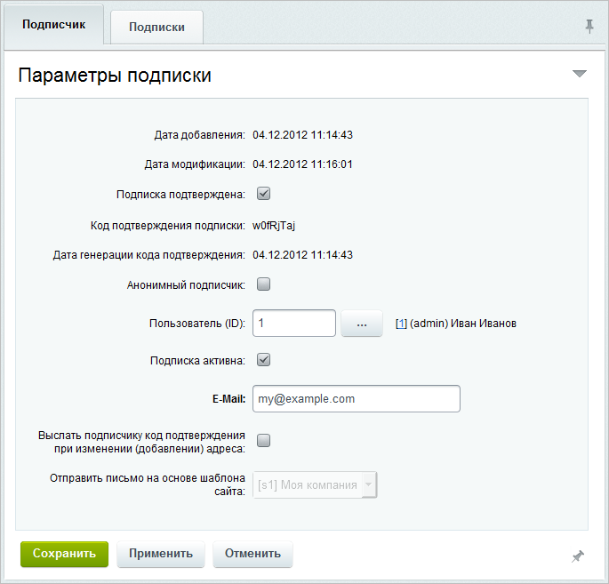
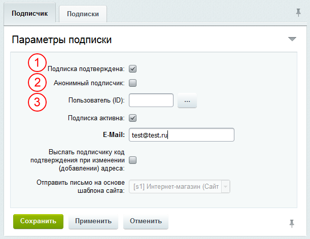
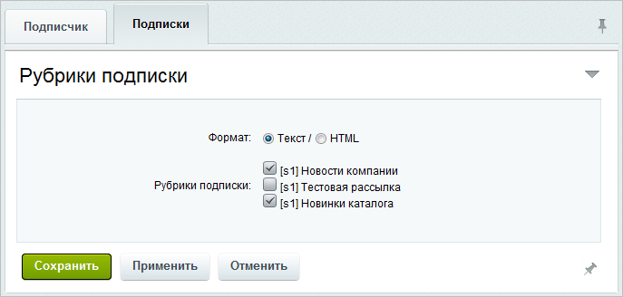

# Организация подписки на рассылку

**Навигация**
- [← Оглавление курса](index.md)
- [← Предыдущий: 1948 — Просмотр выпуска](lesson_1948.md)
- [Следующий: 2952 — Управление выпусками ручной рассылки →](lesson_2952.md)

Официальная страница урока: https://dev.1c-bitrix.ru/learning/course/index.php?COURSE_ID=48&LESSON_ID=2951

Оформление подписки на рассылку делается:

 • самостоятельно пользователем, если рассылка публичная;

 • администратором (если рассылка является **закрытой**, то есть недоступной из публичного раздела).

### Подписка пользователем самостоятельно

Чтобы пользователь мог оформить подписку самостоятельно, выполните два действия:

1. Создайте страницу
  Создать новую страницу можно и через Публичный раздел, и через Административный. В Публичном разделе есть удобный инструмент - Мастер создания новой страницы. Для создания страницы с помощью Мастера нажмите **Создать страницу**.
  [Подробнее](https://dev.1c-bitrix.ru/learning/course/index.php?COURSE_ID=34&LESSON_ID=1911)...
  		 и
  			разместите
                      Просто переместите компонент мышкой в рабочую область.
   
    [Подробнее..](/learning/course/index.php?COURSE_ID=34&LESSON_ID=9163#add_component)
  		 на ней
  			компонент
                      Компонент – это программный код, оформленный в визуальную оболочку, выполняющий определённую функцию какого-либо модуля по выводу данных в Публичной части. Мы можем вставлять этот блок кода на страницы сайта без непосредственного написания кода. [Подробнее...](https://dev.1c-bitrix.ru/learning/course/index.php?COURSE_ID=34&CHAPTER_ID=04457)
  			Страница редактирования подписки
                       Компонент служит для создания страницы с формами для добавления или редактирования адреса подписки.
  						[Описание компонента «Страница редактирования подписки» в пользовательской документации.](http://dev.1c-bitrix.ru/user_help/detail.php?ID=63110)
  		 (subscribe.edit).
2. Разместите в шаблоне сайта или на нужных страницах сайта компонент
  			Форма подписки
                      Компонент служит для построения включаемой в дизайн сайта формы для подписки на рассылки.
  						[Описание компонента «Форма подписки» в пользовательской документации.](http://dev.1c-bitrix.ru/user_help/detail.php?ID=63111)
  		 (subscribe.form). В настройках этого компонента в параметре
  			Страница редактирования подписки
  
  		 укажите адрес созданной ранее страницы.
  По умолчанию на этой странице отображаются активные рассылки, для которых было отмечено поле
  			Выводить в списке публичных рассылок
                      
  		. При желании можно вывести и скрытые рассылки. Для этого нужно в настройках используемого компонента отметить опцию **Показать скрытые рубрики подписки**.

Готово! Теперь пользователь сможет

			подписаться

		 на желаемые рассылки и

			отредактировать

		 свои подписки.

После оформления подписки для пользователя-подписчика создается учетная запись в модуле **Подписка, рассылки** на странице Сервисы &gt; Рассылки &gt; Подписчики:

.

Эта запись содержит

			данные подписчика

                    

		, а также информацию о выбранных пользователем рассылках. При необходимости администратор может изменить бюджет подписчика (например, отписать его от какой-либо рассылки или подтвердить подписку вручную).

### Подписка пользователя администратором

Крайне редко, но случается ситуация когда подписчик не может сам добавить себя в рассылку. Например, если рассылка не видна в публичной части. В этом случае администратор добавляет в систему подписчика с помощью кнопки **Добавить** на контекстной панели страницы **Список подписчиков** (Сервисы -&gt; Рассылки -&gt; Подписчики). Открывается форма добавления подписчика:

На закладке **Подписчик** вводятся данные о подписчике:

На закладке **Подписки** выбираются

			рассылки

                    

		, на которые подписывается пользователь, а также формат отправляемых сообщений.

### Документация по теме

- [Подписчики](https://dev.1c-bitrix.ru/user_help/service/subscribe/subscr_admin.php)
- [Создание и редактирование подписчика](https://dev.1c-bitrix.ru/user_help/service/subscribe/subscr_edit.php)
