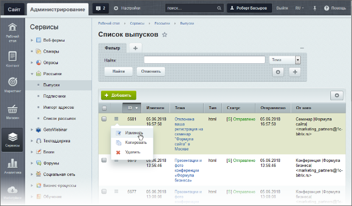
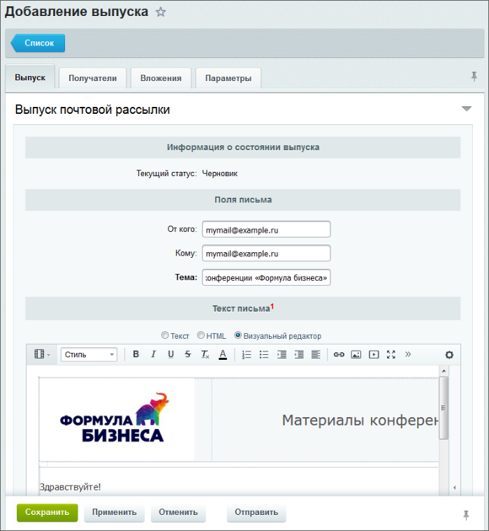
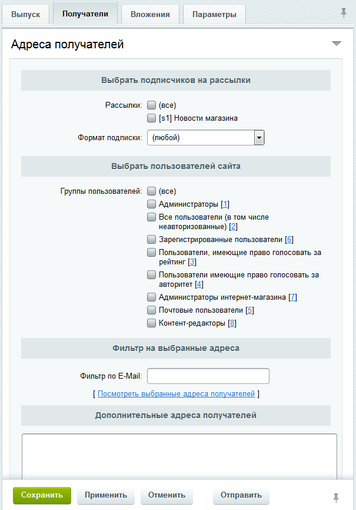
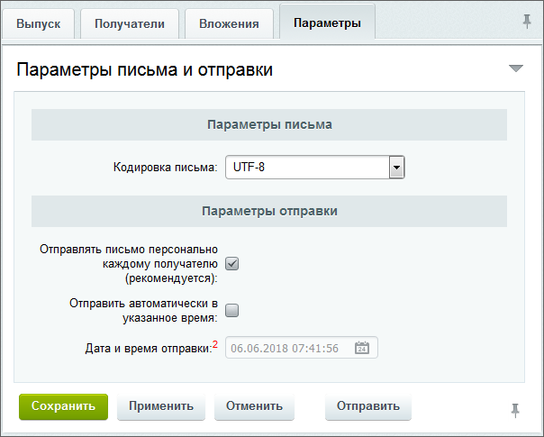

# Управление выпусками ручной рассылки

**Навигация**
- [← Оглавление курса](index.md)
- [← Предыдущий: 2951 — Организация подписки на рассылку](lesson_2951.md)
- [Следующий: 3523 — Работа с почтовыми шаблонами →](lesson_3523.md)

Официальная страница урока: https://dev.1c-bitrix.ru/learning/course/index.php?COURSE_ID=48&LESSON_ID=2952

Каждая рассылка может разослать бесконечное число выпусков. Создав рассылку вы создали, образно говоря, телеканал, передачами в котором служат выпуски. Создание выпусков выполняется для **ручных** рассылок. Выпуски для **автоматических** рассылок генерируются системой по заданному расписанию на основе выбранного шаблона.

> **Выпуск** - это почтовое сообщение, отправляемое подписчикам на те или иные рассылки.

### Видеоурок

<!-- &lt;iframe title="Как создать выпуск ручной рассылки" src="//www.youtube.com/embed/ulGLJE7WevM?feature=oembed&rel=0" allowfullscreen="" width="853" height="480" frameborder="0"&gt;
	 
	&lt;/iframe&gt; -->

### Создание выпуска

Управление выпусками осуществляется на странице **Список выпусков** (Сервисы &gt; Рассылки &gt; Выпуски):

По клику на кнопке **Добавить** откроется форма создания выпуска, состоящая из нескольких закладок. Заполните эти закладки

- Закладка **Выпуск** служит для создания самого информационного сообщения.
  
  Для правильной отправки сообщения необходимо заполнить поля с адресами
  			отправителя
  **От кого** - прописывается адрес, от имени которого будет отправляться выпуск (адрес, который увидит клиент).
  		 и
  			получателя
  **Кому** - указывается адрес для контроля содержания рассылки (например, адрес администратора иди контент-менеджера).
  		 сообщения по умолчанию, а также темой сообщения. Если поля отправителя и получателя не будут заполнены, то они возьмутся из настроек модуля **Подписки, рассылки** либо из настроек **Главного модуля**.
- На закладке
  			Получатели
                      
  		 выбираются получатели выпуска:
  **Примечание:** с помощью фильтра можно наложить условия на адреса, по которым будет разослано сообщение. Например: `%@1c-bitrix.ru`.

  - подписчики рассылок;
  - пользователи определенных групп;
  - дополнительные получатели. это поле для ситуации когда надо создать рассылку для незарегистрированных пользователей (например, новостей сайта). Просто введите в него нужные адреса.
- На закладке **Вложения** выбираются файлы для отправки получателям выпуска в виде вложений.
- На закладке
  			Параметры
                      
  		 указываются параметры отправляемого сообщения.
  Чтобы в поле **Кому** отправляемого сообщения указывался адрес отдельного получателя сообщения, следует выбрать опцию **Отправлять письмо персонально каждому получателю**.
  **Примечание:** система также позволяет отправить выпуск **автоматически**. Для этого нужно:
  - установить флаг в поле **Отправить автоматически в указанное время**;
  - затем указать дату и время, в которое будет отправлен выпуск;
  - подтвердить отправку сообщения с помощью кнопки **Отправить**.

Созданный выпуск может быть:

- сохранен в статусе **Черновик** с помощью кнопки **Сохранить** или **Применить**;
- отправлен непосредственно после создания с помощью кнопки **Отправить**.
