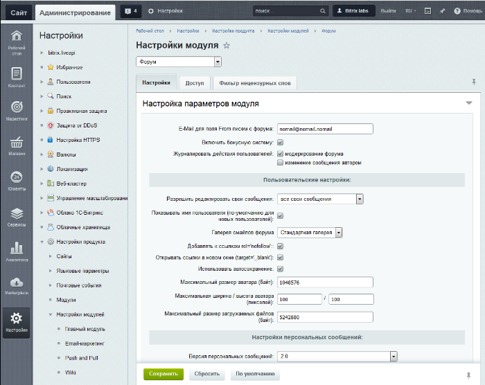

# Настройка модуля

**Навигация**
- [← Оглавление курса](index.md)
- [← Предыдущий: 2982 — Публикация фото галерей](lesson_2982.md)
- [Следующий: 12792 — Проверьте себя →](lesson_12792.md)

Официальная страница урока: https://dev.1c-bitrix.ru/learning/course/index.php?COURSE_ID=48&LESSON_ID=2957

### Закладка Настройки

Управление настройками выполняется на странице настройки модуля **Форум** (Настройки &gt; Настройки продукта &gt; Настройки модулей &gt; Форум).

На закладке **Настройки** задаются глобальные настройки параметров, которые определяют:

- выбор галереи смайлов форума (Начиная с версии 15.5.2 модуля **Форум** используются
  			смайлы ядра системы
  Раздел **Смайлы** (Сервисы &gt; Смайлы) - системный раздел для смайлов, используемых модулями системы.
  Для работы со смайлами используются понятия **Галереи смайлов** и **Набор смайлов**. Число Галерей и Наборов не ограничено. Каждая из Галерей может быть использована в любом из модулей. На данный момент переход на системные смайлы главного модуля совершён не полностью. Часть модулей использует собственные наборы смайлов, детальнее об этом смотрите в описании настроек модулей. Выбор осуществляется в настройках модуля. Настройки **Главного модуля** являются настройками по умолчанию для остальных модулей.
  [Подробнее](lesson_3106.md)...
  		);
- возможность редактирования личных сообщений;
- отображение имени пользователя и ограничения размера его аватара;
- настройки персональных сообщений;
- количество документов, индексируемых за один шаг.

**Примечание**: подробное описание каждого параметра приведено в [пользовательской документации](/user_help/service/forum/settings.php) по модулю **Форум**.

### Закладки Доступ и Фильтр нецензурных слов

#### Доступ

На закладке **Доступ** настраиваются уровни прав доступа к модулю для групп пользователей.

**Примечание**: чтобы пользователи имели возможность редактировать профиль на форуме, дайте группе пользователей форума права не ниже **[Р] Изменение профайла** в настройках **Главного модуля**.

#### Фильтр нецензурных слов

Для фильтрации нецензурных слов на страницах форума включите опцию **Включить фильтр нецензурных слов**, расположенную на закладке **Фильтр нецензурных слов**:

При включенном фильтре указывается действие, которое выполнится с найденными словами:

- **ничего** – никакие действия над нецензурными словами выполняться не будут;
- **удалить** – нецензурные слова будут удалены из текста;
- **заменить** – слова будут заменены на значение, заданное в поле **Замена**.

Кроме того, для каждого языка необходим **Словарь слов и регулярных выражений**, в которых хранятся нецензурные слова. Фильтрация текста сообщений выполняется на основании словаря.

**Примечание**: подробнее о настройке фильтра рассказано в уроке

			Фильтр нецензурных слов.

Фильтр нецензурных слов используется для работы с нецензурными словами в сообщениях форумов. В дистрибутиве уже поставляются заполненные словари, вы можете дополнить их или отредактировать.

Для использования на форуме фильтра нецензурных слов включите данную возможность в настройках модуля **Форум**, при этом укажите, какое действие будет выполняться с найденными словами, и задайте языкозависимые параметры.

[Подробнее](lesson_2968.md)...

### Документация по теме

- [Настройки модуля](https://dev.1c-bitrix.ru/user_help/service/forum/settings.php)
