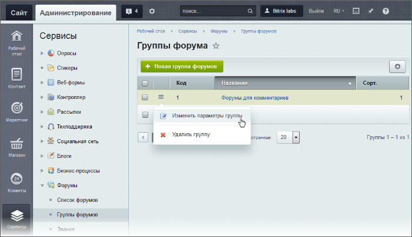

# Группы форумов

**Навигация**
- [← Оглавление курса](index.md)
- [← Предыдущий: 5391 — Возможности модуля Форум](lesson_5391.md)
- [Следующий: 2964 — Форумы: создание и управление →](lesson_2964.md)

Официальная страница урока: https://dev.1c-bitrix.ru/learning/course/index.php?COURSE_ID=48&LESSON_ID=2963

|  | ### Группировка форумов |
| --- | --- |

Если на сайте много форумов, то может возникнуть сложность в работе с ними: пойди, найди нужный. Для решения этой проблемы можно сгруппировать форумы по какому-то общему для них признаку.

> **Группа форумов** – это совокупность форумов, обладающих общим признаком, тематикой.

Просмотр уже созданных групп форумов, их редактирование и создание новых выполняется на странице Сервисы &gt; Форумы &gt; Группы форумов.

|  | #### Создание группы форумов |
| --- | --- |

Для создания группы форумов используйте кнопку **Новая группа форумов**, расположенную на контекстной панели. Для редактирования уже созданной группы выберите соответствующий пункт меню действий.

Форма

                    

		 создания (редактирования) группы форумов очень простая и значение полей ясно из их названия. Поясним только пару из них:

- **Сортировка** – индекс сортировки, который определяет положение группы в списке. Чем меньше значение сортировки, тем выше в списке будет отображаться группа форумов.
- **Родительская группа** – указывается группа, в которую будет вложена данная группа форумов. Выбор многоточия означает верхний уровень вложенности.

|  | #### Документация по теме: |
| --- | --- |

- [Группы форумов](https://dev.1c-bitrix.ru/user_help/service/forum/forum_group.php)
- [Создание и редактирование группы](https://dev.1c-bitrix.ru/user_help/service/forum/forum_group_edit.php)
