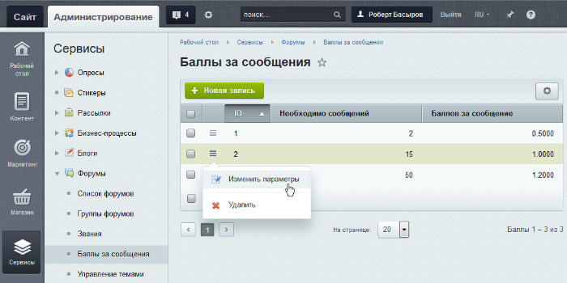
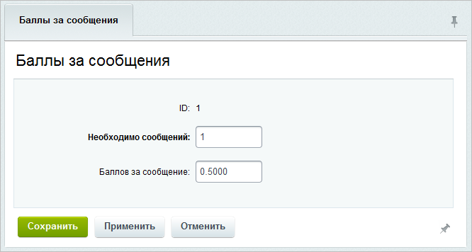
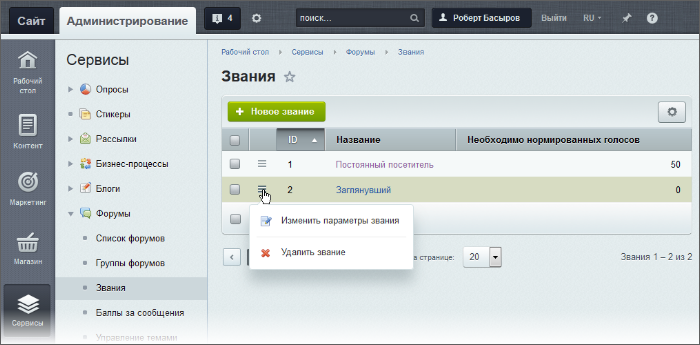
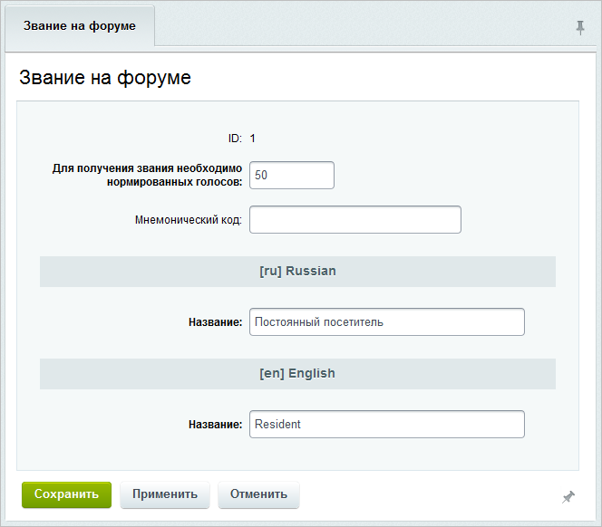

# Звания и баллы

**Навигация**
- [← Оглавление курса](index.md)
- [← Предыдущий: 2965 — Управление темами и подписками](lesson_2965.md)
- [Следующий: 2968 — Фильтр нецензурных слов →](lesson_2968.md)

Официальная страница урока: https://dev.1c-bitrix.ru/learning/course/index.php?COURSE_ID=48&LESSON_ID=2966

На любом форуме есть проблема оценки сообщений пользователя и его квалификации. В 1С-Битрикс для этого используются стандартные механизмы: баллы и звания.

### Баллы за сообщения

Баллы присваиваются пользователю форума за каждое отправленное сообщение. При этом можно легко настроить кумулятивную систему начисления баллов, т.е. количество баллов за одно сообщение будет увеличиваться согласно числу отправленных сообщений.

Настройка количества баллов за сообщение происходит на странице **Баллы за сообщения** (Сервисы &gt; Форумы &gt; Баллы за сообщения):

Для создания новой записи используется кнопка **Новая запись**, расположенная на контекстной панели.  В

			форме создания (редактирования)

                    

		 записи о количестве баллов за сообщение заполните поля:

- **Необходимо сообщений** - число сообщений, начиная с которого за каждое сообщение будет начисляться указанное в записи количество баллов.
- **Баллов за сообщение** – количество баллов, начисляемое за сообщение, при достижении указанного в предыдущем поле числа сообщений.

**Внимание!** Пересчет баллов пользователей при изменении записи автоматически не происходит. Пересчет баллов каждого пользователя произойдет при написании очередного сообщения, при голосовании за него и т.п.

### Звания

Звания посетителей форума устанавливаются согласно количеству набранных баллов. Пользователь получает баллы как за количество сообщений, созданных на форуме, так и в результате голосования других посетителей форума.

**Примечание**: Для получения звания за количество сообщений на форуме включите опцию Включить бонусную систему в настройках модуля **Форум**. Если эта опция неактивна, то звания будут устанавливаться на основе

			рейтингов.

В общем случае система устроена так, что все основные расчеты происходят автоматически по внутренним механизмам. По умолчанию также активен всего лишь один главный рейтинг в системе - Авторитет.

[Подробнее](https://dev.1c-bitrix.ru/learning/course/index.php?COURSE_ID=35&CHAPTER_ID=04975&LESSON_PATH=3906.4493.4975)...

Для настройки званий используйте страницу **Звания** (Сервисы &gt; Форумы &gt; Звания):

Для создания новой записи нажмите кнопку **Новое звание**, расположенную на контекстной панели. Откроется

			форма создания (редактирования)

                    

		 звания. Заполнение формы не должно вызвать у вас проблем, она полностью понятна.

### Документация по теме

- [Звания](https://dev.1c-bitrix.ru/user_help/service/forum/forum_points.php)
- [Создание и редактирование звания](https://dev.1c-bitrix.ru/user_help/service/forum/forum_points_edit.php)
- [Баллы за сообщения](https://dev.1c-bitrix.ru/user_help/service/forum/forum_points2post.php)
- [Создание и редактирование баллов за сообщение](https://dev.1c-bitrix.ru/user_help/service/forum/forum_points2post_edit.php)
