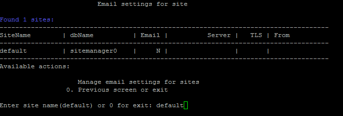
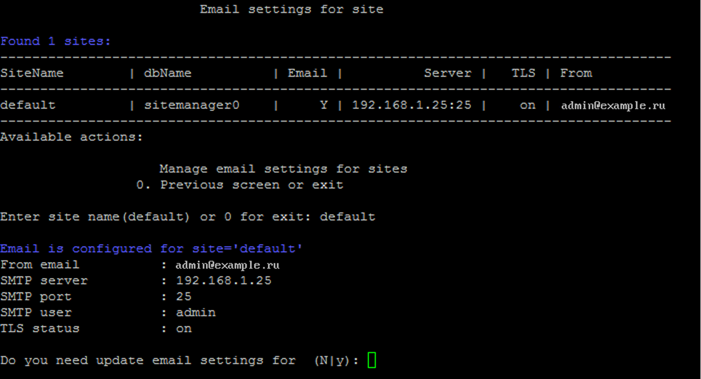

# Настройка почты на VMBitrix

**Навигация**
- [← Оглавление курса](index.md)
- [← Предыдущий: 2945 — Настройка почты на Linux](lesson_2945.md)
- [Следующий: 2947 — Частые проблемы →](lesson_2947.md)

Официальная страница урока: https://dev.1c-bitrix.ru/learning/course/index.php?COURSE_ID=48&LESSON_ID=2967

Запустите виртуальную машину.

В первом окне нажмите **Login**, войдите под **root** (это обязательно). Войдите в пункт меню: 6. Управление сайтами (6. Configure pool sites). В этом пункте, в свою очередь, выберите пункт 4. Настройка почтового сервера (4. Change a site's e-mail settings).

Для настройки интегрированного почтового сервера выполните следующее:

1. Перейти в главном меню в 6. Configure pool sites &gt; 4. Change a site's e-mail settings и ввести имя хоста, для которого нужно настроить отправку почты:
  
2. Далее ввести необходимые данные для почтового сервера:
  
  **Примечание**: При настройке укажите данные своего или публичного почтового сервиса.

  - **from address** - адрес отправителя, от которого будет осуществляться пересылка писем.
  - **server address or DNS** - ip-адрес или доменное имя почтового сервера. Если нажать Enter, то будет использован адрес по умолчанию (127.0.0.1)
  - **server port** - порт сервера. Порт зависит от типа соединения, 25 - для обычного и 465 - для зашифрованного (с использованием SSL). Если нажать Enter, то будет использован порт по умолчанию (25).
  - Если необходима SMTP-авторизация, то в строке **SMTP authentication** наберите `y` и введите логин и пароль для доступа к SMTP-серверу, в противном случае - `n`. Для большинства почтовых серверов SMTP-авторизация обязательна.
  - Если выбрана опция SMTP-авторизации, то понадобится ввести тип авторизации **type of authentication method**: `auto`, `plain`, `scram-sha-1`, `cram-md5`, `gssapi`, `external`, `digest-md5`, `login`, `ntlm` (например для yandex.ru достаточно `auto`, а для mail.ru - `plain`).
  - Если необходим TLS-протокол защищенной передачи данных, то в строке **TLS enabled** наберите `y`, в противном случае - `n`.
3. Дождаться пока задача по настройке почтового сервера будет закончена.
4. Убедиться в правильности введенных данных настройки почтового сервера можно снова в 6. Manage sites in the pool &gt; 4. Change e-mail settings on site:
  

**Внимание!** Задачи могут выполняться довольно длительное время (до 2-3 часов и более) в зависимости от сложности задачи, объема данных, используемых в этих задачах, мощности и загруженности сервера. Проверить текущие выполняемые задачи можно с помощью меню 5. Background tasks in the pool &gt; 1. View running tasks. Если по каким-либо причинам нужно посмотреть лог-файлы выполнения задач, то они находятся в директории `/opt/webdir/temp`.

**Внимание!** С 01.12.2020 Яндекс включил строгий контроль адреса отправителя. Это значит, что вы больше не сможете через SMTP-клиент отправить письмо, если отправитель в поле From («От кого») отличается от авторизованного пользователя. Указать несколько отправителей в поле From также не получится .
