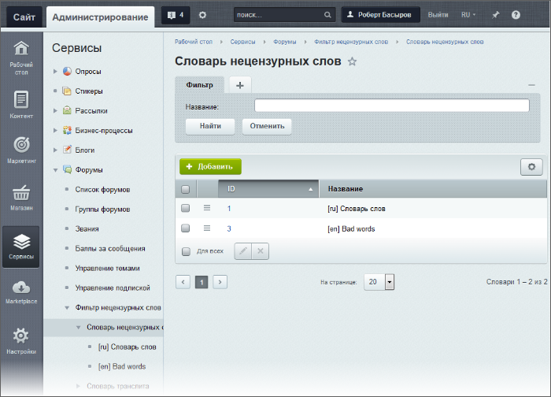
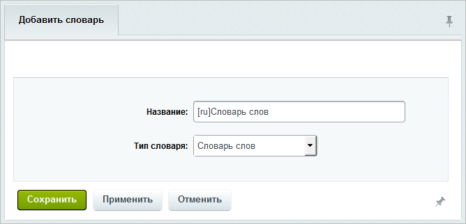
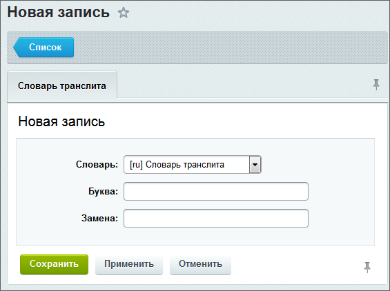

# Фильтр нецензурных слов

**Навигация**
- [← Оглавление курса](index.md)
- [← Предыдущий: 2966 — Звания и баллы](lesson_2966.md)
- [Следующий: 7360 — Назначение модератора форума →](lesson_7360.md)

Официальная страница урока: https://dev.1c-bitrix.ru/learning/course/index.php?COURSE_ID=48&LESSON_ID=2968

### Следим за грубостями

Фильтр используется для работы с нецензурными словами в сообщениях форумов. В дистрибутиве уже поставляются заполненные словари, вы можете дополнить их или отредактировать.

Для использования на форуме фильтра нецензурных слов

			включите данную возможность

                    

		 в настройках модуля **Форум**, при этом укажите, какое действие будет выполняться с найденными словами, и задайте языкозависимые параметры.

На странице Сервисы &gt; Форумы &gt; Фильтр нецензурных слов &gt; Словарь нецензурных слов представлен список словарей с нецензурными словами:

### Добавление словаря, слов и букв транслита

Это требуется редко, но если потребовалось, то для добавления нового словаря воспользуйтесь кнопкой **Добавить**, расположенной на контекстной панели страницы. В открывшейся форме укажите **Название** и

			Тип словаря

                    "Словарь слов" или "Словарь транслита".

Словарь транслита – список знаков и букв другого языка, которыми могут заменяться буквы в словах используемого языка.

		.

Для добавления нецензурных слов в словарь используется страница Сервисы &gt; Форумы &gt; Фильтр нецензурных слов &gt; Словарь нецензурных слов &gt; **&lt;имя_словаря&gt;**. В открывшейся форме добавьте корень слова с

			символами изменяемых частей

                    Символы изменяемых частей:
^ - приставка;

% - суффиксы и окончания;

? - один символ;

* - любое количество словообразующих символов.

		 слова и выберите

			тип шаблона

                    Тип шаблона – способ как система будет искать и удалять слово.

**Слово** –  (без использования словаря транслита) – искаться и удаляться (заменяться) будет слово в точности с тем как оно введено в поле Поиск.

**Транслит** – (с использованием словаря транслита) – искаться и удаляться (заменяться) будет слово в соответствии со словарем транслита.

**Регулярное выражение** – полное символьное выражение, которое использует система для анализа слова.

		. Необязательно, но можно добавить слово или фразу, которые

			заменят добавляемое слово

                    Замена происходит в том случае, если в настройках модуля включен фильтр нецензурных слов

 и в качестве действий с найденными словами выбрано **Заменить**.

Причем сначала проверяется, имеется ли собственная замена, если она есть, то будет использована.

 Если же собственной замены нет, то будет использоваться замена из настроек форума.

		 в тексте.

<!-- &lt;p&gt;&lt;img src="/images/admin_expert/forum/v12/forum_words.png"&gt;&lt;/p&gt; -->

Для добавления информации об аналоговом написании букв в словарь транслита используется страница **Словарь транслита** (Сервисы &gt; Форумы &gt; Фильтр нецензурных слов &gt; Словарь транслита &gt; **&lt;имя_словаря&gt;**). Создание

			записи словаря

                    

		 Транслита не представляет сложности.

<!-- &lt;p&gt;&lt;img src="/images/admin_expert/forum/v12/forum_letter.png" alt="Аналоги букв" &gt;&lt;/p&gt; -->

### Документация по теме

- [Список словарей нецензурных слов/транслита](https://dev.1c-bitrix.ru/user_help/service/forum/censor_filter/forum_dictionary.php)
- [Создание/редактирование словаря](https://dev.1c-bitrix.ru/user_help/service/forum/censor_filter/forum_dictionary_edit.php)
- [Словарь слов](https://dev.1c-bitrix.ru/user_help/service/forum/censor_filter/forum_words.php)
- [Создание/редактирование записи словаря нецензурных слов](https://dev.1c-bitrix.ru/user_help/service/forum/censor_filter/forum_words_edit.php)
- [Словарь транслита](https://dev.1c-bitrix.ru/user_help/service/forum/censor_filter/forum_letter.php)
- [Создание/редактирование записи словаря транслита](https://dev.1c-bitrix.ru/user_help/service/forum/censor_filter/forum_letter_edit.php)
