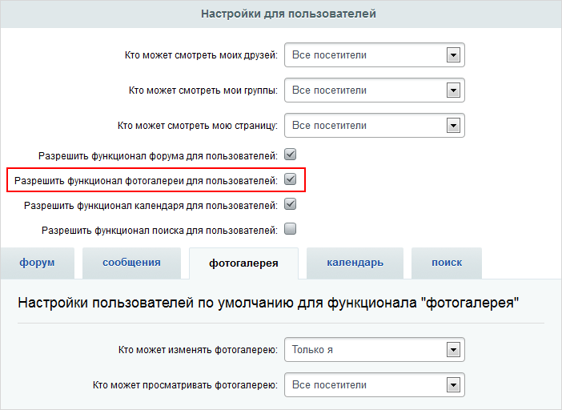
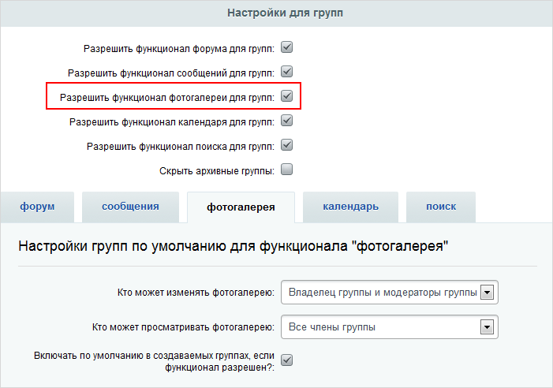

# Фотогалерея в социальной сети

**Навигация**
- [← Оглавление курса](index.md)
- [← Предыдущий: 2657 — Основные понятия](lesson_2657.md)
- [Следующий: 5391 — Возможности модуля Форум →](lesson_5391.md)

Официальная страница урока: https://dev.1c-bitrix.ru/learning/course/index.php?COURSE_ID=48&LESSON_ID=2981

|  | ### Настройки в Социальной сети |
| --- | --- |

Для использования фотогалерей в Социальной сети сайта активируйте этот функционал в настройках модуля **Социальная сеть** на странице Настройки &gt; Настройки продукта &gt; Настройки модулей &gt; Социальная сеть в секциях:

1. **Настройки для пользователей**:
  
2. **Настройки для групп**:
  

Далее в этих же секциях задайте права по умолчанию для фотогалерей.

Если сайтов несколько, то управление фотогалереями выполняется отдельно для каждого сайта.

|  | #### Документация по теме: |
| --- | --- |

- [Модуль "Социальная сеть"](http://dev.1c-bitrix.ru/user_help/service/socialnetwork/settings.php)
